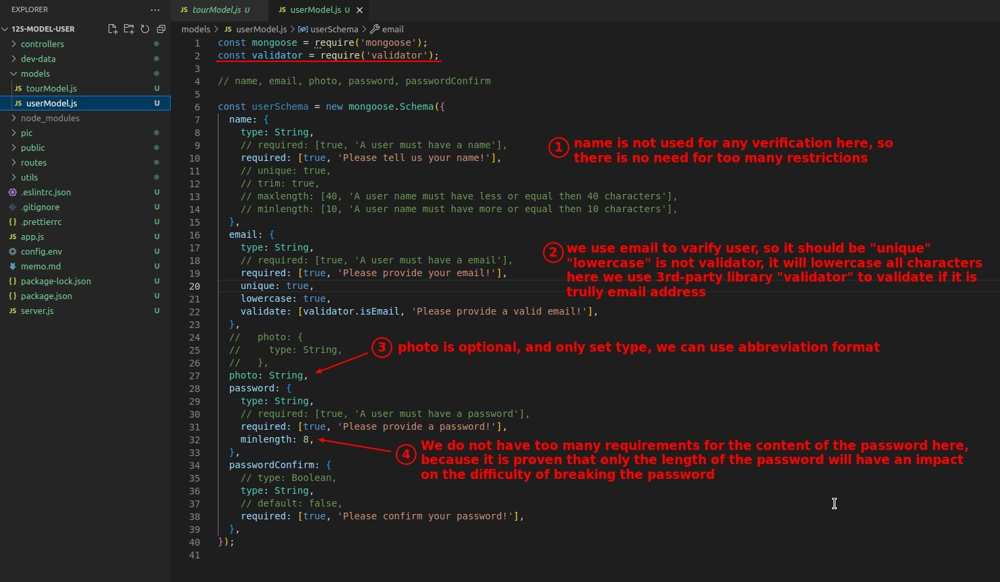

## **Create new file for user model and Challenge!**

> Authentication and authorization are about user registration, login, and the right to access pages or use routes, all about the user, so we need to start by implementing the user model.

## **My Answer (Only Schema)**

## **Compare with Lecturer's Answer**

## **Generate Model "User" and Export it**

