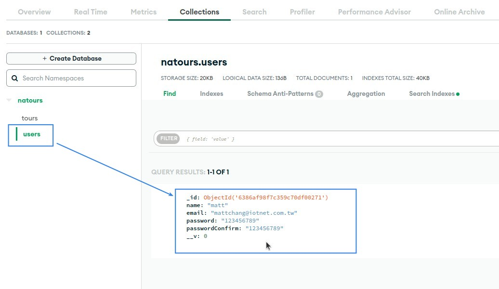

## **Signup Function in the Controller**

- The signup function is not written in userController.js but in authController.js, because it belongs to the User's own behavior of creating an account, and the function in userController.js belongs to the admin's behavior in operating the account, so it is more reasonable to separate it.
- The content of the signup function is actually very similar to the createTour function in tourController.js, the key is to use Model.create to complete, only the function naming logic is different.

## **Error Handling for Async Function**

## **Build Router to let User can call Signup**

> After you have a function, you still need the router to be able to be called by the client.

- authController.js function we also write in userRouters.js, Router will no longer be divided into auth and user, probably because there are fewer codes, so it will not cause confusion.
- You can find that the router '/signup' does not follow the rules of REST, because it is not necessary here, so REST rules are not necessarily followed, especially in the authentication part.

## **Test with Postman**

## **Check User Data in MongoDB**

- In fact, passwords should not be presented directly in the database in this way, and the subsequent lecture will teach how to hide these passwords.
