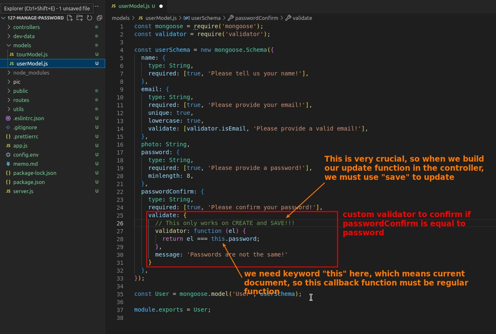
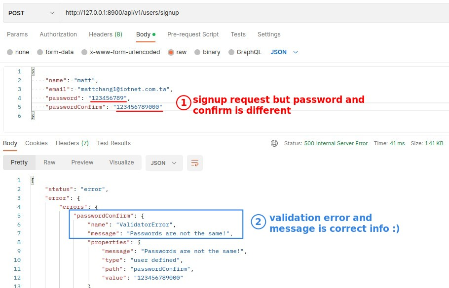
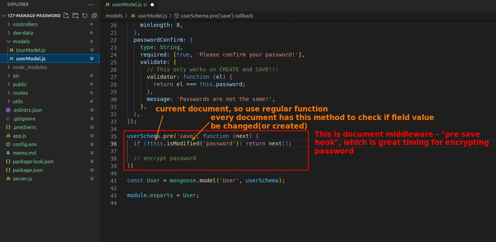
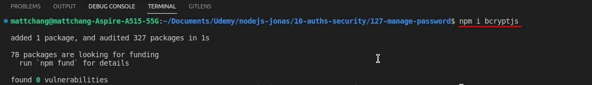
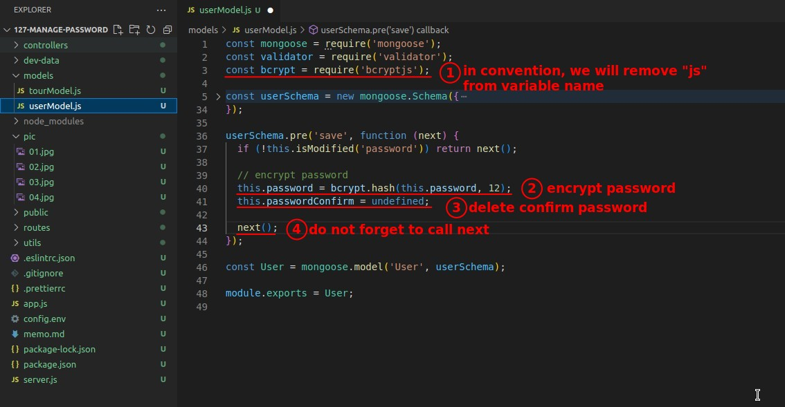
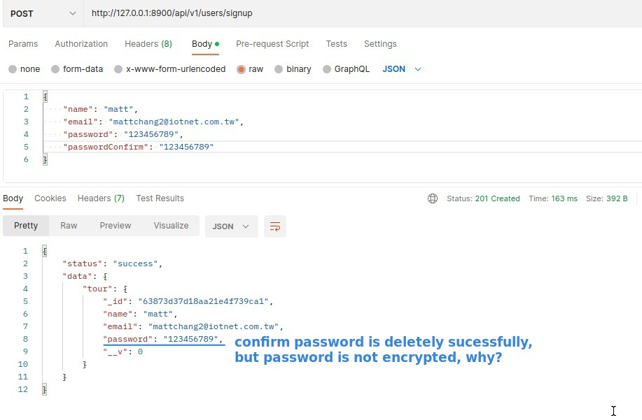
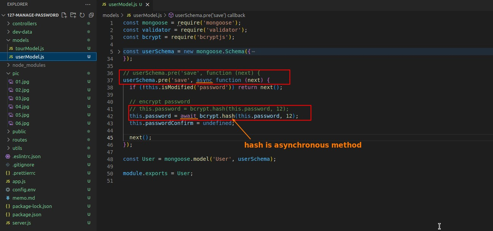
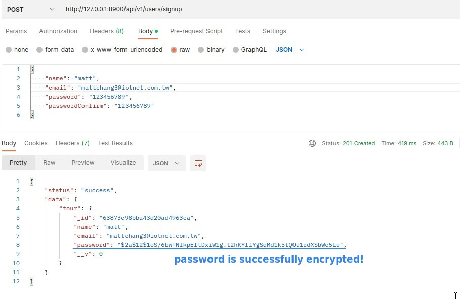
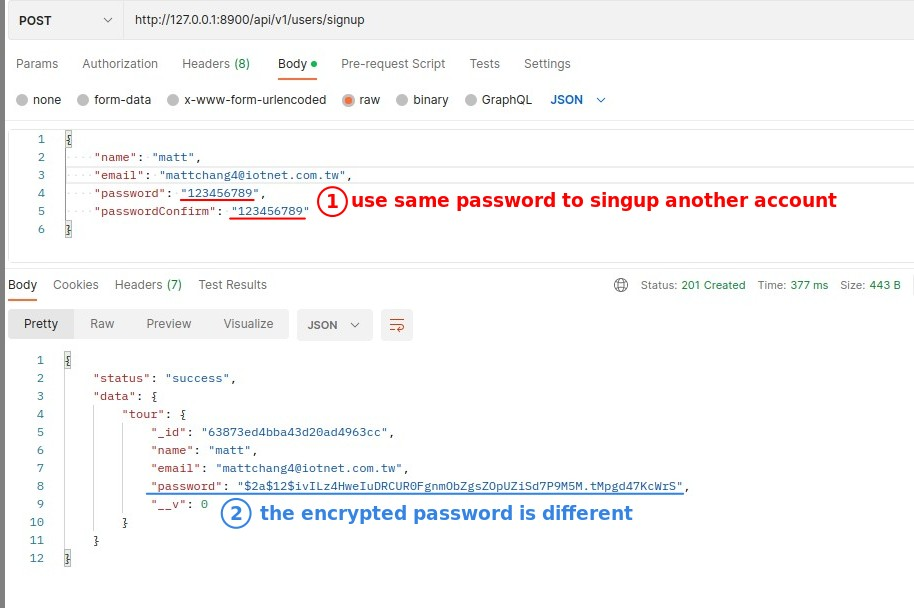

## **Confirm Password Validation**

- In the resource tour we use the method "findByIdAndUpdate" in the funtion to update the data, however, because the resource user has the need to confirm the password, it is absolutely impossible to use the same method to implement the update function.

## **Encrypt Password**

### _Great Timing for Encrypting Password_

> The best time to encrypt is after validation and before saving to the database, so "pre-save-hook" document middleware is the best choice.

### _Install BcryptJS_

> We use a very well-known and very well-studied hasing algorithm called bcrypt to help us with encryption.

- This algorithm will first salt then hash our password in order to make it really strong to protect it.
  - salt means to add random string into our password. This way, even if you use the same password for encryption, you will get different results.

### _Implement Encrypt password, delete confirm password_

- confirm password is only needed during validation, pre-save-hook works after validation, so we can remove it here because we don't want to see our password exposed from this field in the database.
- The second parameter of method "hash" represents the CPU intensity used for encryption, which by default is 10.
  - But since the computer hardware has been upgraded a lot, it is recommended to use 12 or above, too high is not good, because the encryption time will increase a lot.

### _Test but failed_

### _Method "hash" is asynchronous_

- In fact, bcrypt also provides a synchronized version of hash, but for the sake of server performance we still use the asynchronous method "hash" to handle it.

### _Test and pass_

## **Encrypt Theory**

- As mentioned earlier, bcrypt encrypts by adding salt and then doing the hash process.
  - All the same passwords will not give the same result because of salt addition, as we have proved here.
