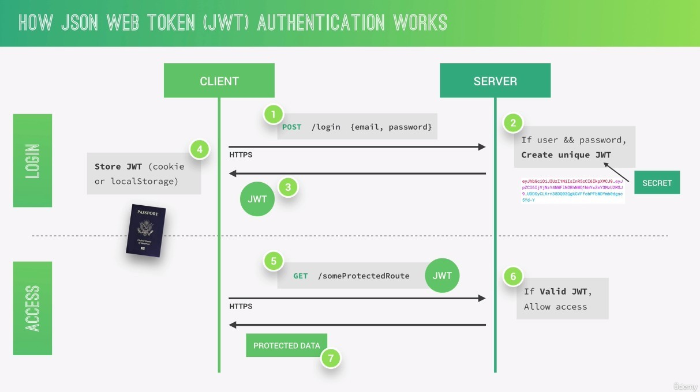
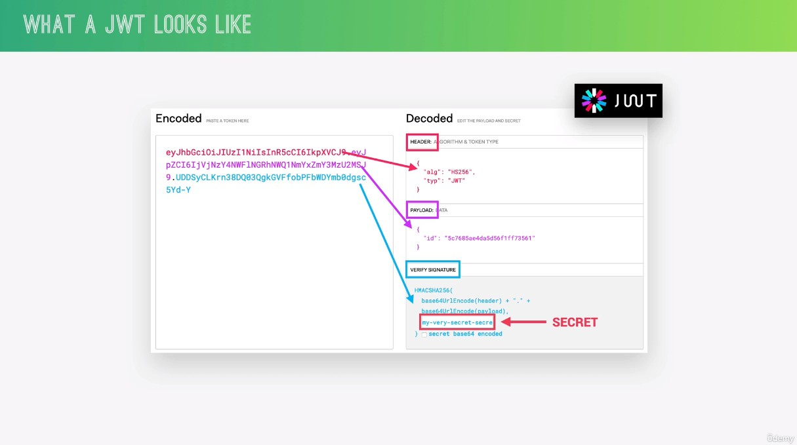
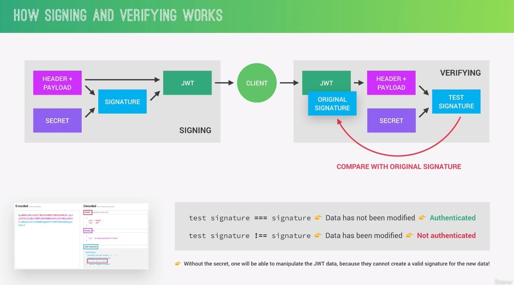

- Json Web Tokens are a stateless solution.
  - It means no need to store any session state on the server.
    - It is perfect for RESTful API. RESTful APIs should always be stateless.
- step 2: If user && password is correct in the database, server will use a **secret** string to create unique JWT and send JWT back to client next step.
- Server does in fact not know which users are actually logged in.
- Now what's very important to note here is that all this communication must happen over **https**.
  - Secure encrypted http in order to prevent that anyone can get access to passwords or Json Web Tokens.

- JWT essentially, It'a an encoding string made up of three parts.
  - first 2 parts only encoded but no encrypted:
    - header: just some metadata about the token itself
    - payload: data that we can encode
  - signature: created using the header, the payload and the **secret** that is saved on the server.
- The whole process of generating a JWT above is called **Signing**.

- The main purpose of the verification is to know if the JWT has been modified, by comparing the TEST signature with the original signature.
