## **Fix security vulnerabilities of function "signup"**

> The function "signup" we wrote in authController.js actually has a major security vulnerability: users can create their own accounts at the admin level, so it must be fixed here first.

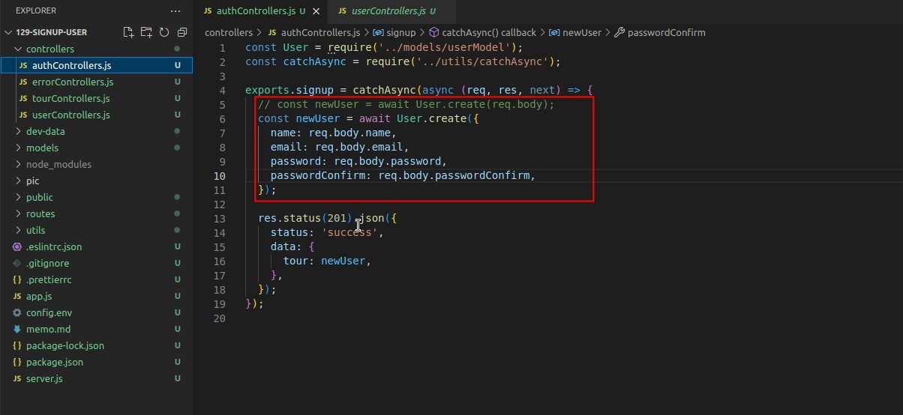

- As above we restrict the newly created account to only "name", "email", "password" will be written to the database, but not all content, so as to avoid security vulnerability.
- If you want to create an admin, go to the database directly after the account is created or use Mongo Compass to make changes to the user data directly.

## **Install JWT and Check It's Documents**

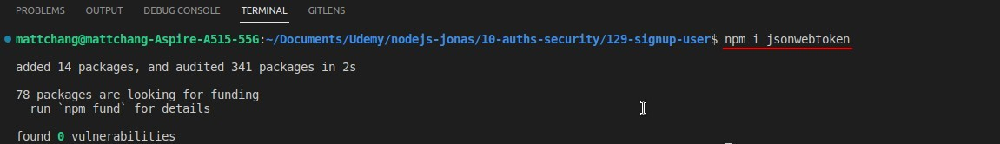

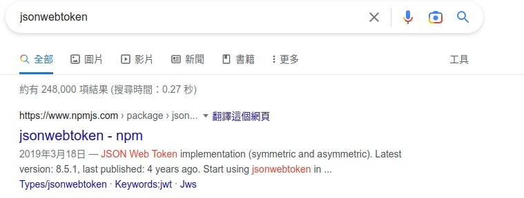

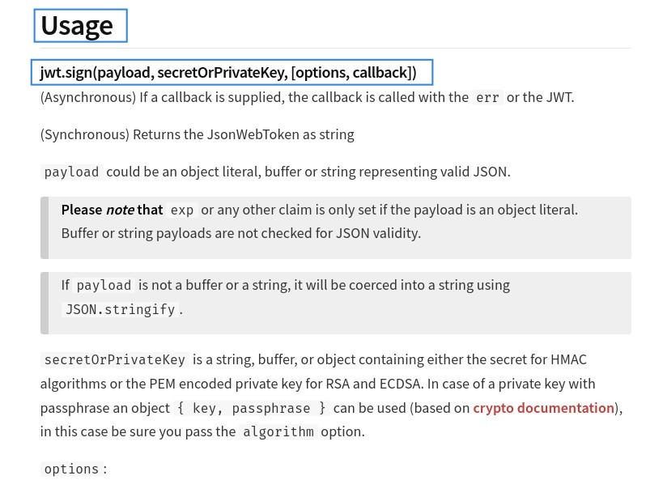

- In fact, there are only three methods of JWT: sign, verify, decode, and the third one is not very important, so in fact there are only two functions left that we saw in the concept diagram of the last lecture: sign, verify.

## **Use JWT to Sign a TOKEN**

### _payload_

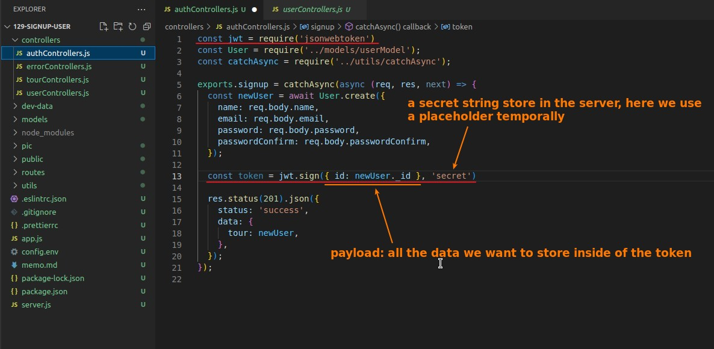

- Note that this data is not encrypted, only encoded, so it must not be too sensitive.
  - The MongoDB-generated \_id fits perfectly here because it's unique and insensitive, and doesn't raise any security issues.

### _secret_

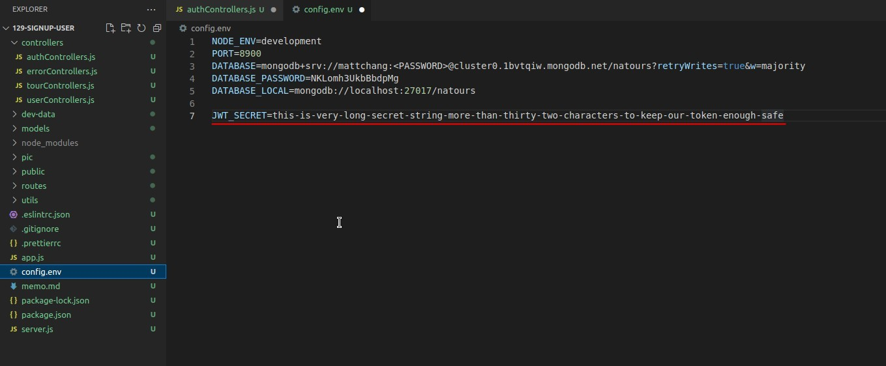

- According to the encryption logic used by JWT, the secret string saved by the server must be more than 32 characters, which is a key point that many other tutorials often ignore but is very deadly.
- The secret string is best not written directly in JS, the env file is the perfect place to save the secret string.

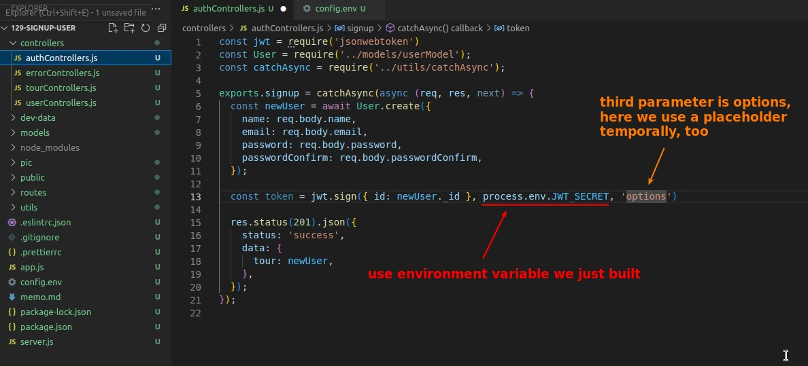

### _options_

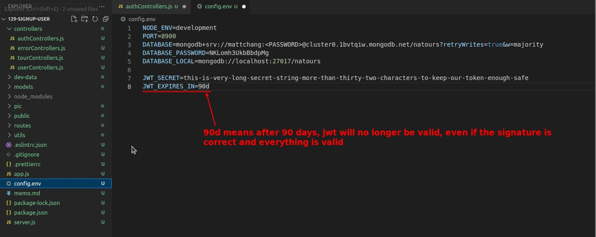

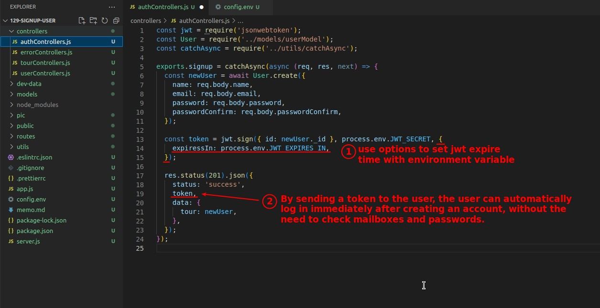

## **Test and Debug**

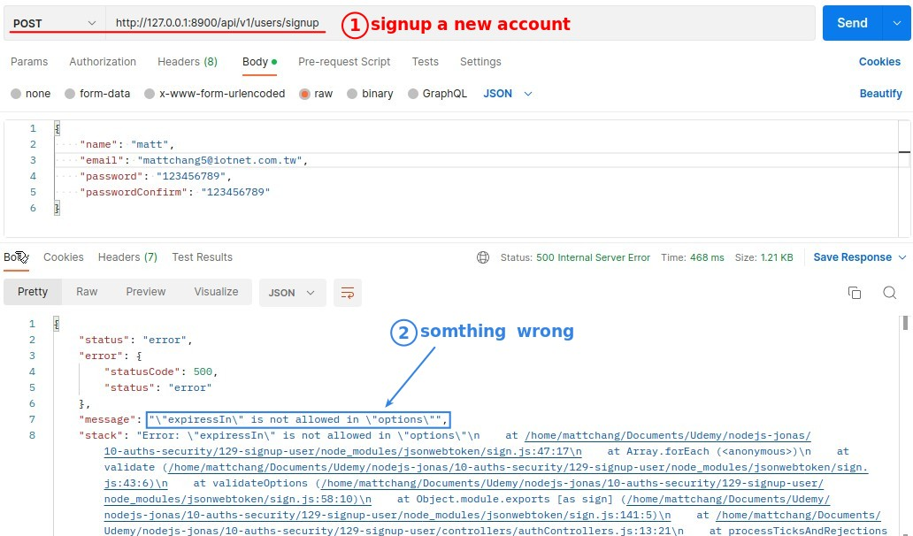

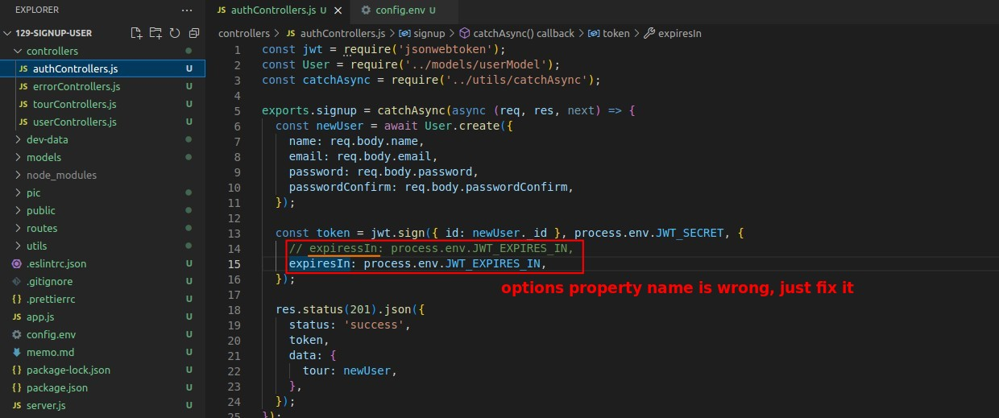

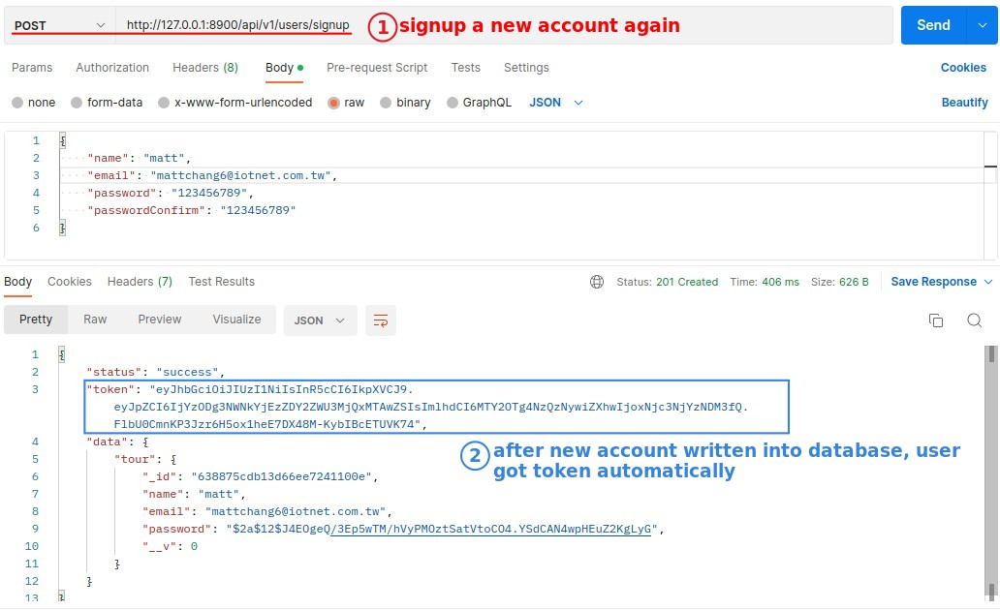

## **decode token**

> We use the jwt.io web page to decode the token content generated by the signup.

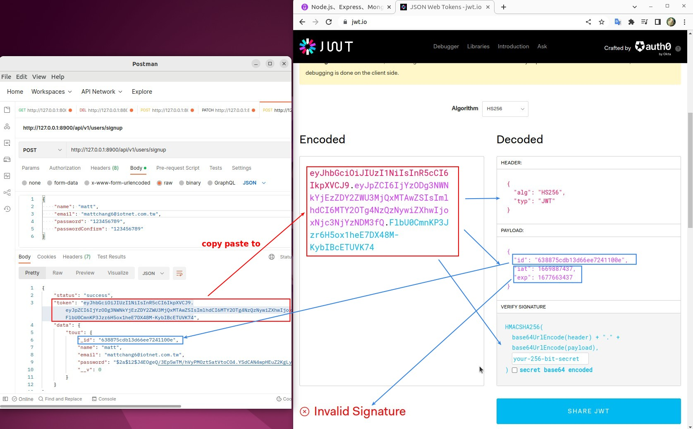

- You can see that the value of \_id obtained after decoding the web page is indeed the value we wrote in.

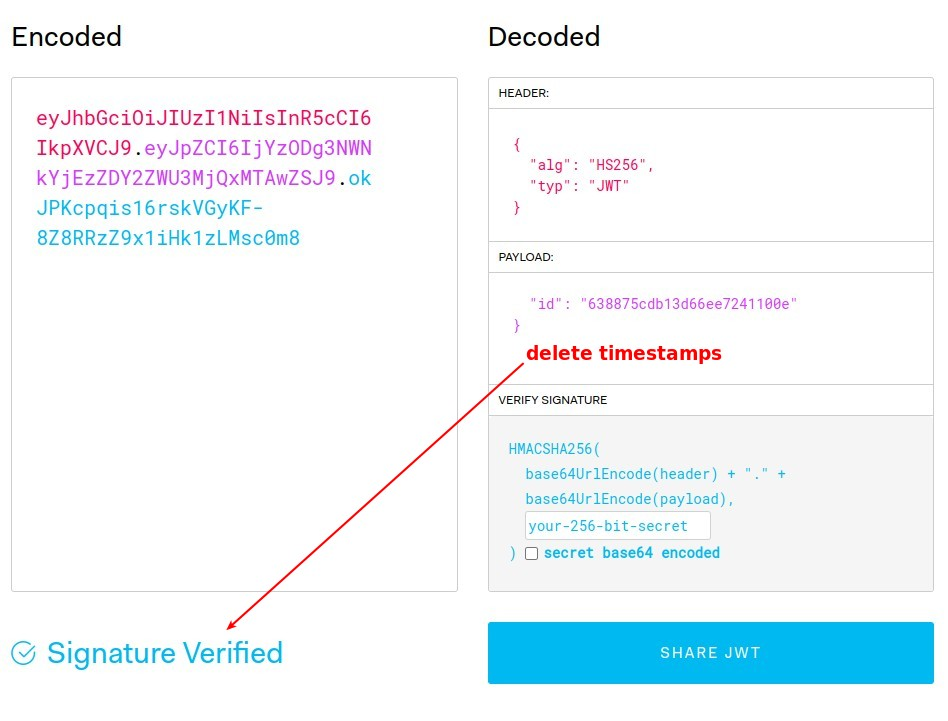

- Because of the option, two timestamps are automatically added to the payload by JWT, and the signature will be valid only after we remove them..
