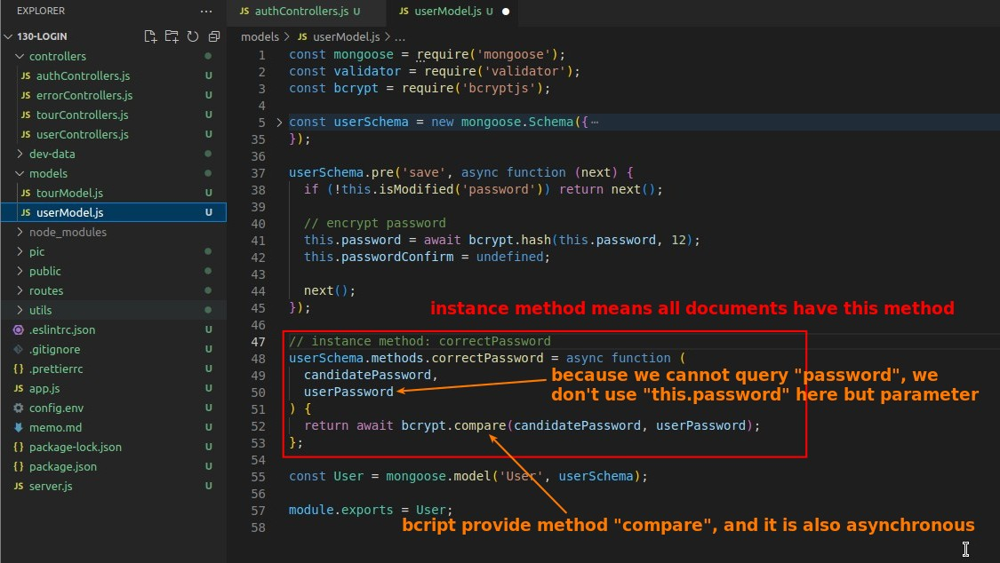

## **Check if email and password exist in request body**

### _create fake token to response(test purpose)_

### _route_

## **Avoid PASSWORD being queried**

### _build query function_

### _select: false_

- Note that the option "select" is to make the field "password" unavailable to all queries, not just hidden.

## **Query User and Explicitly SELECT**

## **Instance Method: correctPassword**

- It is important to note that we write the code to compare passwords in the model, instead of controller.
- It is also because of the "select: false" in the Schema that we cannot use "this.password" directly, so the effect of the option "select" is comprehensive and should be used with care.

- We put line 38 directly into the condition so that if the user does not exist, it will not be executed and no error will occur. It is very tricky :)

## **Signing TOKEN**

## **Final TEST**

