## **Goal**

### _already done: issue JWT from server to client_

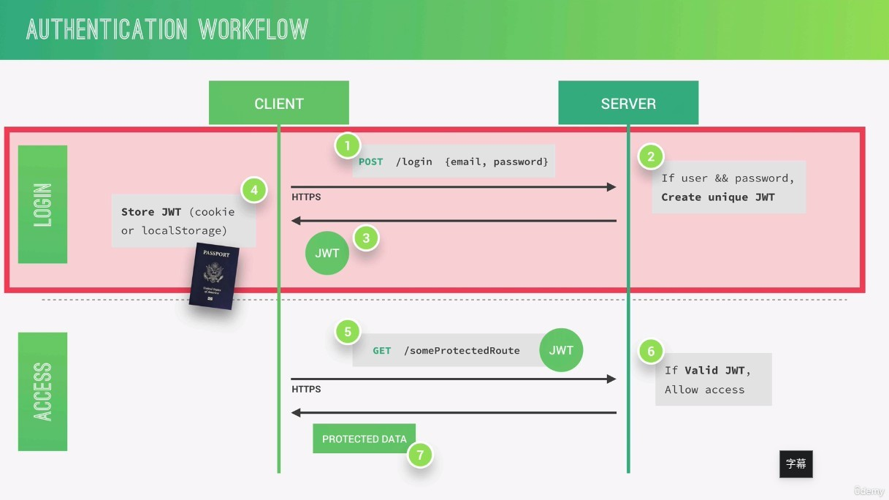

### _now we want to implement: send JWT from client to server to varify_

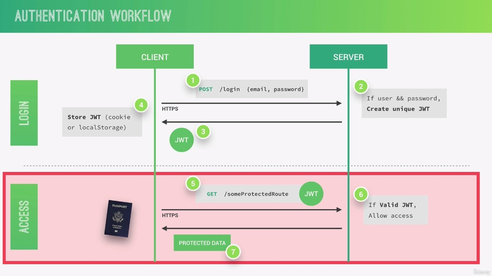

- The verification mechanism only needs to be triggered if the router that client call is protected.

## **What is "protect" routes and How to implement it?**

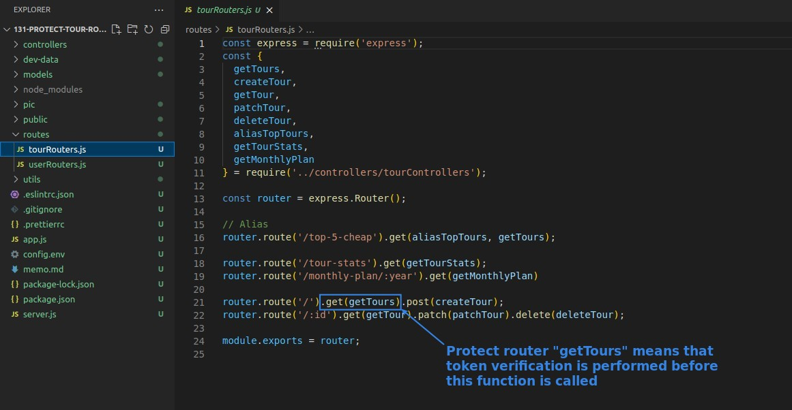

- The easiest and most effective way is to add a middleware directly in front of getTours to check if there is a valid JWT token.

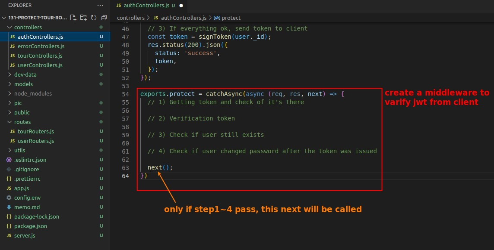

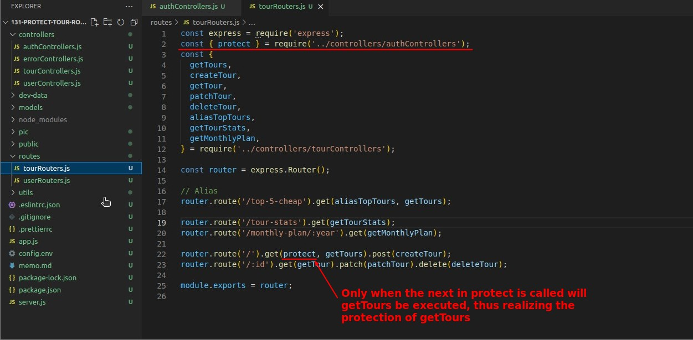

## **How to send JWT from Client?**

> Generally, the client will use the header to carry the JWT token for verification.

### _test header with custom content_

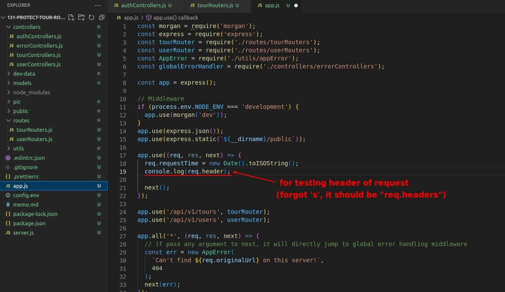

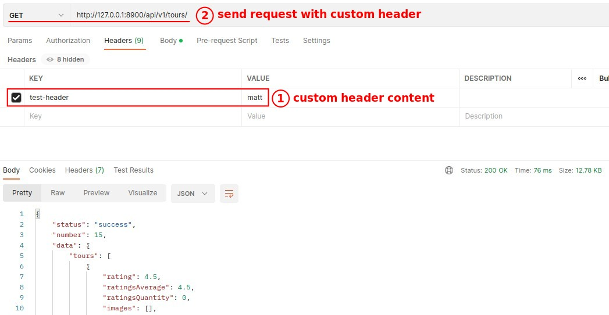

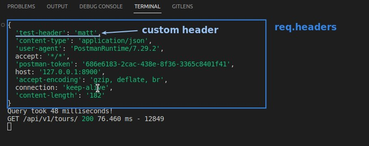

### _test header with carrying JWT token_

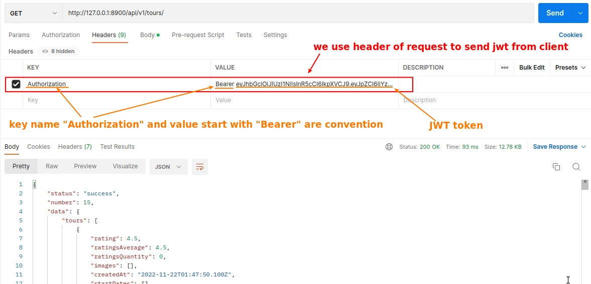

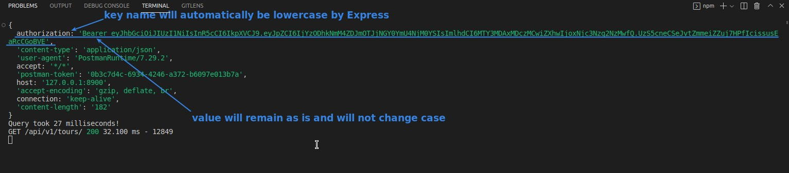

## **Getting token and check of it's there**

> Then start implementing the first part of the function "protect".

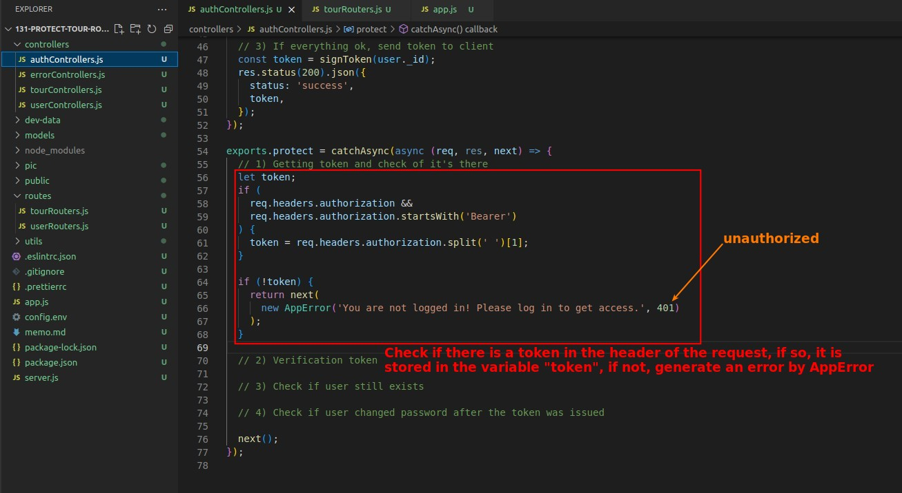

- The first part is very simple, except for the use of AppError to generate errors, basically it's mostly just JavaScript concepts.
- Other steps will be completed in the subsequent lectures.

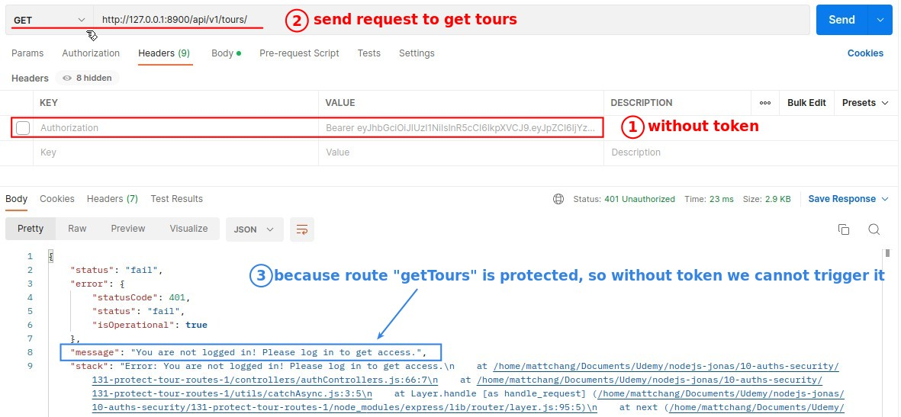
