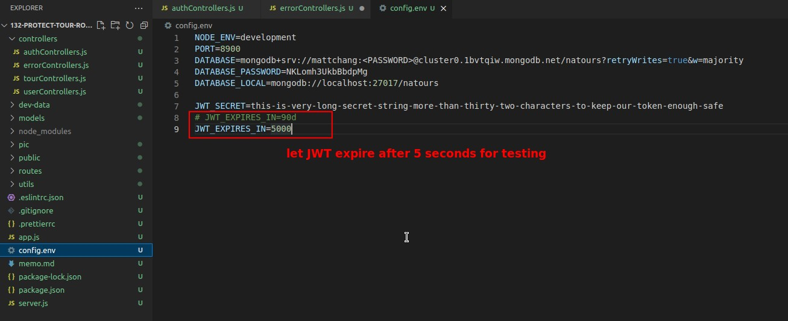

## **Step2: JWT Verifications**

### _jwt.verify_

### _promisify_

- Here we use the NodeJS native method "promiseify" to convert "jwt.verify" to an asynchronous function that returns the promise (which it doesn't), so we can continue to write using the async/await pattern

### _check result of verification_

- So if "jwt.verify" succeeds, you will get payload data, and if it fails, you will get one of the following two errors.

## **Editted JWT Token**

### _Deliberately generate an edited token for testing_

### _Handling Errors_

## **Expired JWT Token**

### _Deliberately generate an expired token for testing_

### _Handling Errors_

## **Step3: Check if User still Exist**

## **Step4: Check if User Changed Password After the Token was issued**

- As in the previous lecture on comparing passwords, password-related processing is more appropriate for the model and implemented using instance methods, so that each user document can call it directly.

- The logic for generating the new field "passwordChangedAt" will be implemented in a future lecture, but for now we are using fake data to generate it directly for testing.

- function "signup" this side to add this line otherwise "passwordChangedAt" fake data will not be added into, here is to do a test, before the end of the course to remember to restore the original codes.

## **Finish "changedPasswordAfter" and "protect" functions**

- Both sides represent time but the format is different, so some modifications are needed to compare them to meet our needs.

## **Recovery Codes and Final Test**

### _Recovery Codes_

### _Run-through of the normal signup and request tours(final test)_

- Above is a run-through of the normal sigup and reuqest tours to make sure our program is running properly.
