## **Create Environment Variable Manually**

> In the future, we will frequently switch between development and production and there are dozens of request types, with environment variable can save a lot of time.

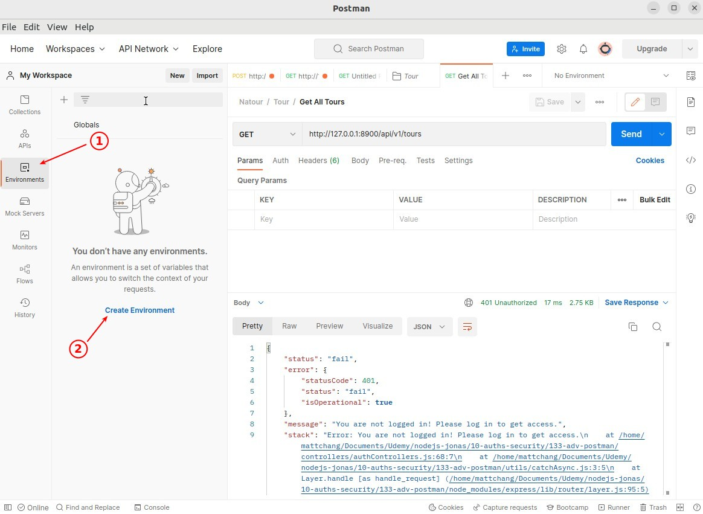

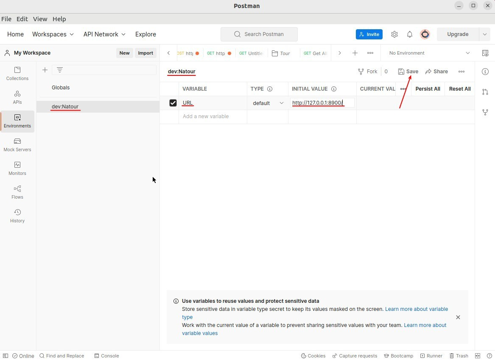

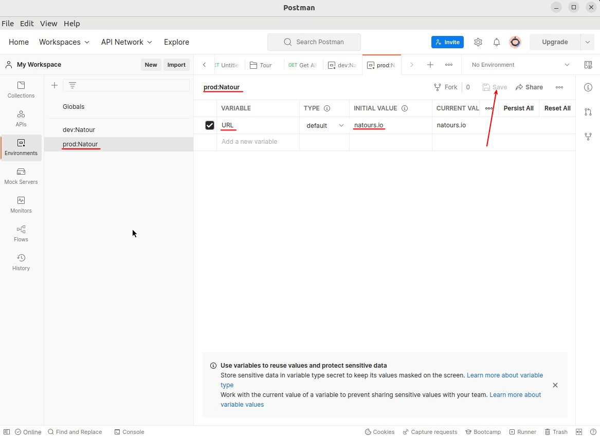

- Actually, we don't have a real production URL yet, so we'll use the placeholder here first.

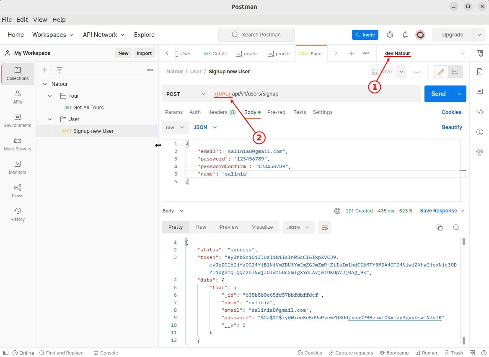

## **Use Postman Script to Create Environment Variable Automatically**

> In the past, we had to use signup or login to get a token and then manually copy and paste it into the header of another request, but now we can use the script provided by Postman to automate the whole process.

### _Extract Token from Signup/Login_

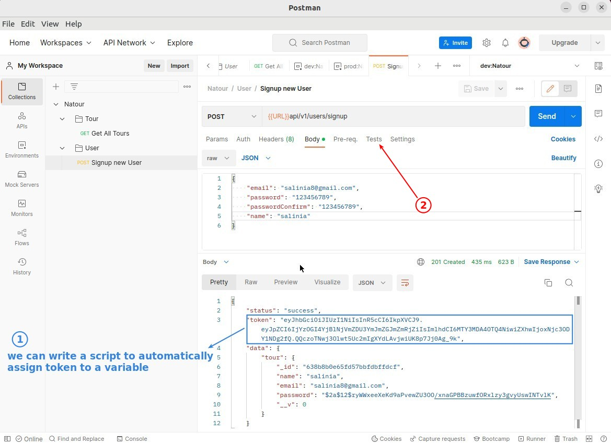

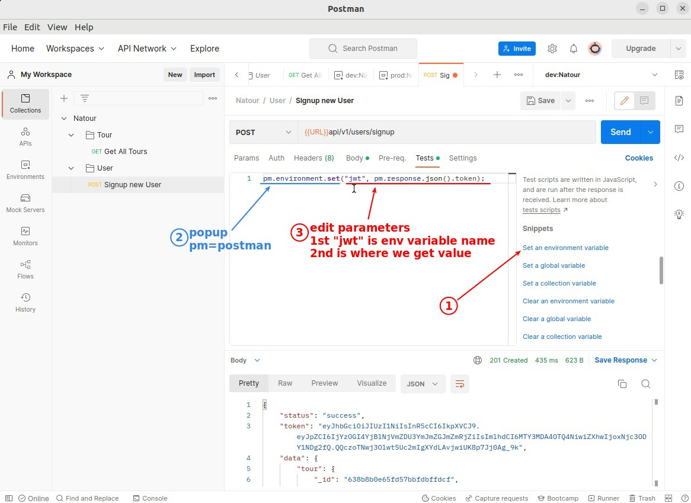

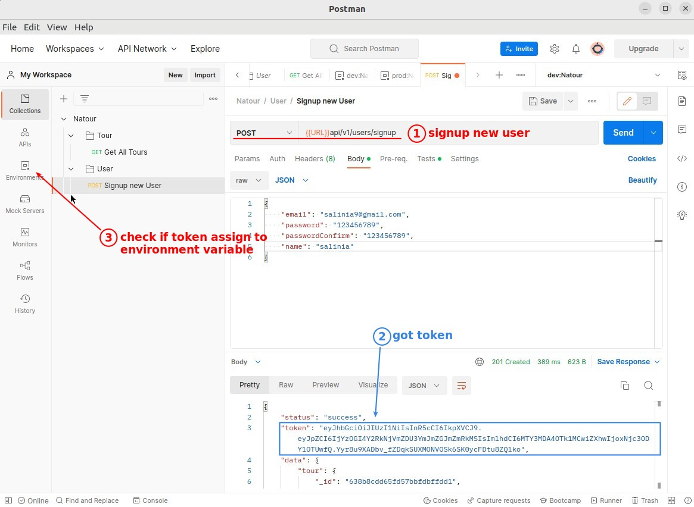

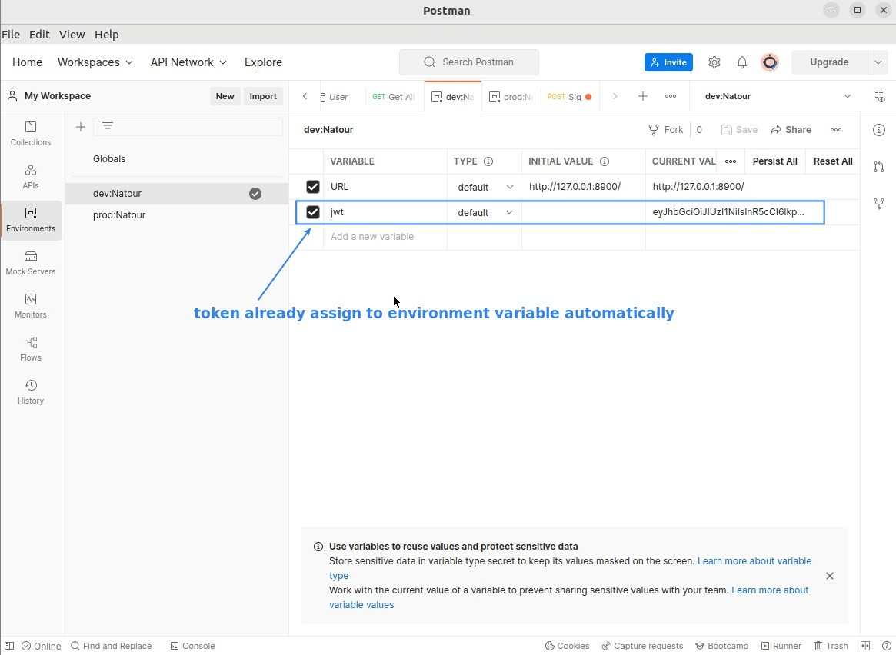

### _Use Token in Request for Protected Routers_

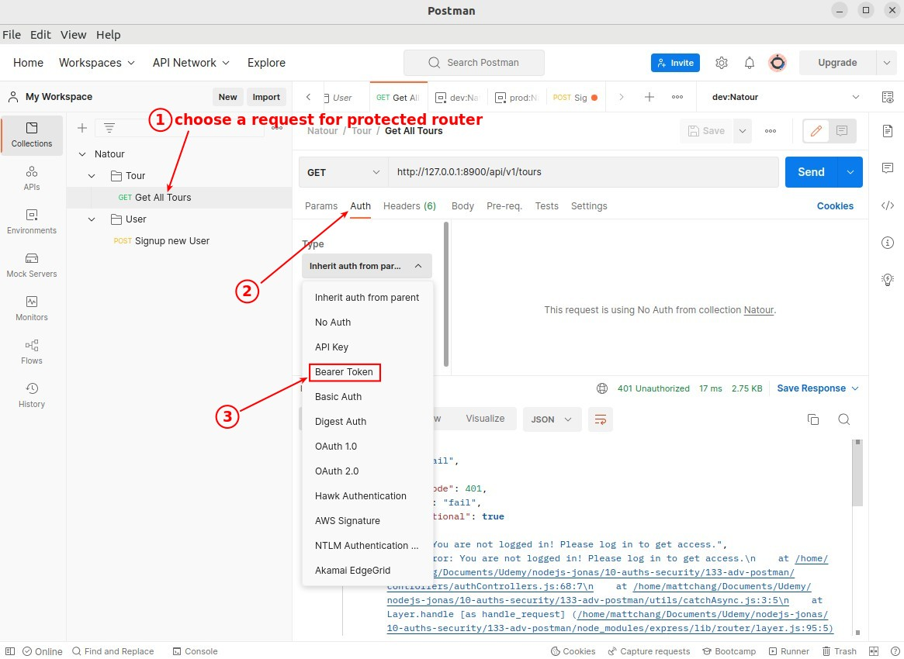

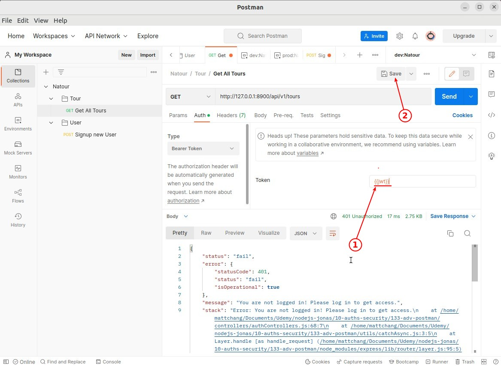

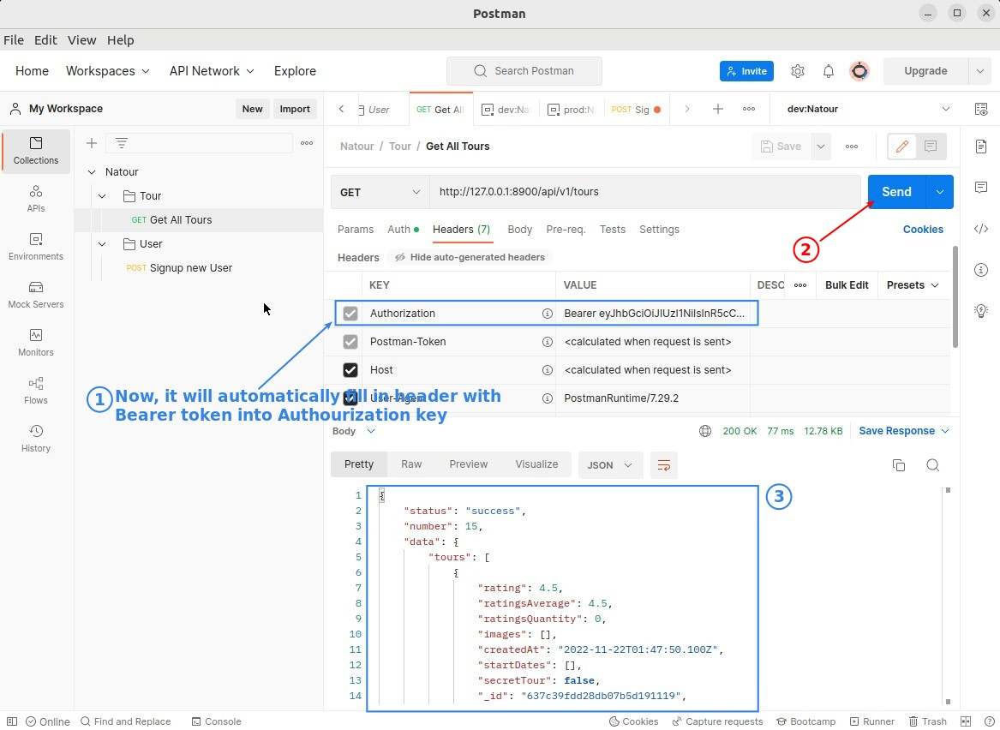
