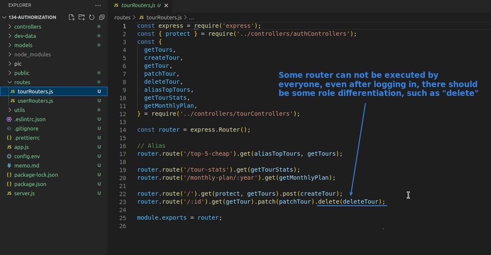
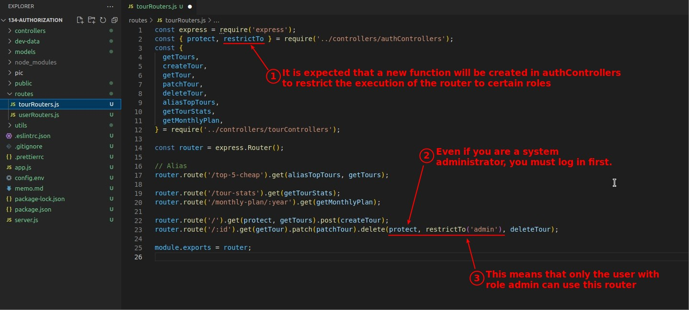
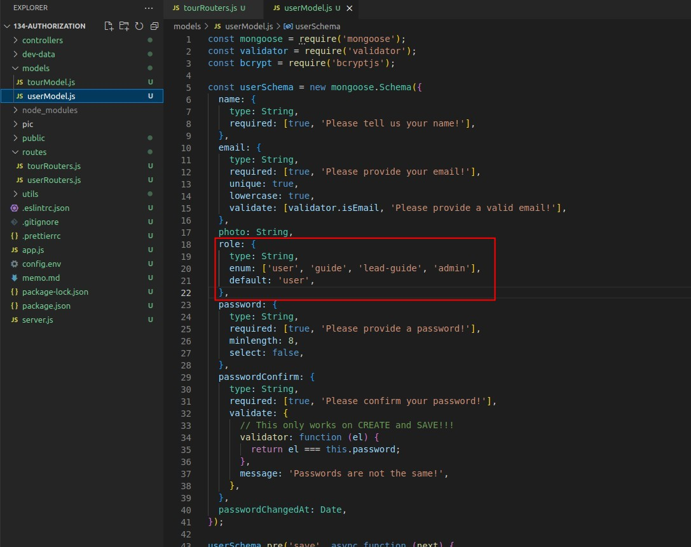
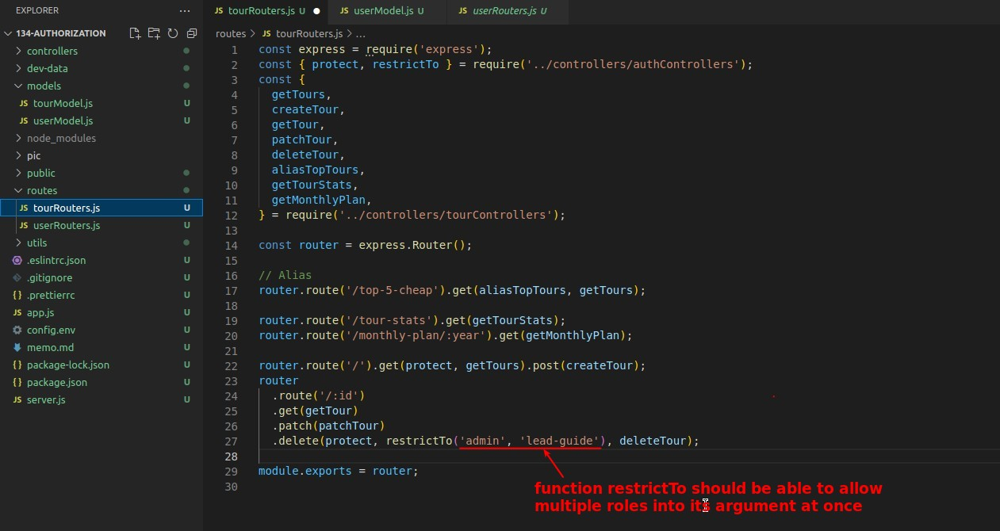
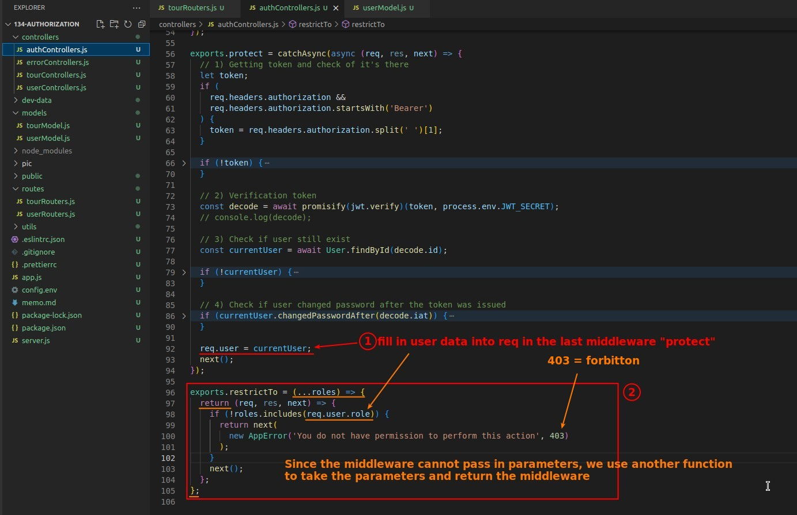
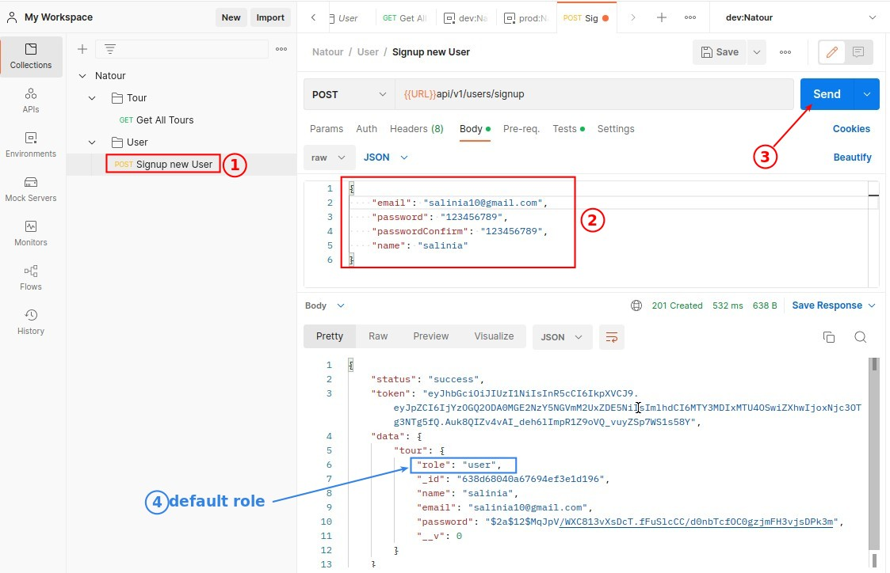
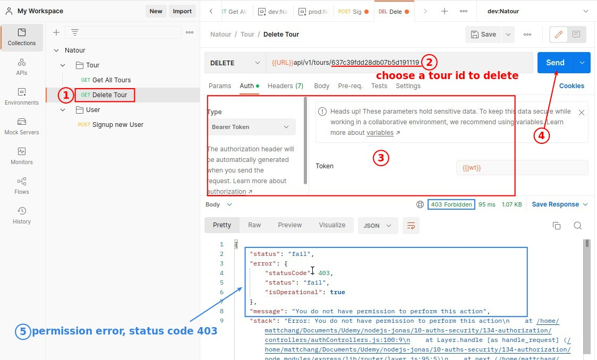

## **Reason to Restrict Role for Routers**

- So after logging in, users must also have the distinction of roles in order to reasonably assign the actions (routers) that can be executed, which is the concept of authorization.

## **Routers**

- restrictTo is our custom function, we define the functionality here first, and then write the content later.

## **Add new field "role" into user Schema**

## **restrictTo: How to pass parameters into Middleware**

- (...roles) is ES6 syntax, which means that the arguments passed to this function are collected in array "roles".

## **Test**

