## **Two Steps to Reset Password**

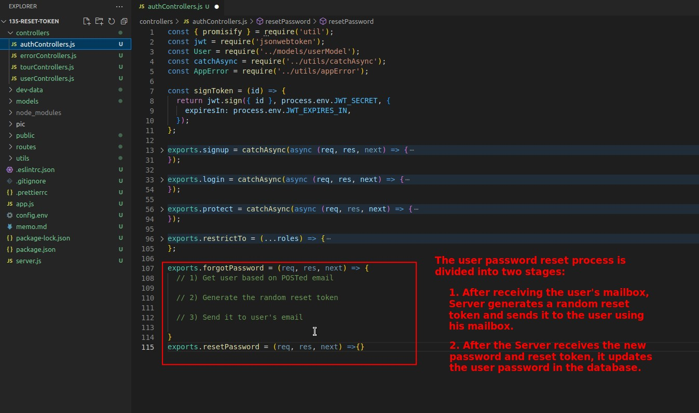

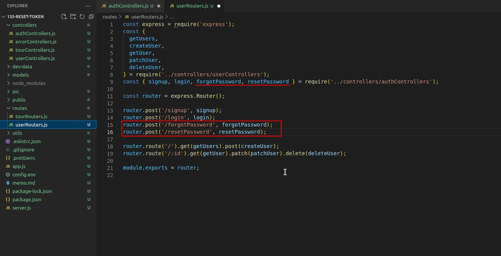

## **Check if Email is Exist**

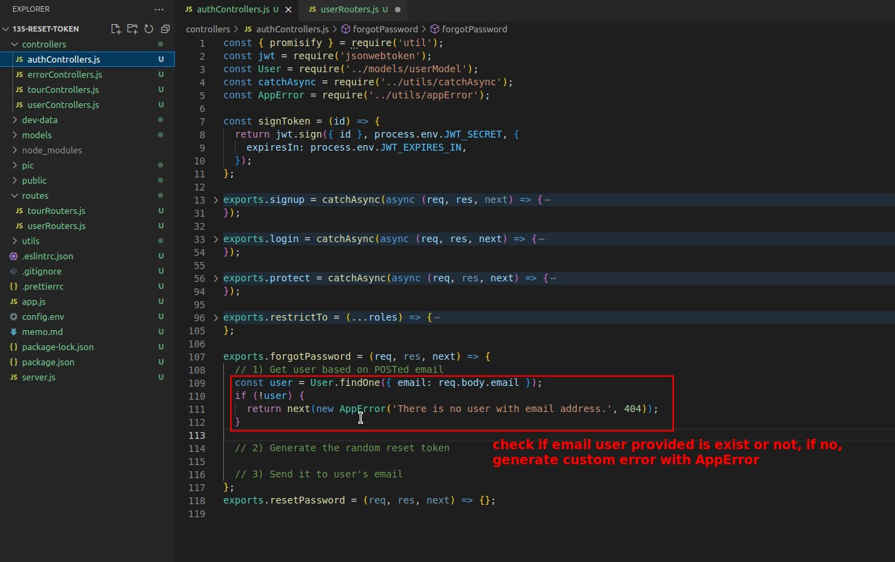

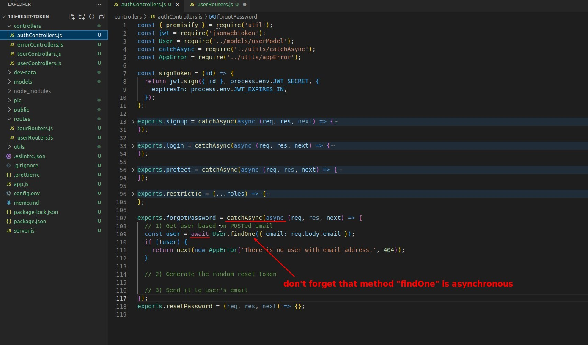

## **Add new Fields of user Schema**

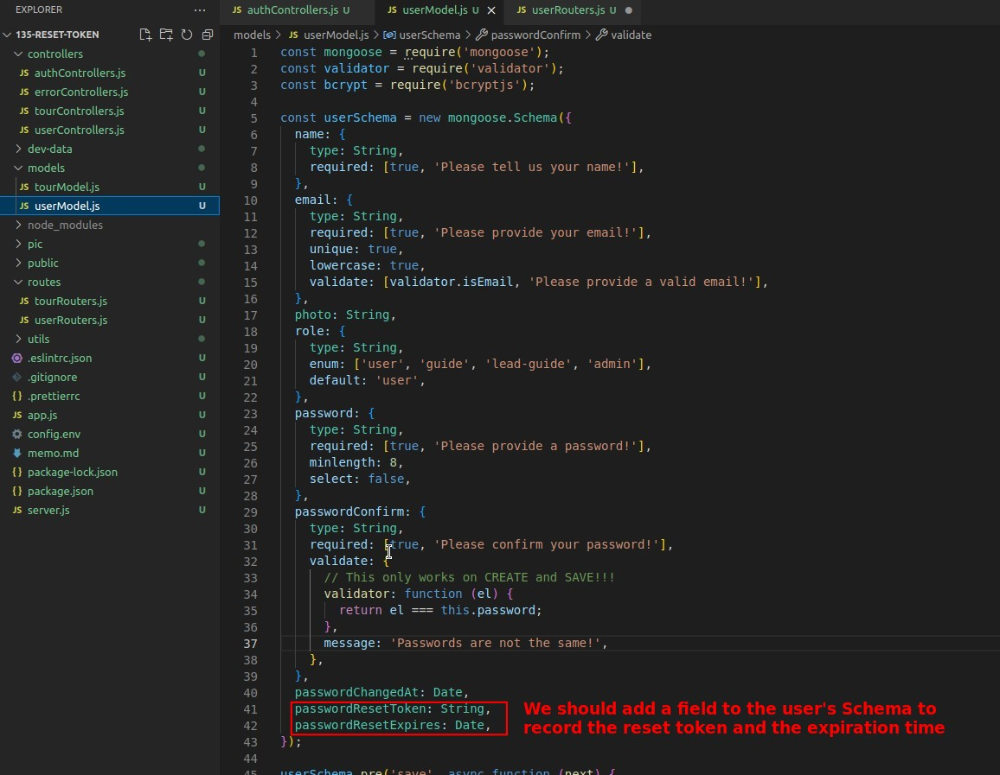

## **Add new Instance Method: cratePasswordResetToken**

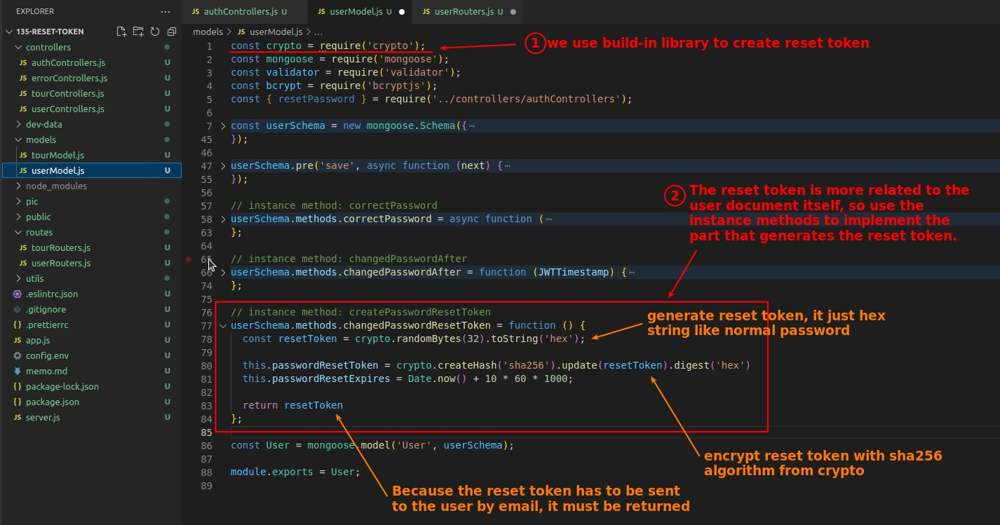

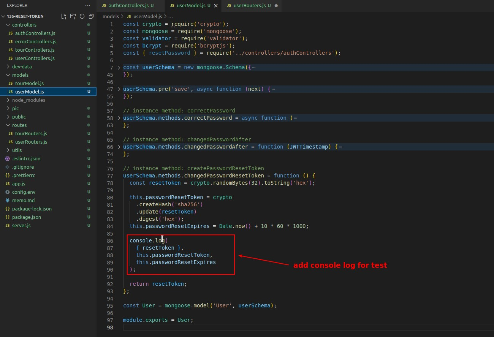

## **Finish 1st Step Function in the Auth Controller**

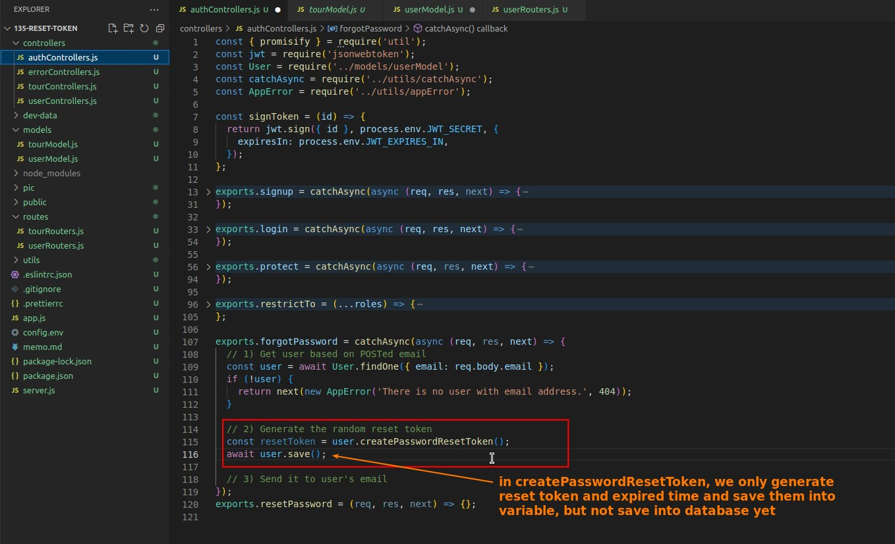

## **Test**

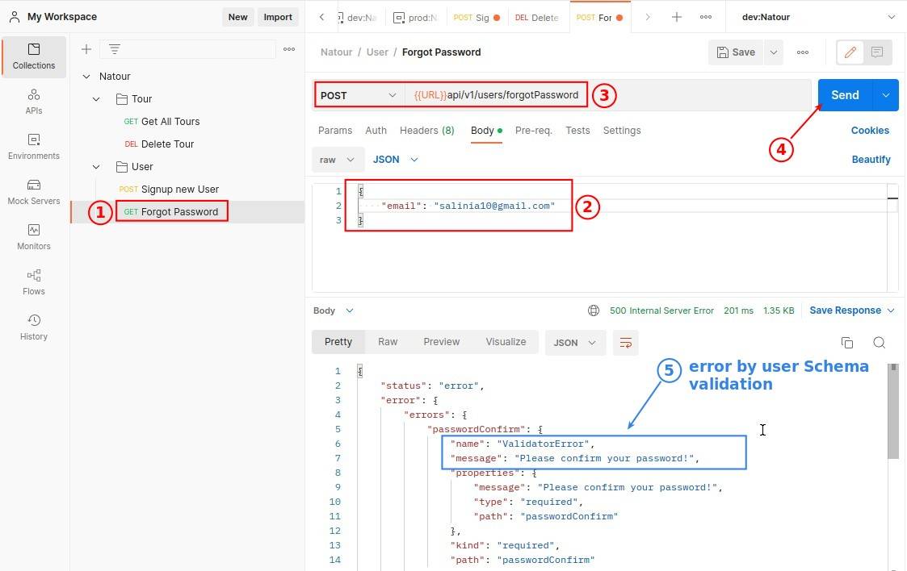

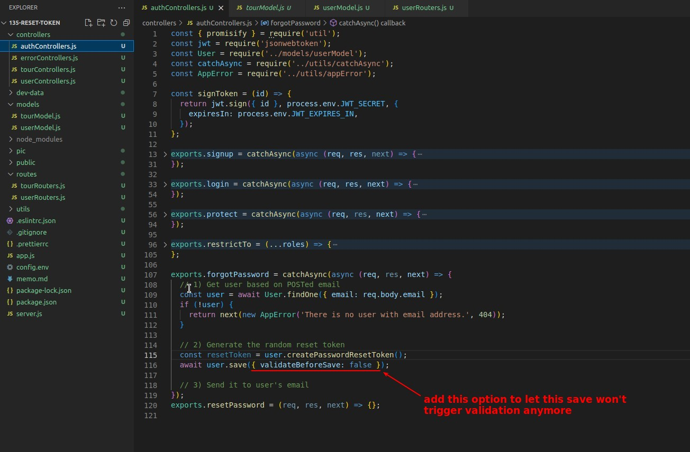

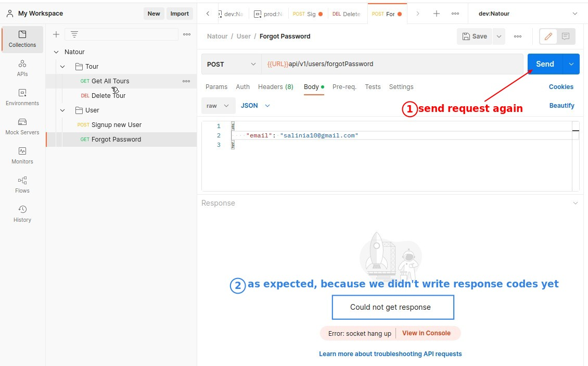

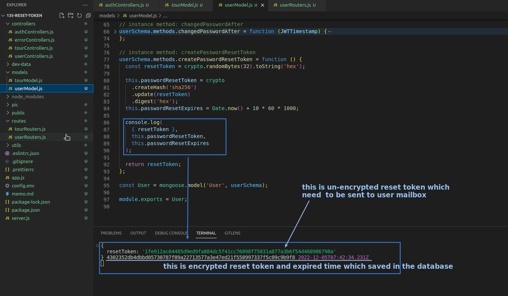
