## **Create New Util - email.js for sending email**

### _nodemailer_

> nodemailer is a third-party package that allows us to send mail using nodeJS

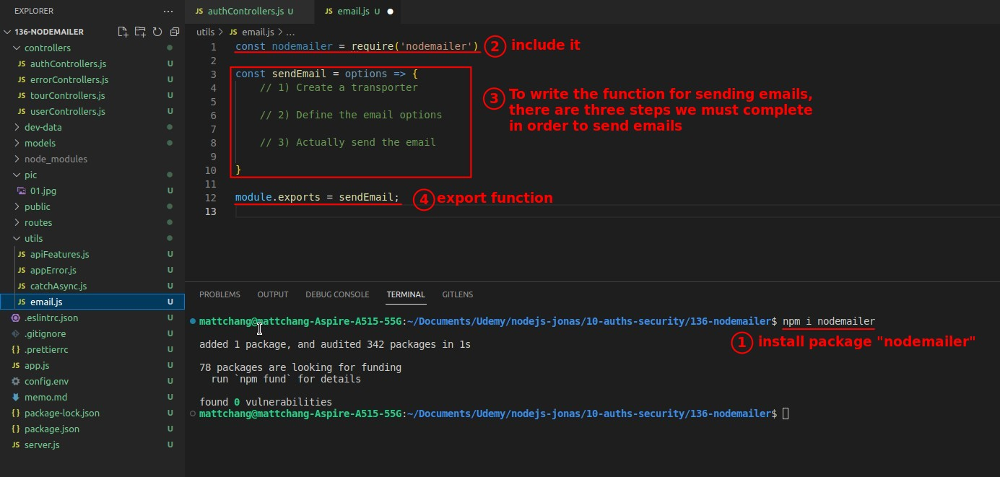

## **Step 1(mail): Create Transporter**

### _Gmail_

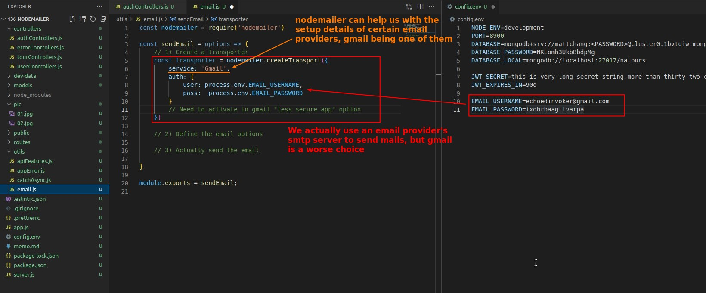

### _MailTrap_

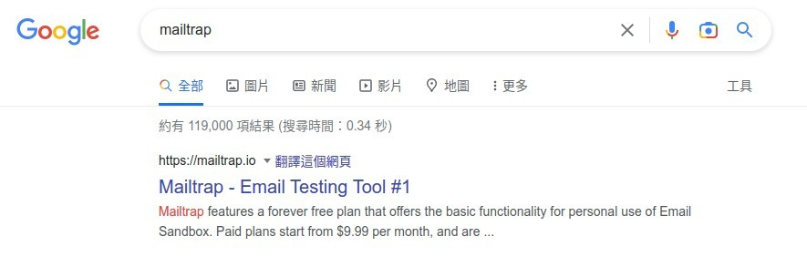

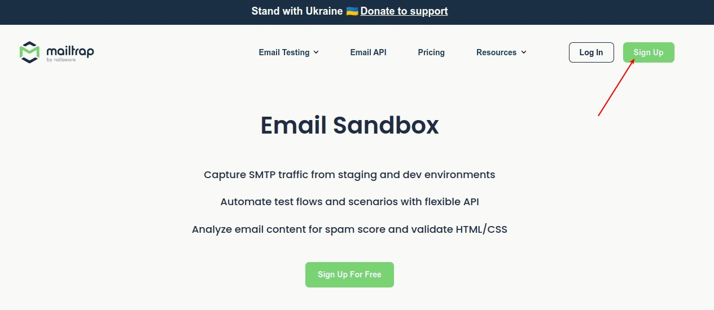

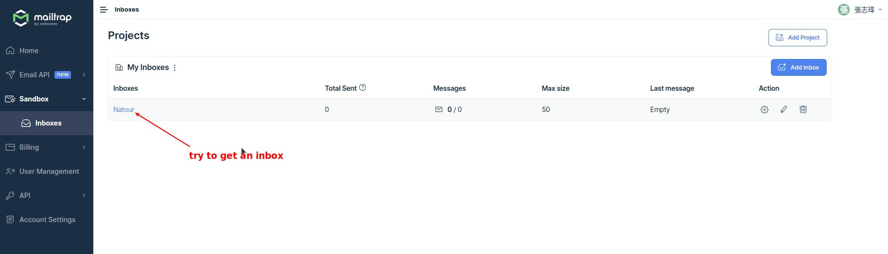

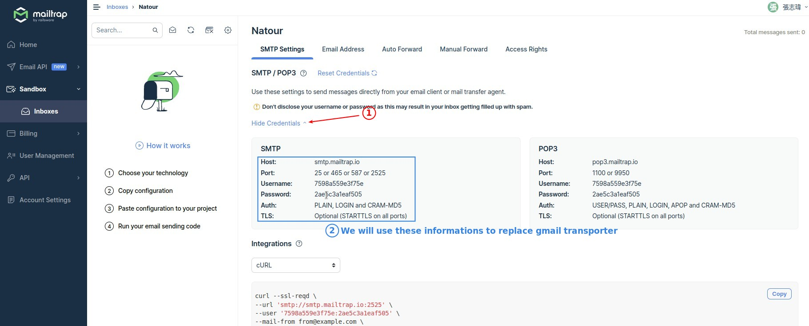

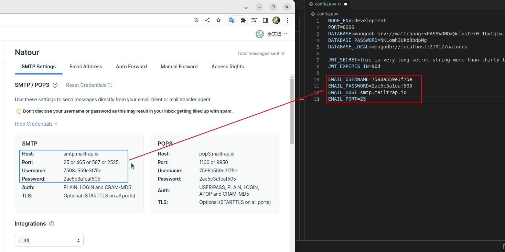

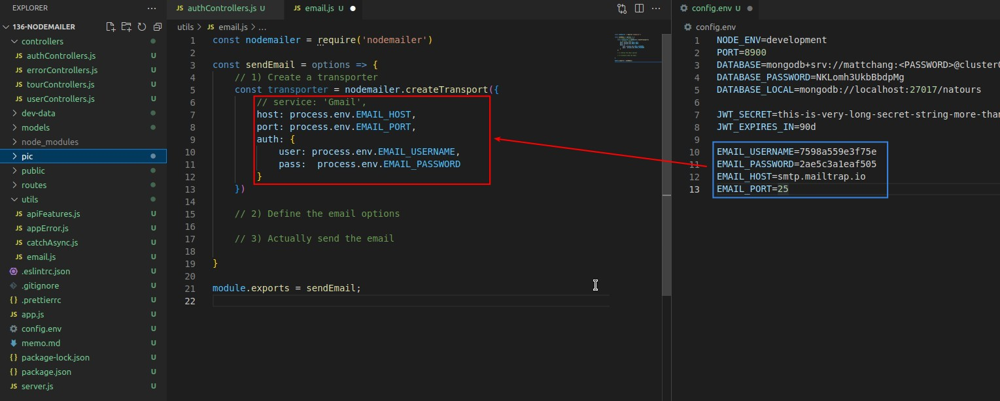

## **Step 2(mail): Define the email options**

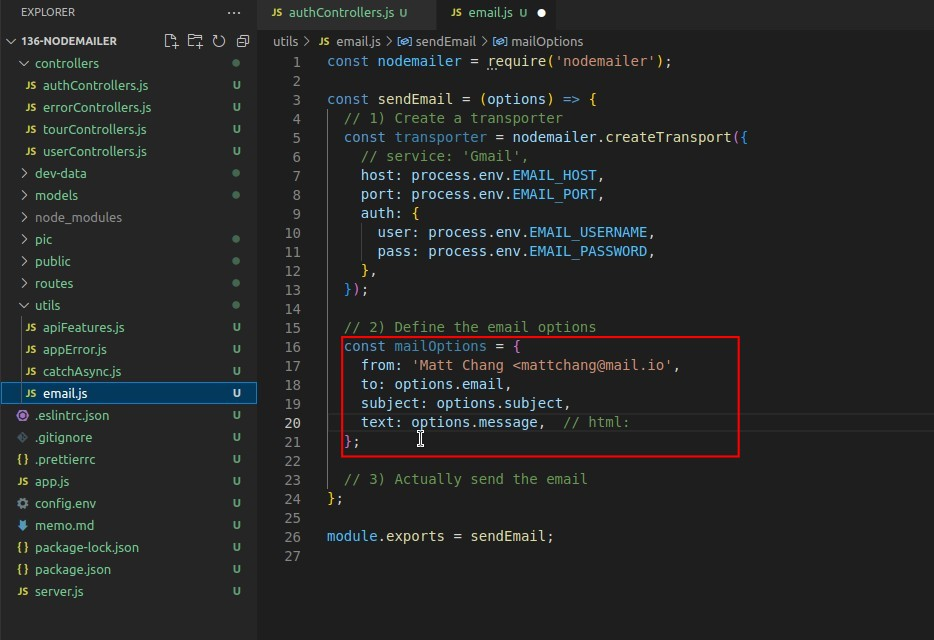

## **Step 3(mail): Actually send the mail**

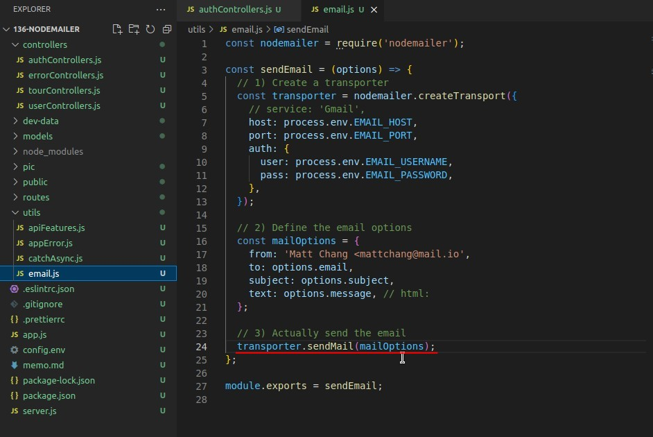

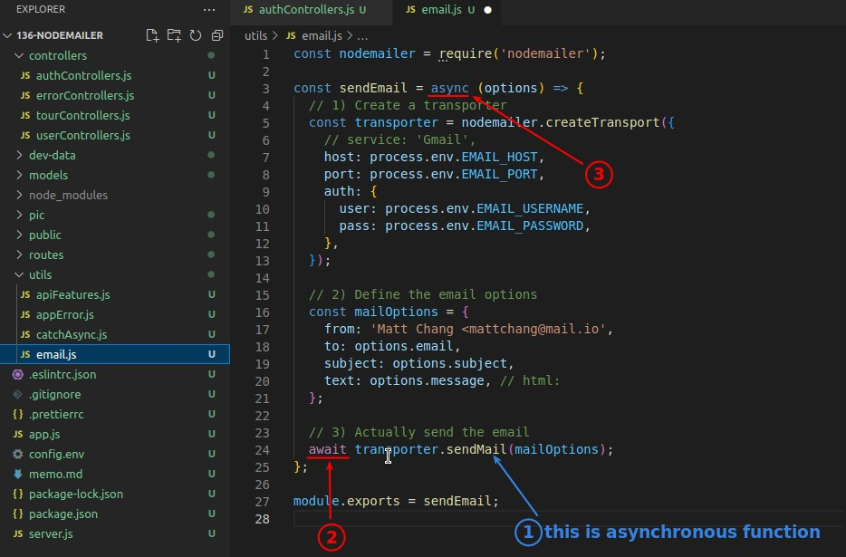

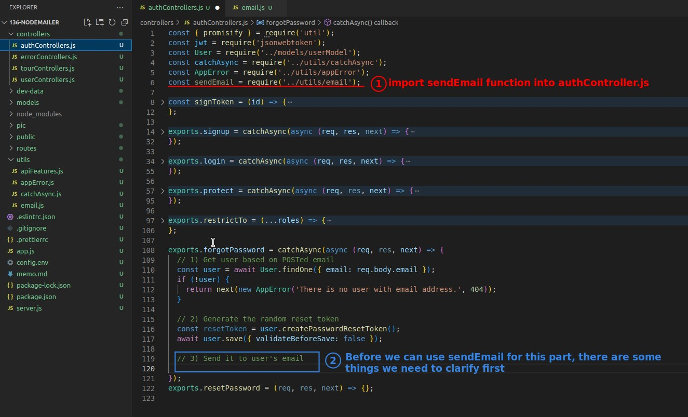

## **The Way We'll Use "resetPassword"**

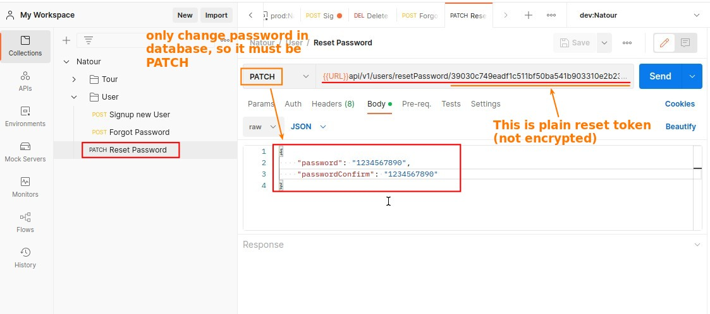

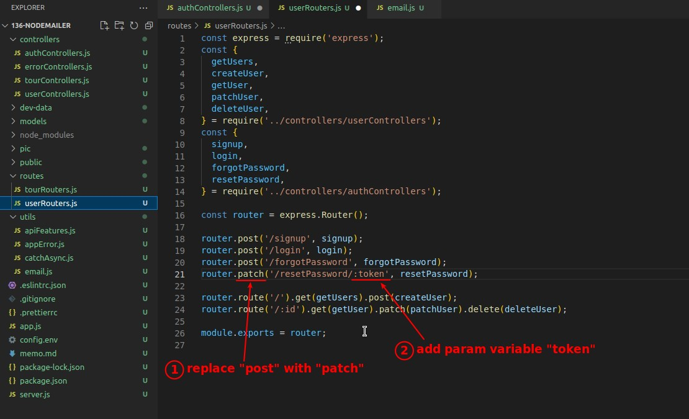

## **Step 3(forgotPassword): Send Reset Token to User's MailBox**

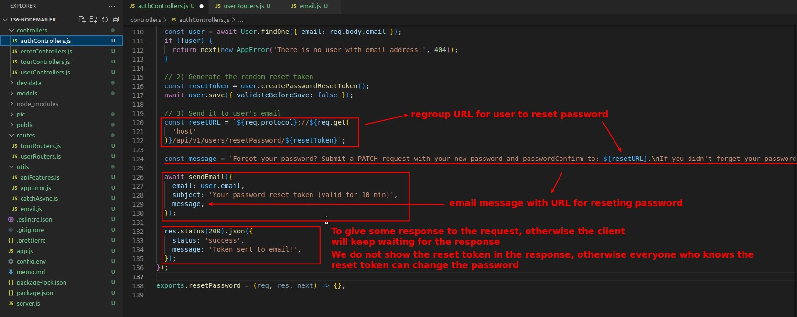

## **Error Handling**

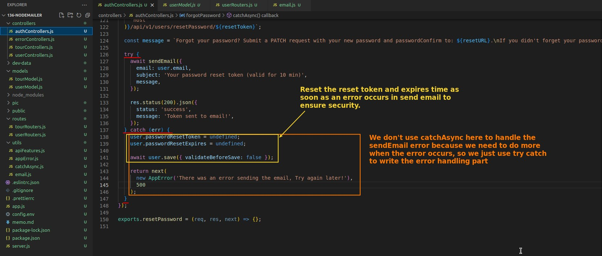

## **TEST**

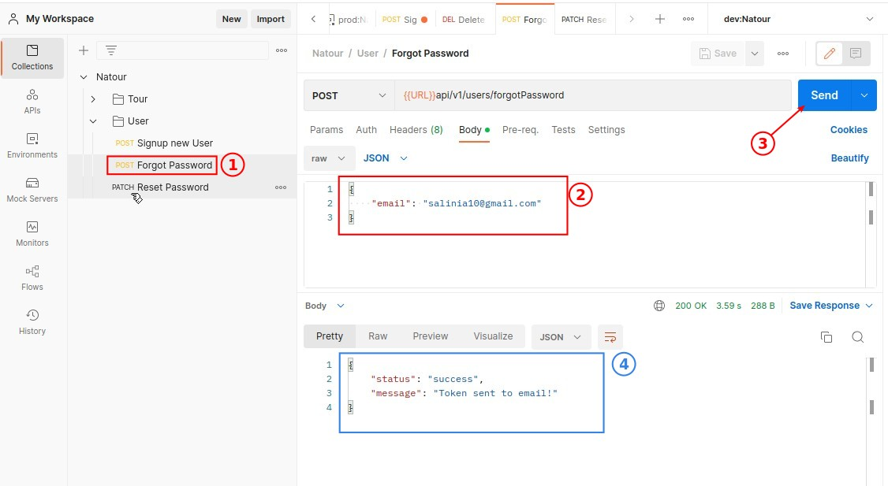

