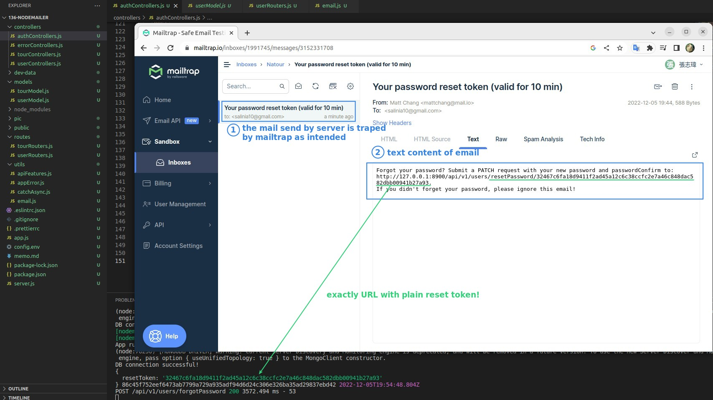

## **Create New Util - email.js for sending email**

### _nodemailer_

> nodemailer is a third-party package that allows us to send mail using nodeJS

## **Step 1(mail): Create Transporter**

### _Gmail_

### _MailTrap_

## **Step 2(mail): Define the email options**

## **Step 3(mail): Actually send the mail**

## **The Way We'll Use "resetPassword"**

## **Step 3(forgotPassword): Send Reset Token to User's MailBox**

## **Error Handling**

## **TEST**

