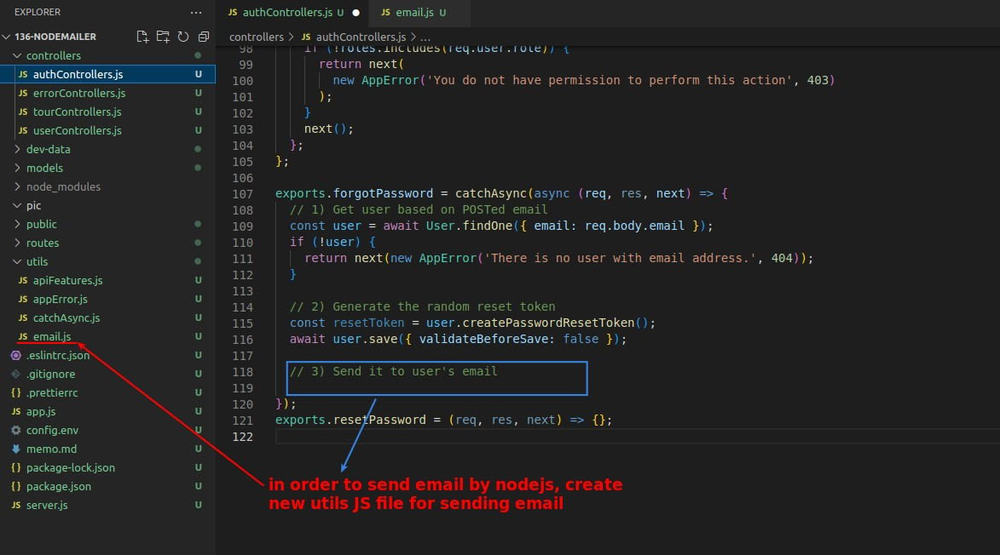

## **Create New Util - email.js for sending email**

### _nodemailer_

> nodemailer is a third-party package that allows us to send mail using nodeJS

## **Step 1(mail): Create Transporter**

### _Gmail_

- Because gmail will be regarded as an email abuser if you send more than 500 letters in a day, and then the experience will get worse and worse, so gmail is not a good choice for the app.

### _MailTrap_

> MailTrap is a sandbox for mailboxes, it can trap the letters we send in it without actually sending them to the client or user's mailbox, which is suitable for testing the mailbox function.

- Because mailtrap is not one of the default mail providers of nodemailer, we need to fill in the host and port information ourselves.

## **Step 2(mail): Define the email options**

## **Step 3(mail): Actually send the mail**

## **The Way We'll Use "resetPassword"**

> Here's how we'll use router "resetPassword" in the future lectures.

- You can see that the plain reset token will be the param variable, and the user will provide the password and passwordConfirm in the body.
  - So the router about "resetPassword" needs some changes.

## **Step 3(forgotPassword): Send Reset Token to User's MailBox**

> The third step of the function "forgotPassword" is to use the function sendEmail written in utils to send an email with the "resetPassword" URL link to the user.

- Note that the URL is written using "req.protocol" to get http or https and "req.get('host')" to get the domain, rather than using the dead write approach.

## **Error Handling**

> We used catchAsync to handle async errors in the controller before, but since the error handling here needs more work, we go back to the original try catch approach to write the error handling part.

## **TEST**

