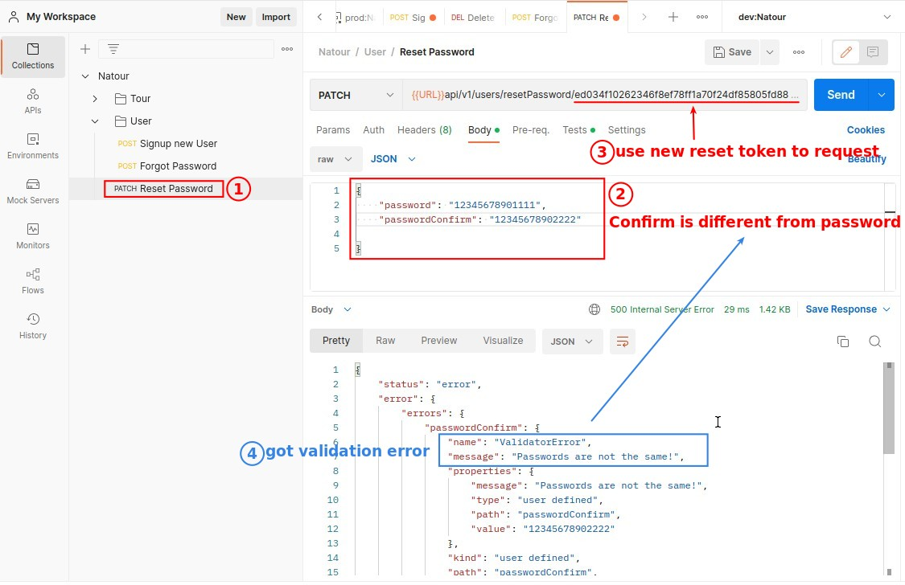

## Define all Steps of function "resetPassword"\*\*

## **Step 1: Get user based on the reset token**

## **Step 2: If reset token has not expired, and there is user, set the new password**

## **Step 4: Response JWT to client**

## **Test**

## **Test again, the reason we use ".save" to update user document**

## **Step 3: Update "changedPasswordAt" for the user**

## **Test for property "passwordChangedAt"**

