## **Define all steps of function "updatePassword**

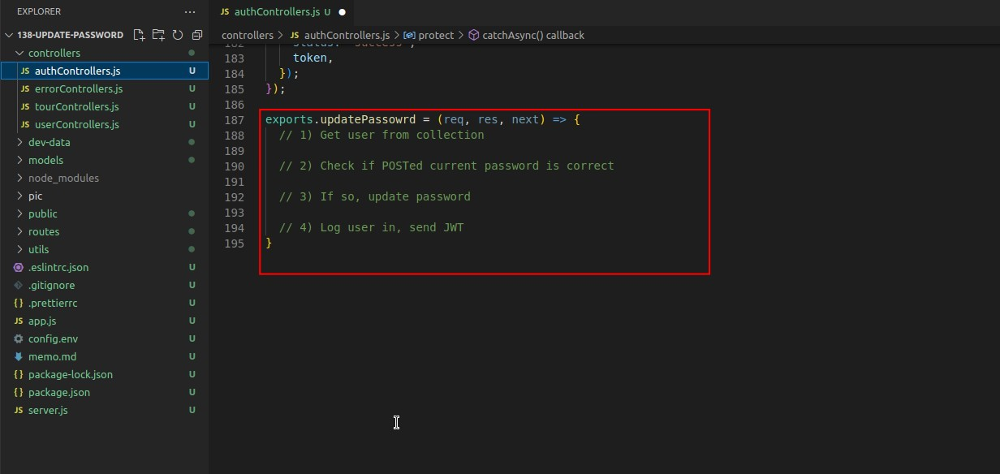

- The difference from forgotPassword/resetPassword is that updatePassword changes the password while the user is logged in, so it should be a lot easier.

## **Challenge**

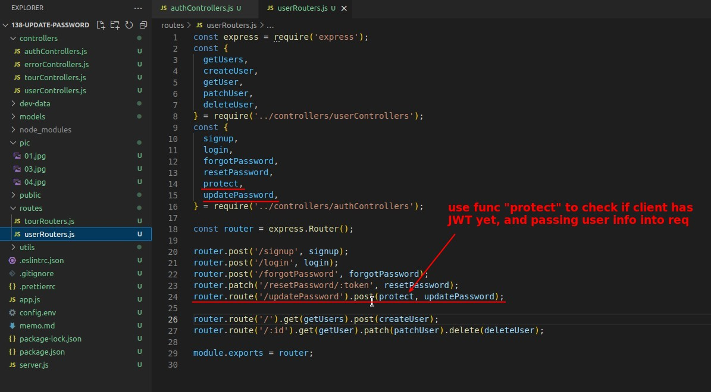

- I choose to use the middleware "protect" before the function "updatePassword" to check if there is a token and get the user information into the req.

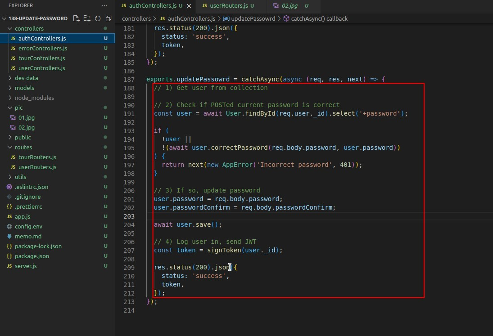

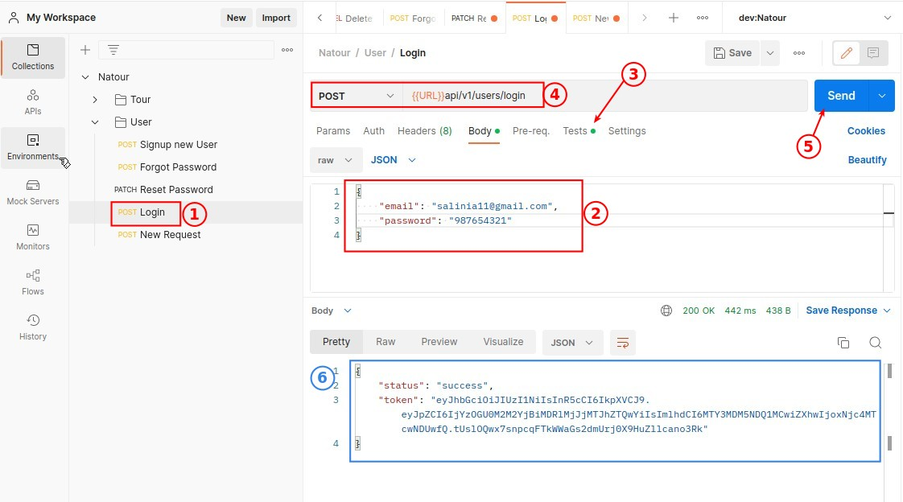

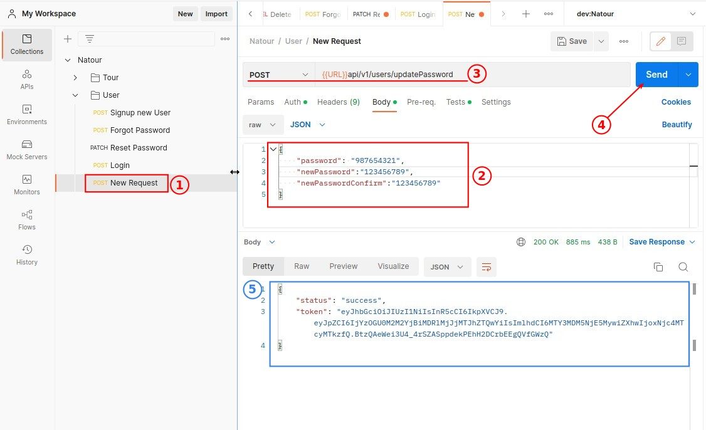

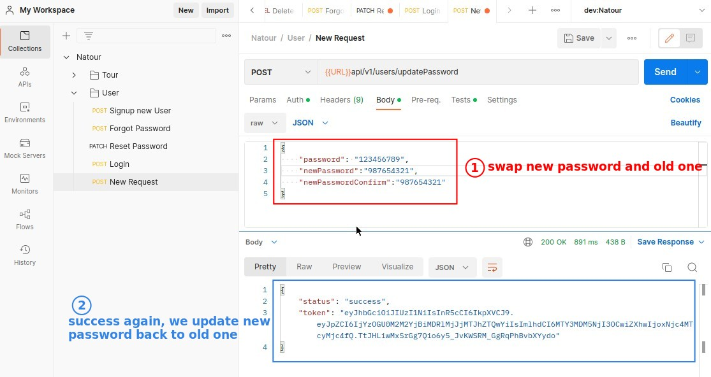

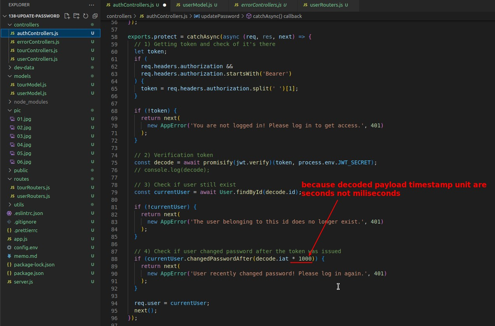

## **Answer by Lecturer**

> Generally speaking, the solution is the same as my own, except that there is a further step to refactor sign Token codes.

### _Refactor Signing Token and Response_

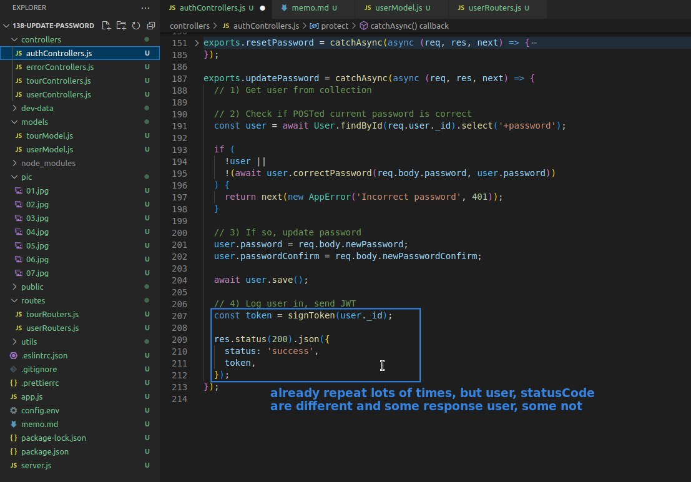

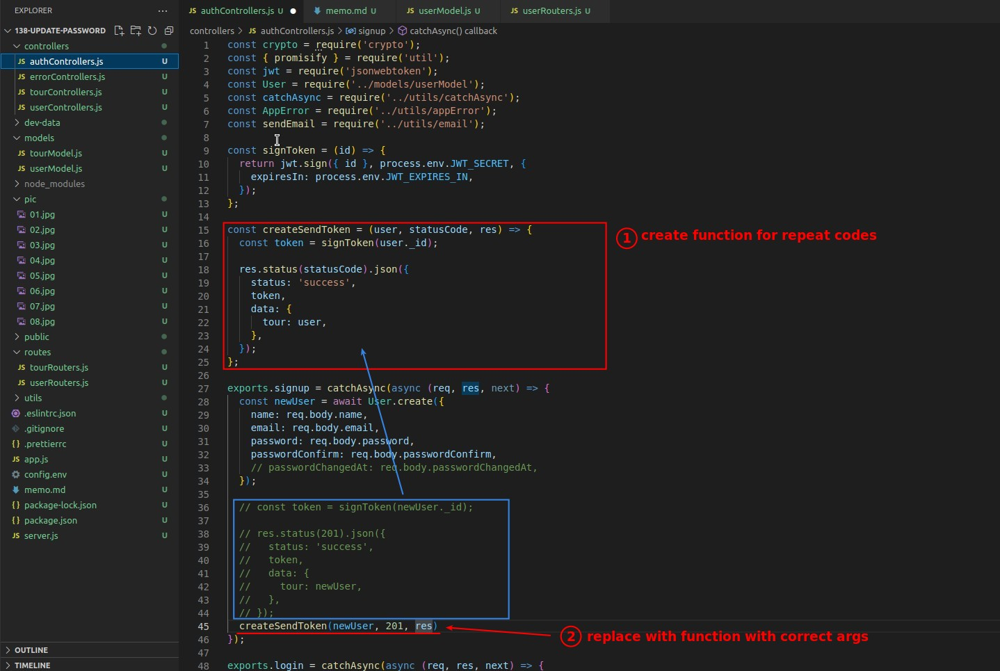

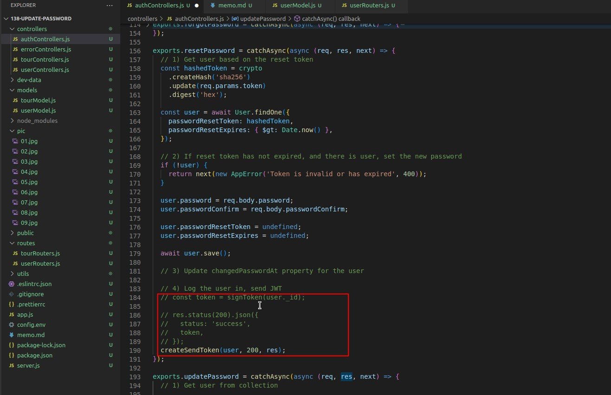

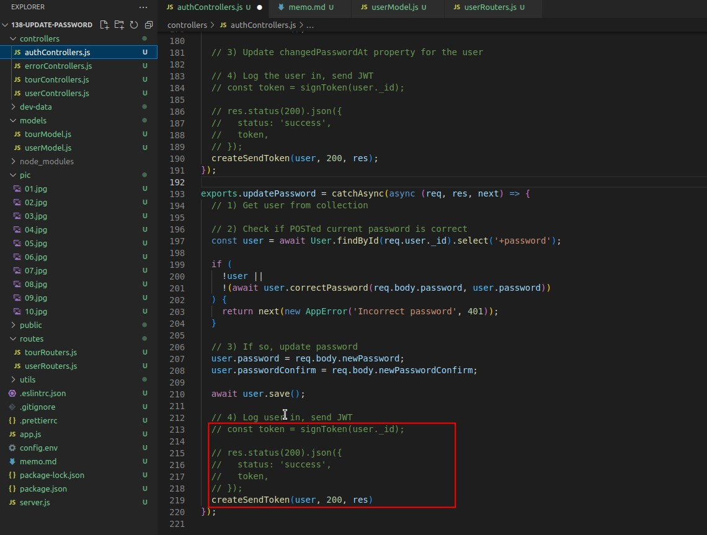

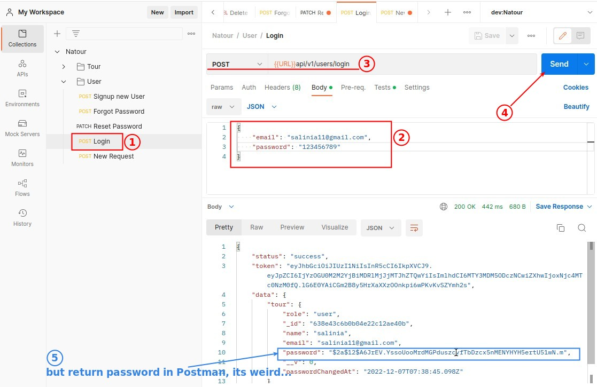

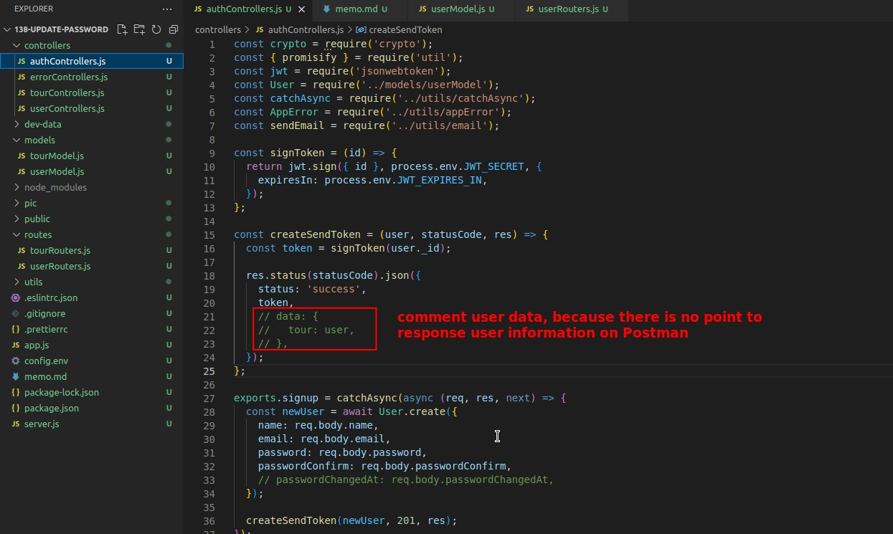

### _lecturer use PATCH_

- Another difference is that the lecturer uses PATCH instead of POST, but both results are the same, and both should work, because the user data we get after using findOne to modify the user information and save back is also the complete user data.
