## **updateMe**

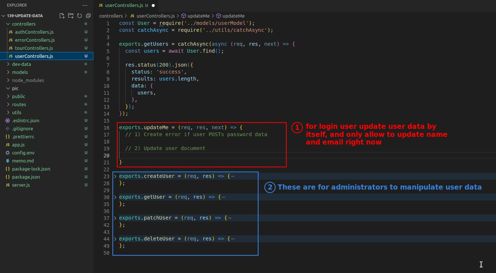

- Note that updatePassword is placed in authController, and updateMe is placed in userController, we are used to put the two functions in separate controllers with different resources, this is just a common design approach, and we just follow the convention.

## **Create Error if user POST password/passwordConfirm**

> Because update password is a function of updatePassword and not a function of updateMe here, so when the user request body provides password-related data, it must generate an appropriate error message to the client.

### _controller_

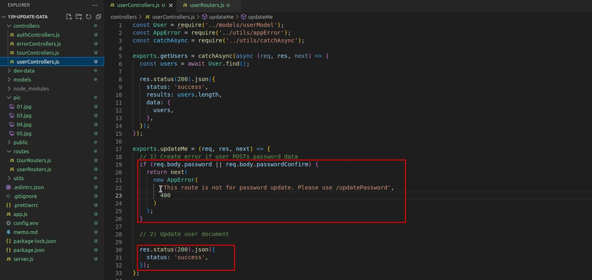

### _router_

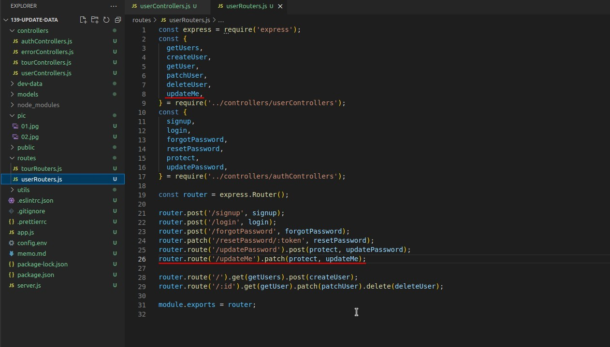

### _POSTMAN test_

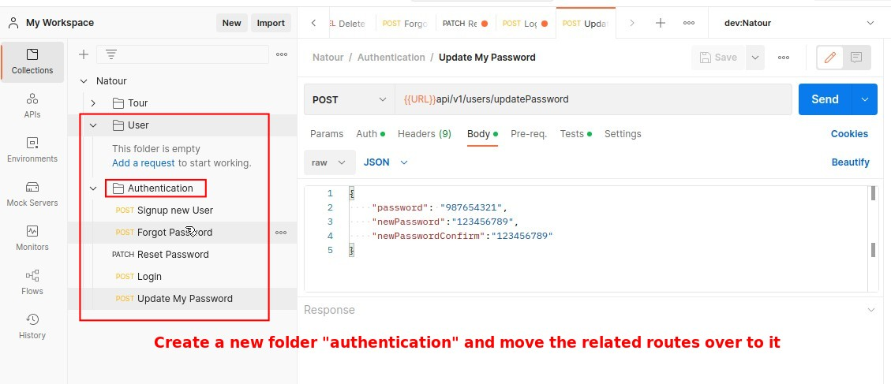

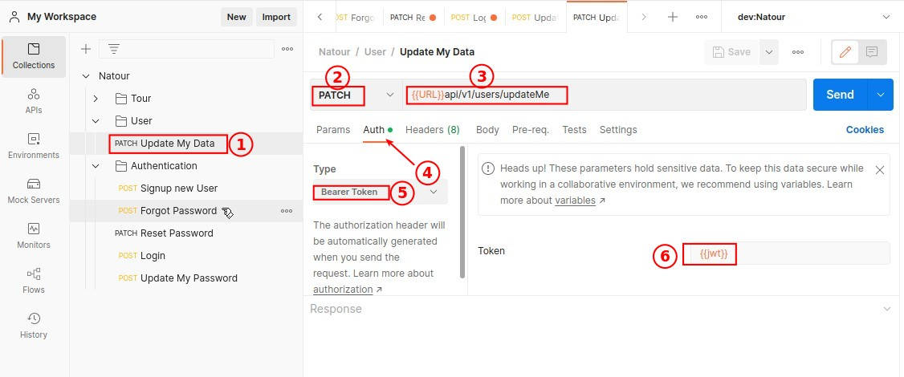

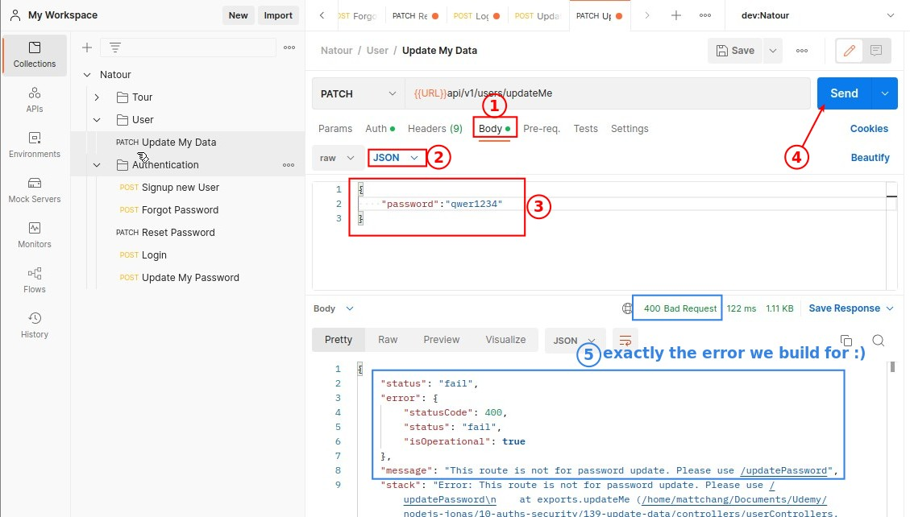

## **Update User Data with .save**

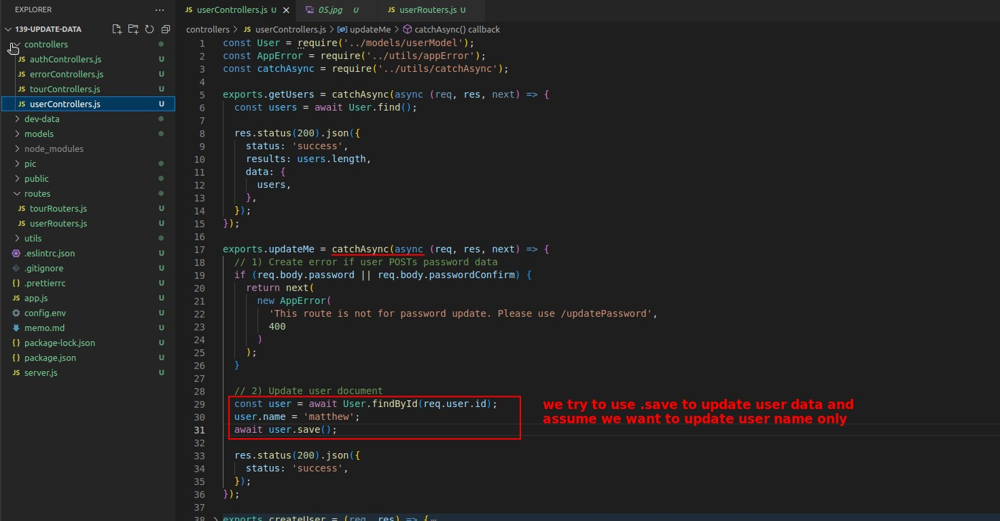

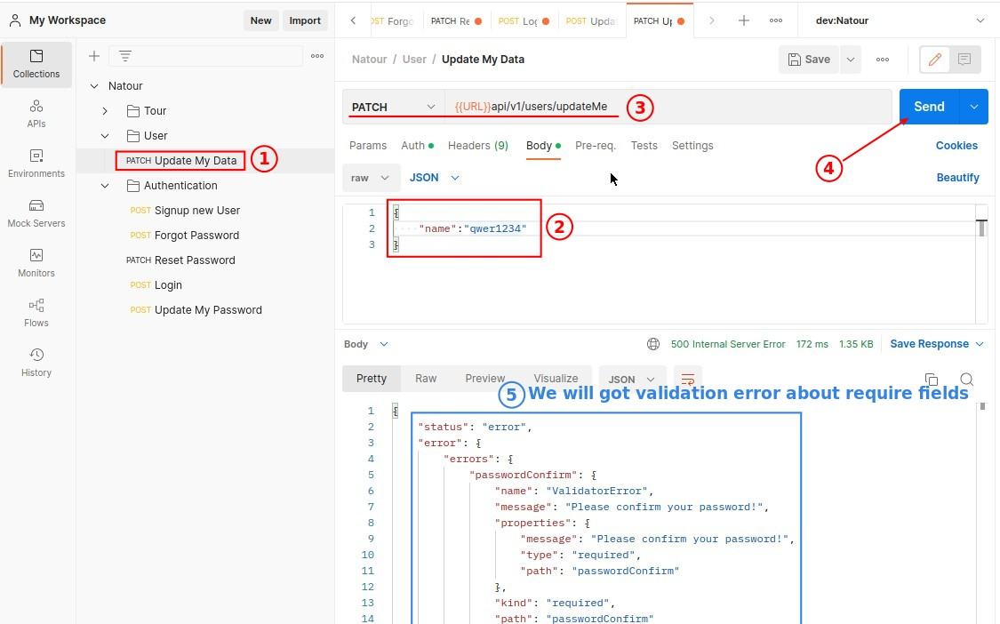

- Because .save will directly validate the attached user object content, it will produce the above error result and is not suitable for this situation.

## **Replace .save with .findByIdAndUpdate**

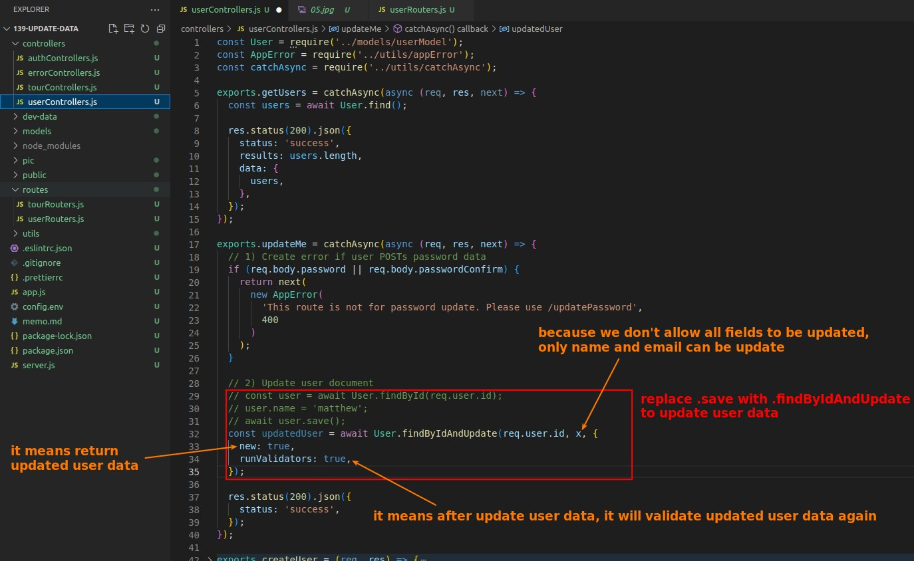

- We turn on validation in the third parameter option, but the difference with .save is that although there is validation, it doesn't generate error messages like require password.

## **Filter Request Body**

> Not every field except the password can be updated, for example, "role" is not suitable to be updated by the user himself, so we need to filter the body of the client request.

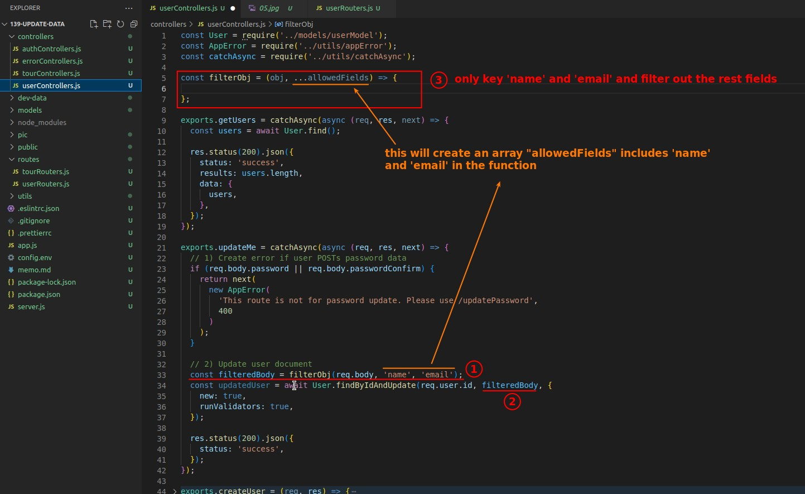

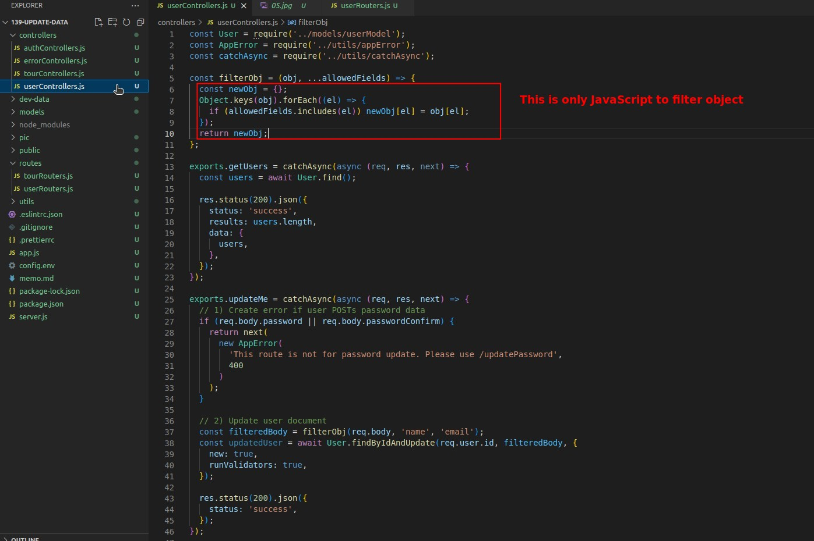

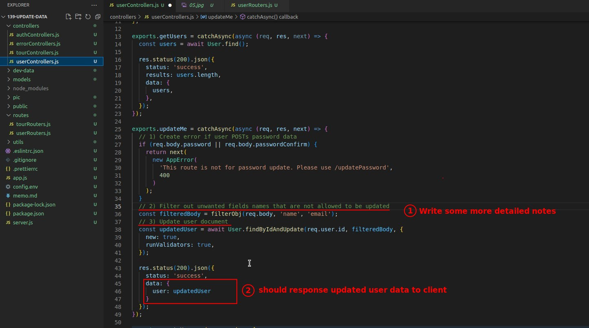

## **Final Test**

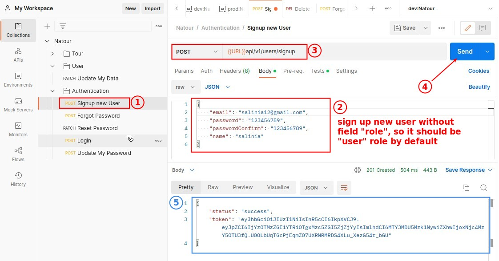

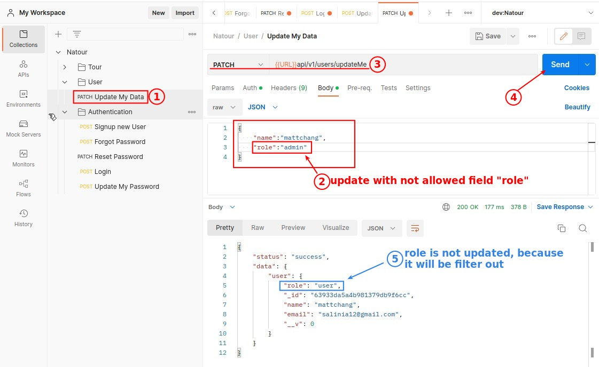
