## **Implement Deleting user**

> This lecture will implement a router that allows users to delete their accounts.

### _Add new property 'active' into user Schema_

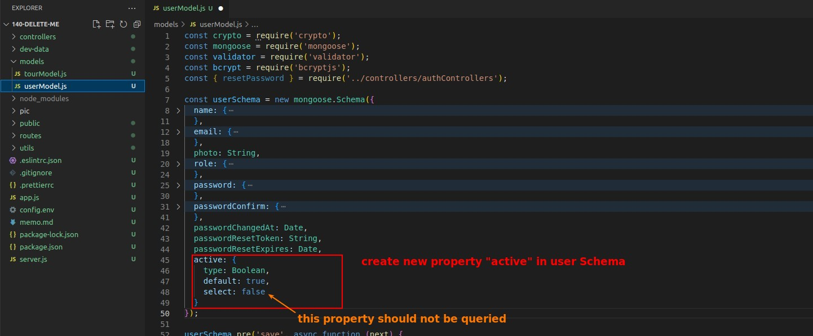

### _function 'deleteMe' in userControllers_

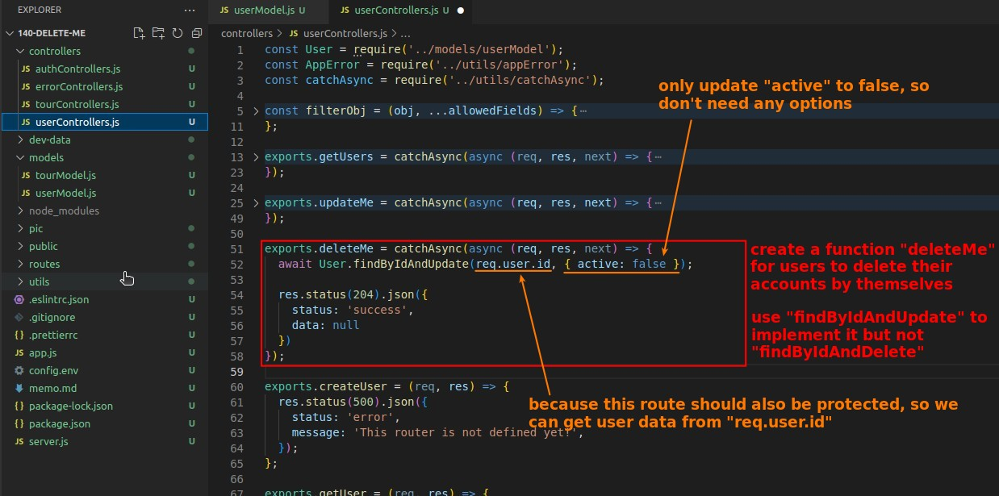

- status code 204 means 'no content', use this code to not response any message to the client side.
- Note that here we are using the method "findByIdAndUpdate" instead of "findByIdAndDelete", because we are not deleting the user data from the database

### _router '/deleteMe' in userRouters_

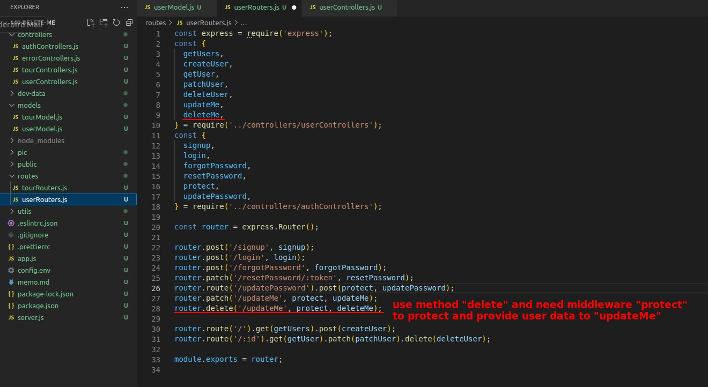

- Note that the router name is wrong in the above picture, it should be '/deleteMe'.

## **Test**

### _create request 'Delete My Account' in Postman_

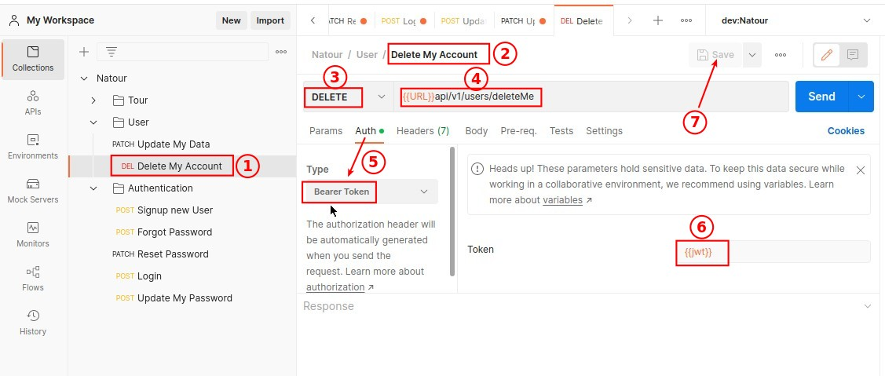

### _Query all users data_

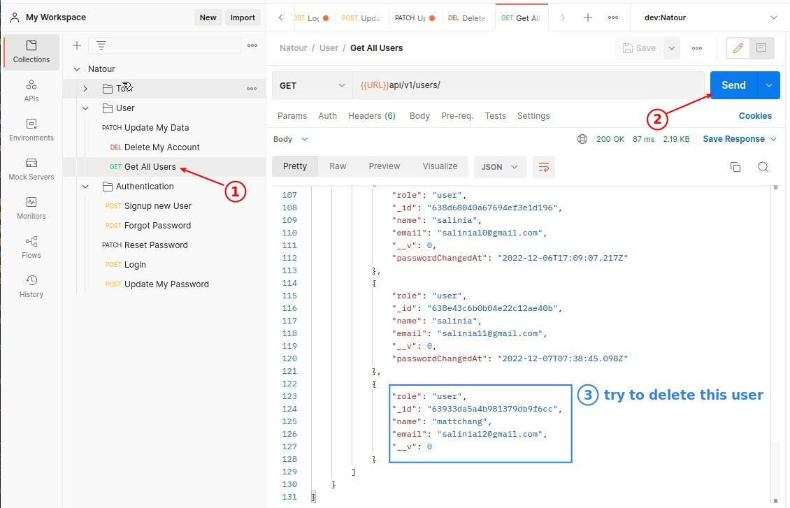

### _Login_

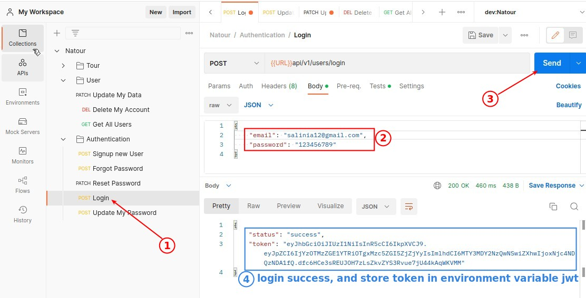

### _Delete account_

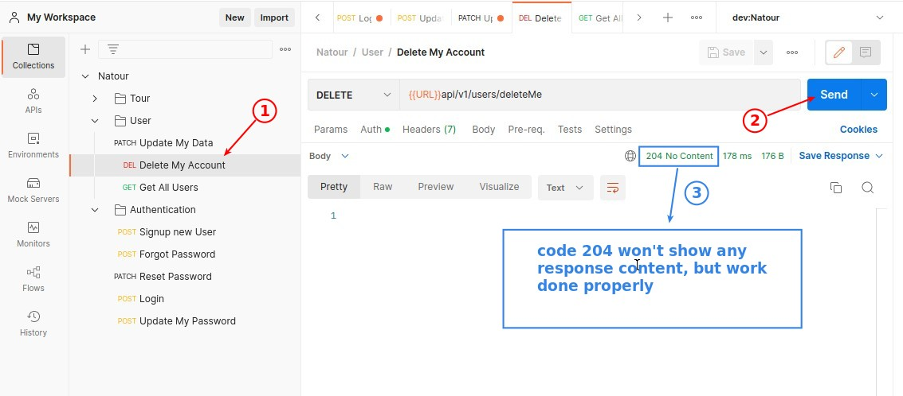

### _Check if account exist by Querying request_

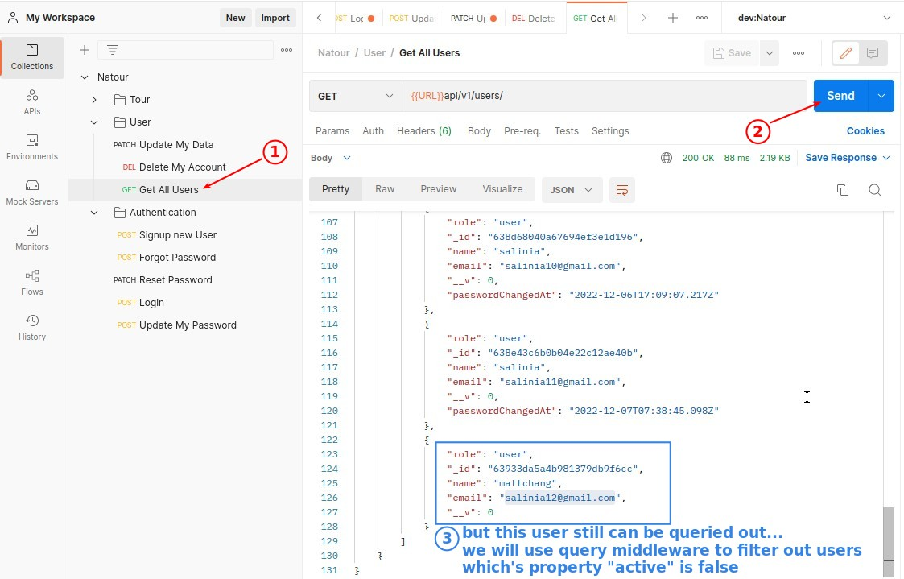

## **Use pre-query-hook Middleware to Filter Out inactive users**

### _Use regular expression to select all methods start with 'find'_

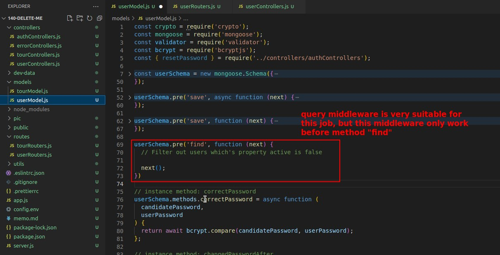

- The method "find" used here is an instance method for current user documents, unlike User.find, which can change current user documents directly based on the query result.

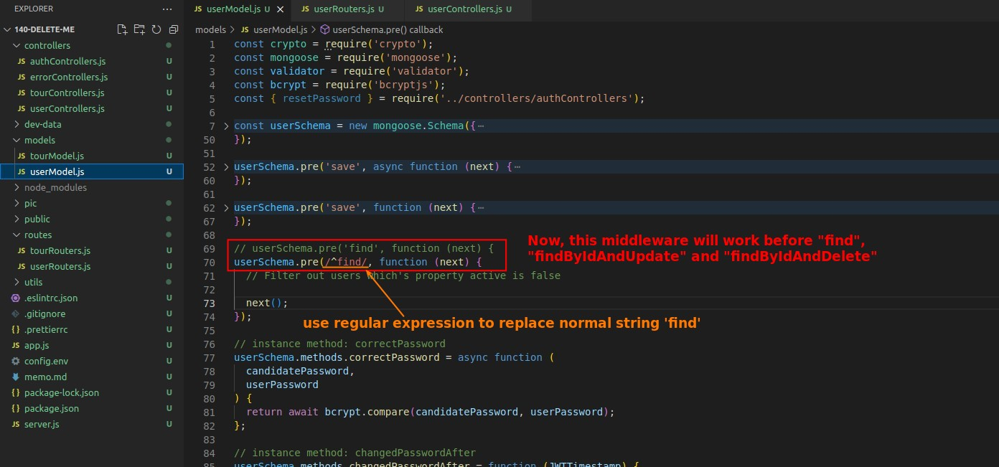

### _Instance method of current user documents and query condition_

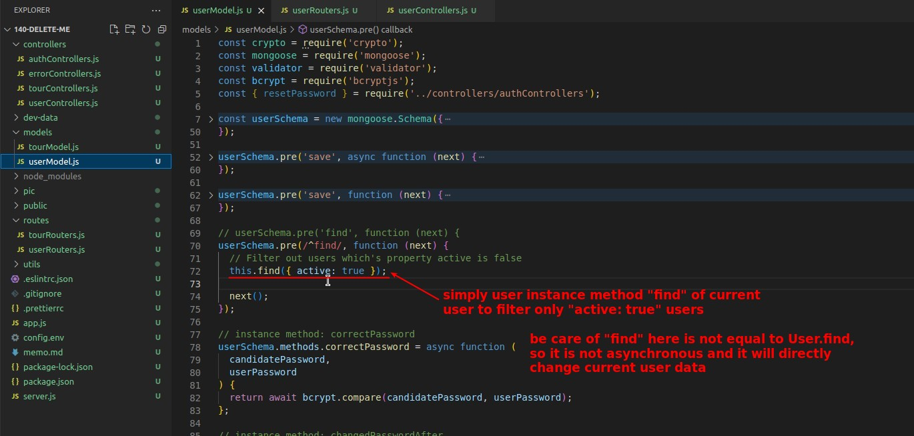

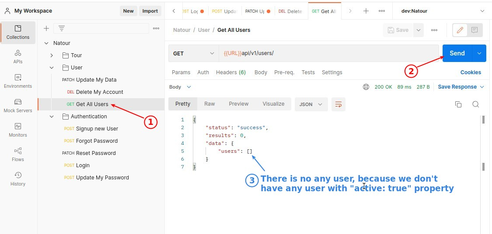

### _Final Test_

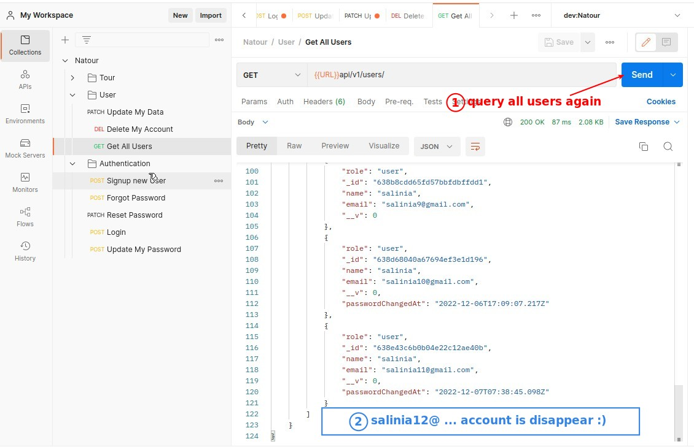

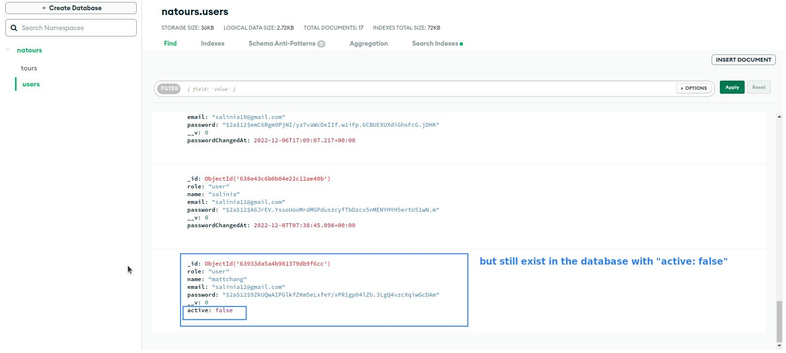

- You can find that although you can't query inactive users anymore, the data of these inactive users still exists in the database.
