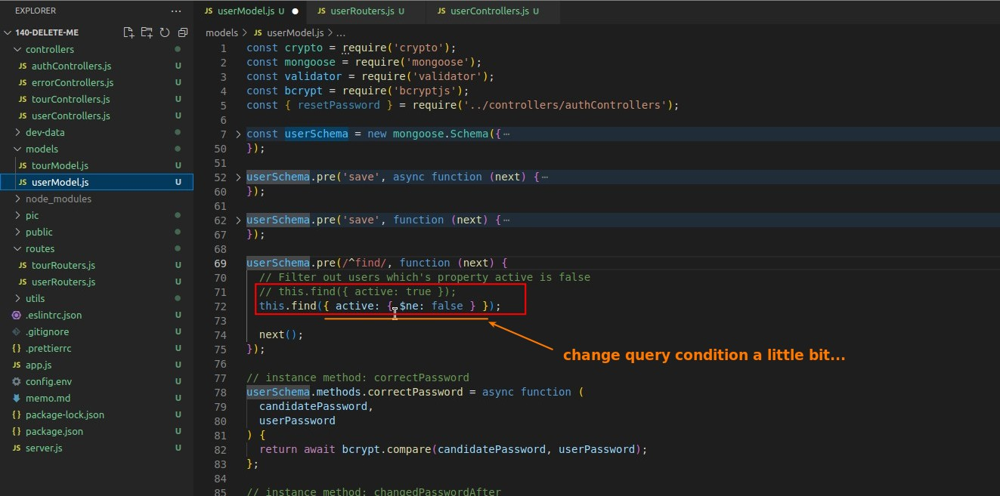

## **Implement Deleting user**

## **Test**

## **Use pre-query-hook Middleware to Filter Out inactive users**

### _Use regular expression to select all methods start with 'find'_

### _Instance method of current user documents and query condition_

### _Final Test_

