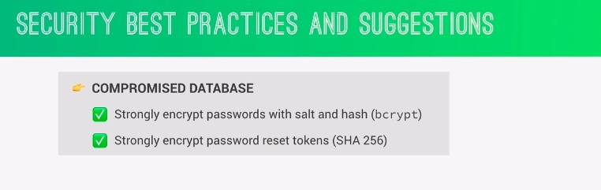
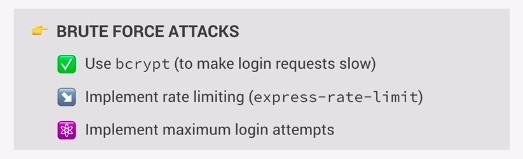
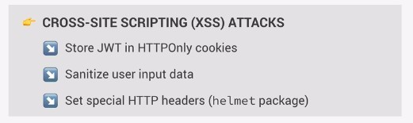
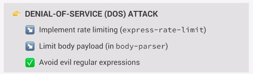
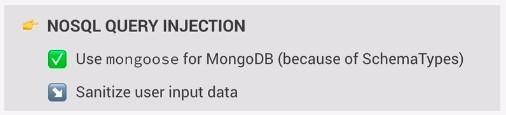
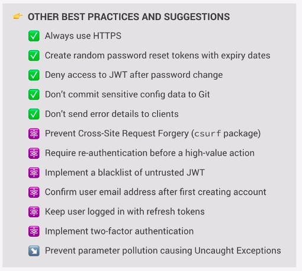

# **_SECUIRITY BEST PRACTICES AND SUGGESTIONS_**

> Security mainly come from the way to deal with various attacks, so there will be a lot of security practices, if you want to learn all of them, you should go to other security experts course to learn, so this lecture is only a brief summary of various security attacks and their corresponding best practices, not further to discuss each part in detail.

## **COMPROMISED DATABASE**

> This means that the attacker has gained access to our database.
> 

- The above are actually passive defense approaches, simply to prevent further damage from occurring.

## **BRUTE FORCE ATTACKS**

> This means that the attackers tried to log in with millions of random passwords until they were successful.
> 

- Example of the third approach: If a user fails to log in ten times, the user's login function is temporarily suspended for one hour.

## **CROSS-SITE SCRIPTING (XSS) ATTACKS**

> The attacker tries to inject their own script into our page to run their malicious code, which will allow the attacker to read the local storage.
> 

## **DENIAL-OF-SERVICE (DOS) ATTACK**

> The attacker sends too many requests to the server causing it to crash.
> 

- What is a revil egular expression?

## **NOSQL QUERY INJECTION**

> Instead of entering valid data, the attacker injects some queries to create query expressions when querying data.
> 

## **OTHER BEST PRACTICES AND SUGGESTIONS**

- If HTTPS is not used for communication between server and client, anyone can listen to the contents of the conversation and steal our JWT.
- Sensitive config data such as passwords and tokens of any kind should never be uploaded anywhere(such as Git, database, provider storage...).
- Don't respond with a complete error to the client. Stuff like the stack trace could give the attacker some valuable insights into your system.
- Other parts of this course will not be implemented, so if you are interested, you can find security courses or online materials to study by yourself.
