## **Review codes about token before**

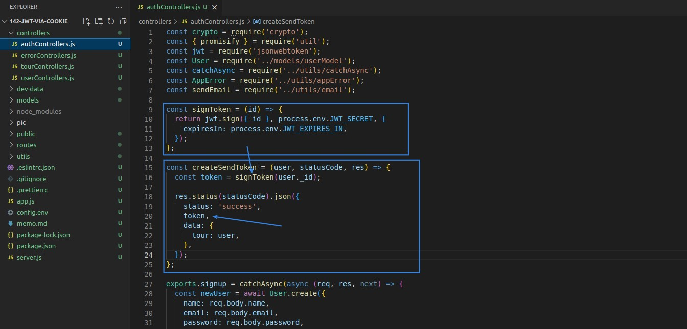

- As shown above, we have already done some refactor work for the codes of sign/send token, but we just use res.json to send the token to the client, now we want to add the more security way of using cookie to send the token to client.

## **Use res.cookie to send cookie with token to client**

### _res.cookie_

### _cookie expired timing_

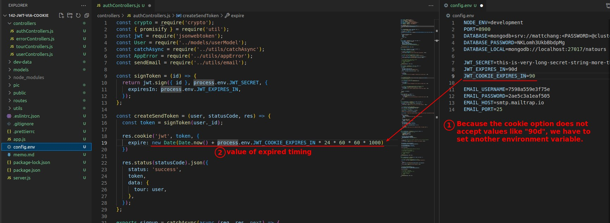

- Because the cookie option does not accept values such as "90d" like the JWT package, we have to set a different environment variable to determine the cookie expiration time.
- Because they are both about token, the cookie expiration time is the same as the JWT expiration time, except that the former is when the browser deletes the cookie and the latter is when the JWT expires.

### _other two cookie option about security_

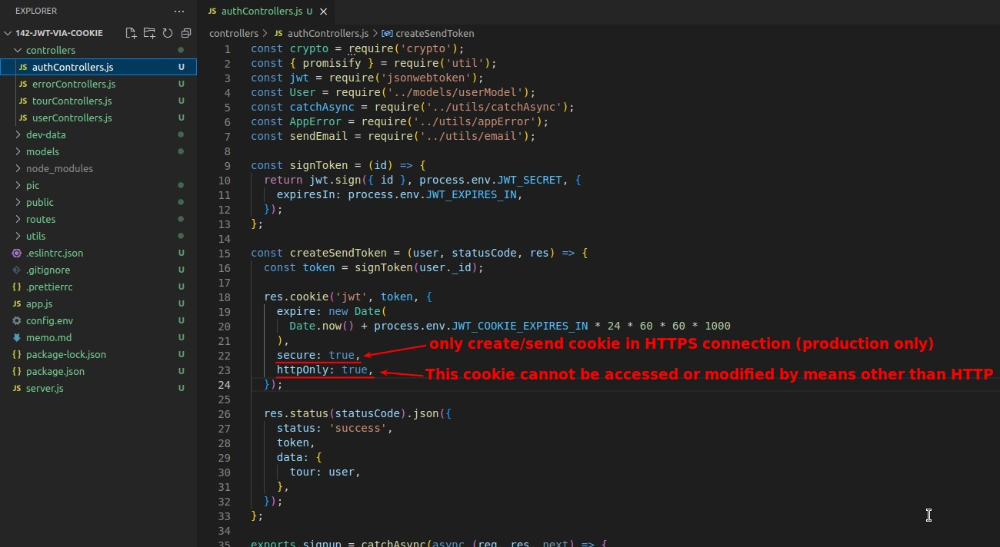

- Because we use Postman to send requests to the server for testing which is non-HTTP communication way during development, "secure: ture" is only meaningful in production mode.
- "httpOnly: true" does not work for Postman testing (Postman can still access cookie data), but it does not affect Postman testing, so it does not need to be restricted to production mode only.

## **Refactor and Restrict the run mode of security: true**

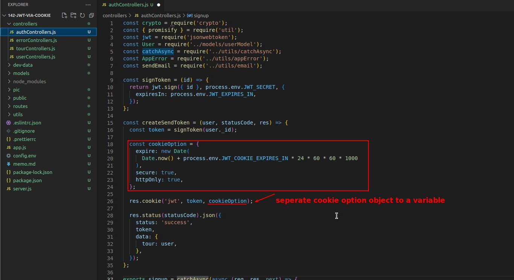

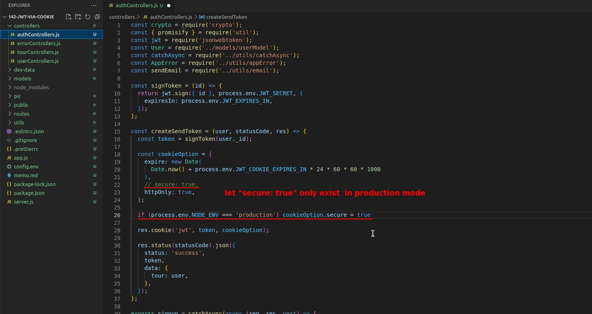

- As mentioned earlier, "secure: true" must only be available in production mode, which is what is implemented above.

## **Test with Postman**

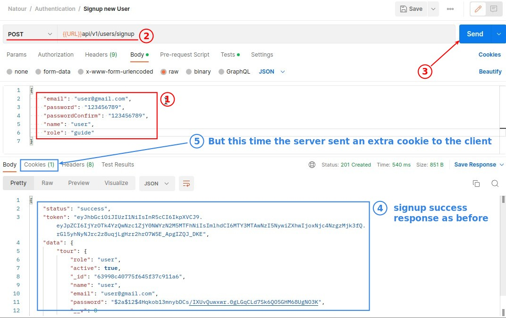

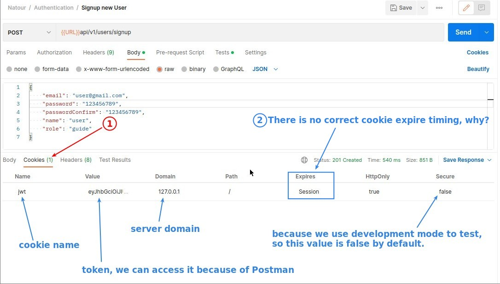

### _Fix property name mistake and test again_

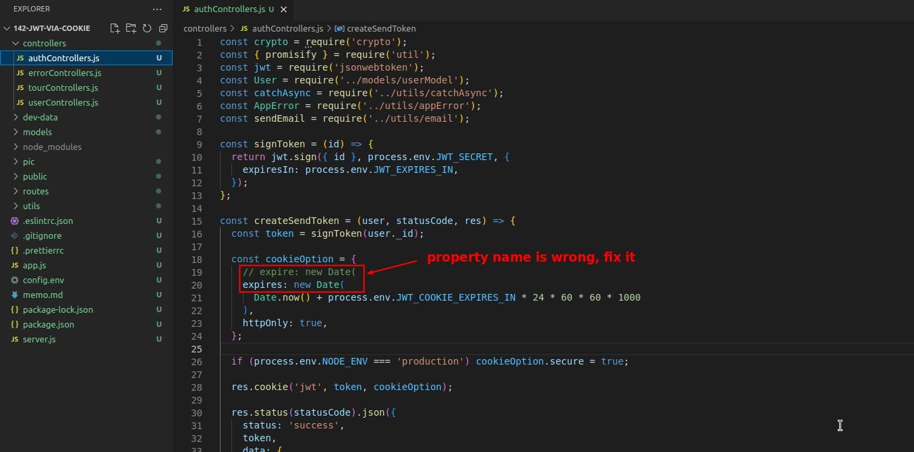

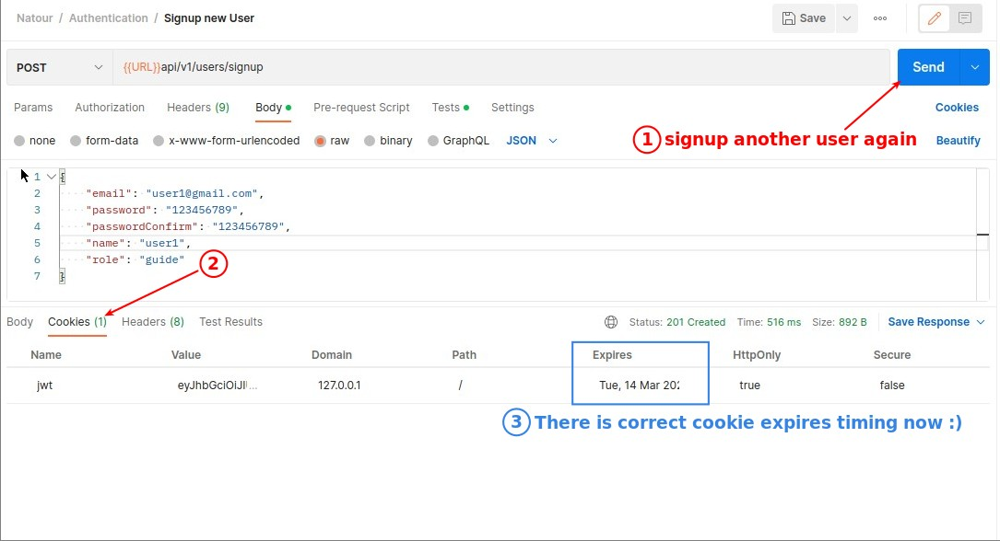

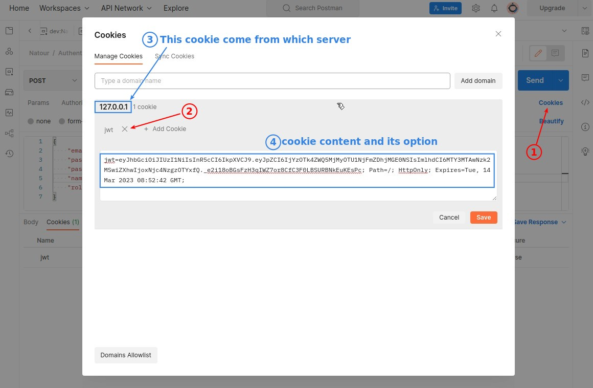

- The above interface is used when observing "multiple" cookies.

## **Remove the password in the signup response**

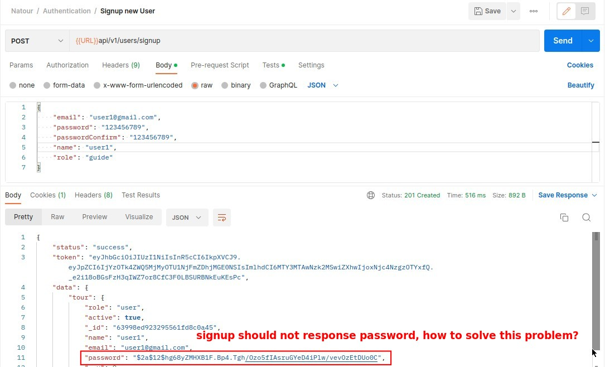

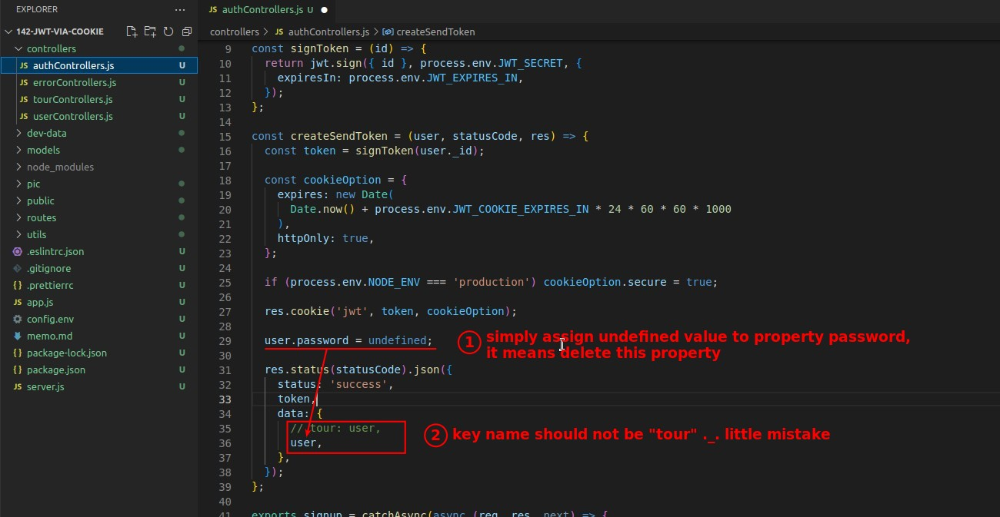

- We set its property "password" to "undefined" before responding user object to client, which means that the client will not receive the property "password" anymore.

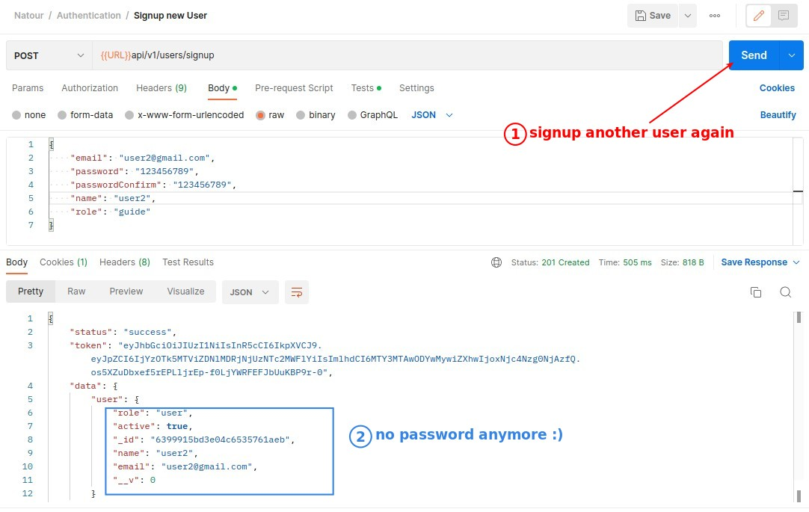
