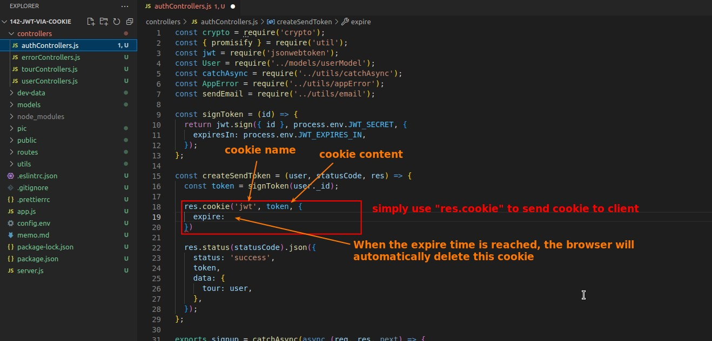

## **Review codes about token before**

## **Use res.cookie to send cookie with token to client**

### _res.cookie_

### _cookie expired timing_

### _other two cookie option about security_

## **Refactor and Restrict the run mode of security: true**

## **Test with Postman**

### _Fix property name mistake and test again_

## **Remove the password in the signup response**

