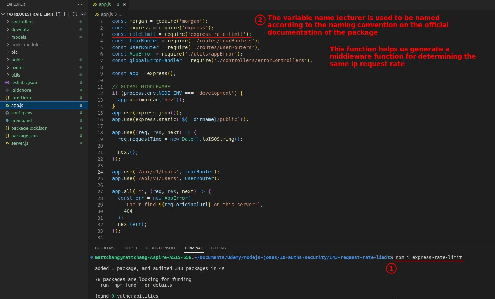
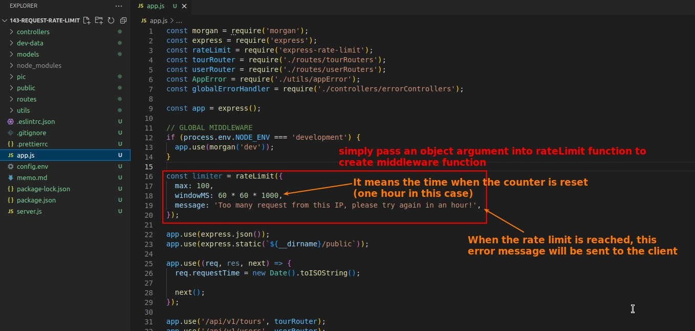
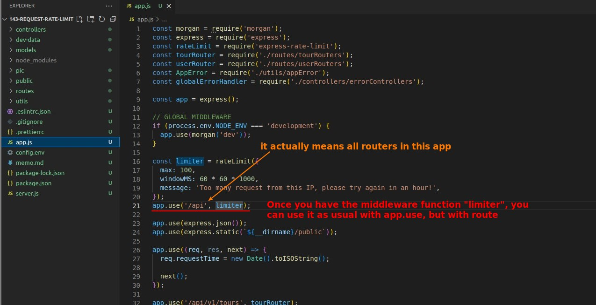
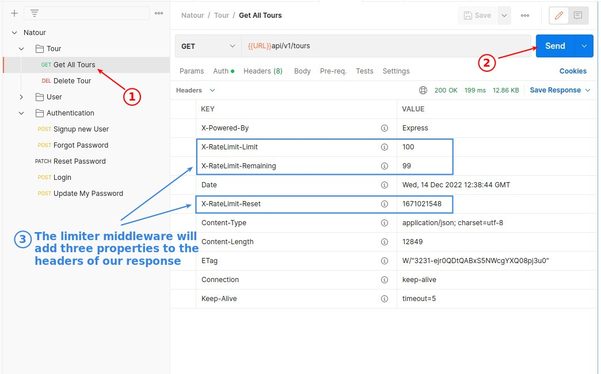
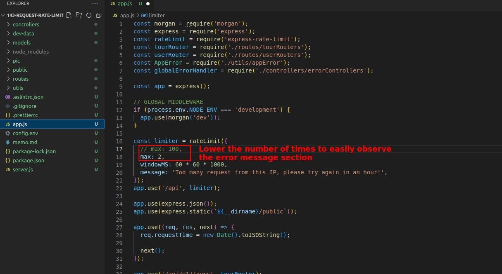
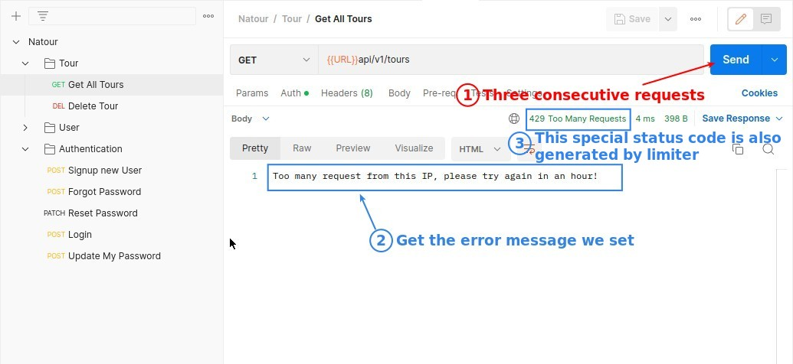

## **Install/Import express-rate-limit package**

## **Create/Use Rate Limit Middleware**

### _Create middleware function with rateLimit function_

### _Use middleware function in the app.js_

## **Test and Check headers of response**

## **Test error message**

