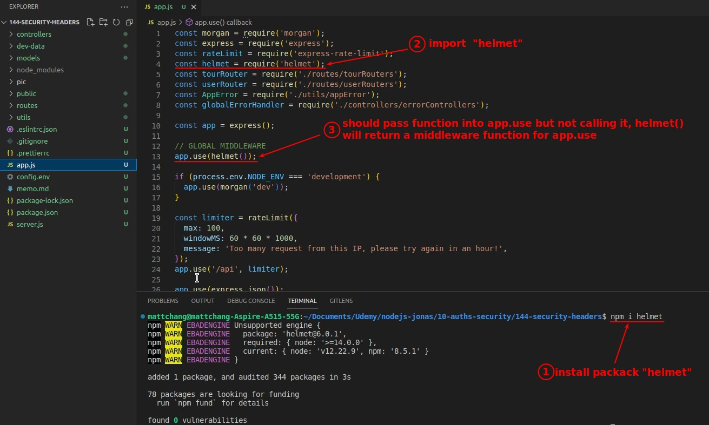
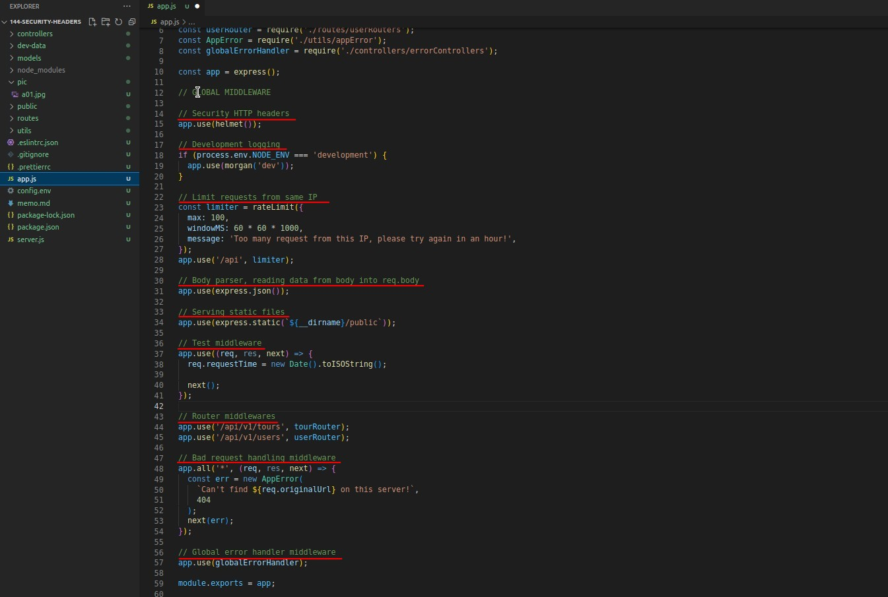
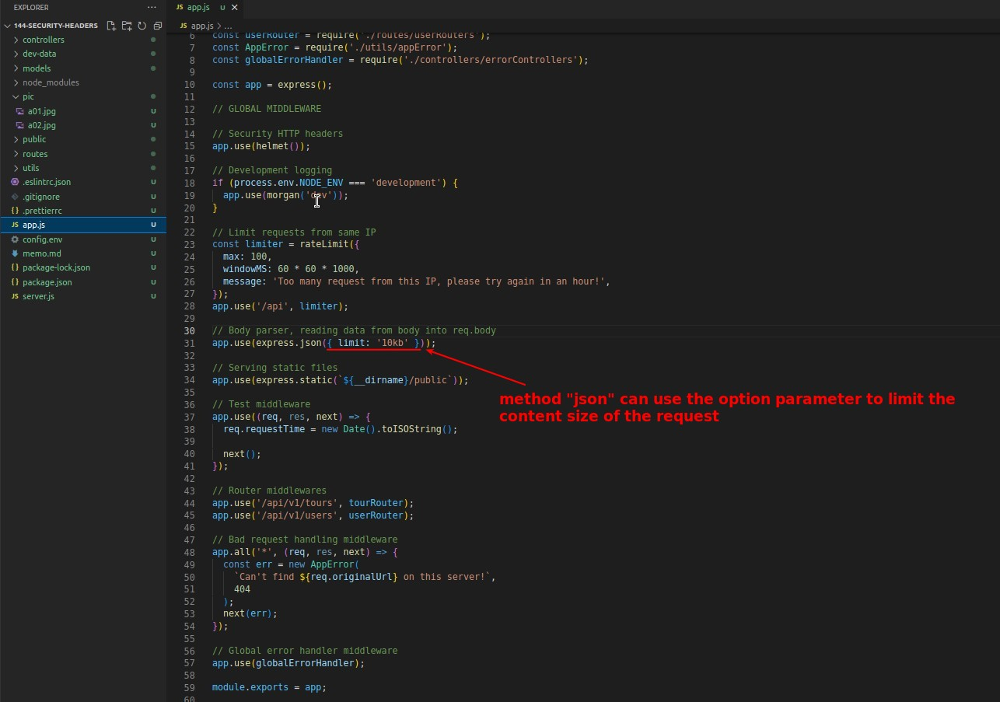
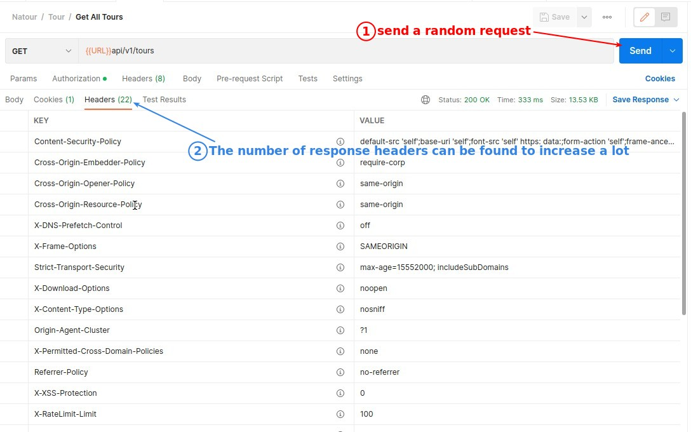
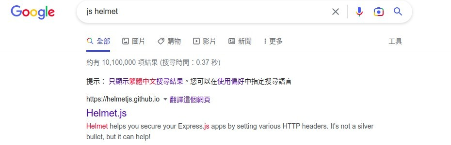
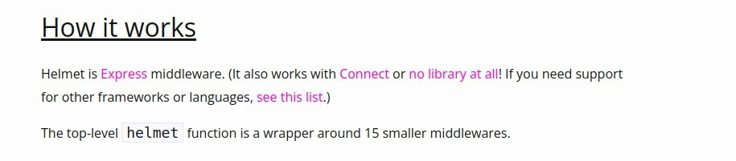

## **Use 3rd-party helmet to generate security headers**

> The security part of Express is not out-of-the-box, so it is routine to use the 3rd-party package "helmet" to improve the security of the Express app, just like we used the package "express-limit-rate" before.

- Note that the location of the middeware generated by "helmet" is better in the front part of the middleware stack, so we put it directly in the first middleware here.

## **Add notes for every global middlewares in app.js**

> We've added a lot of middlewares to app.js so far, so let's add a comment for each middleware to keep our understanding of all the middlewares in app.js.

## **Limit size of request body**

> As we suggested in our previous lecture on theory, we must limit the size of the request body to prevent certain security attacks, and we will implement it here.

## **Postman Test**

## **How Helmet work?**

> For those interested in how "helmet" actually helps us increase security, you can read their official documentation.

- So in fact "helmet" is a combination of 15 middlewares.
