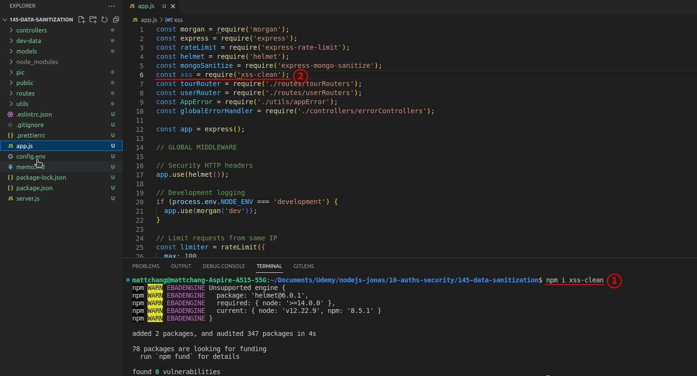

> This lecture will use the concept of data sanitization to prevent two types of security attacks.

## **Data sanitization againt NoSQL query injection**

## **Data sanitization againt XSS**

> Using mongoose's Schema itself has a defensive effect against XSS, where the 'validator' package also provides the function of data sanitization can be used, but there are still some holes we can further use the third-party package 'xss-clean' to completely prevent XSS attacks.

