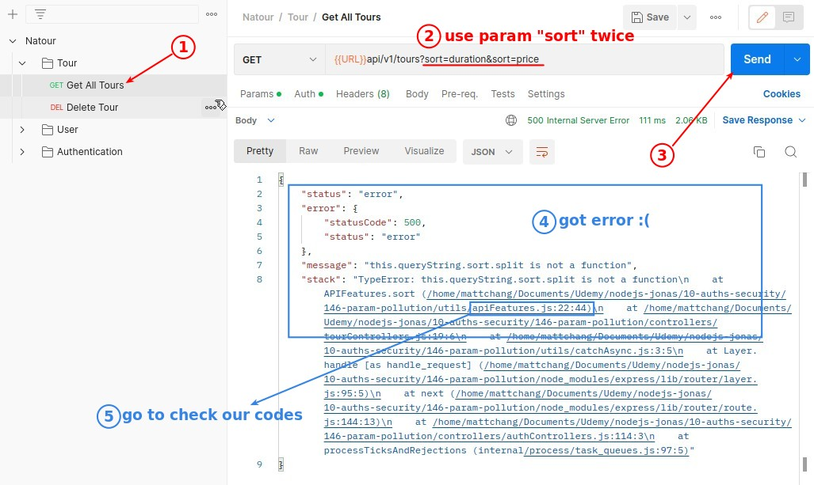
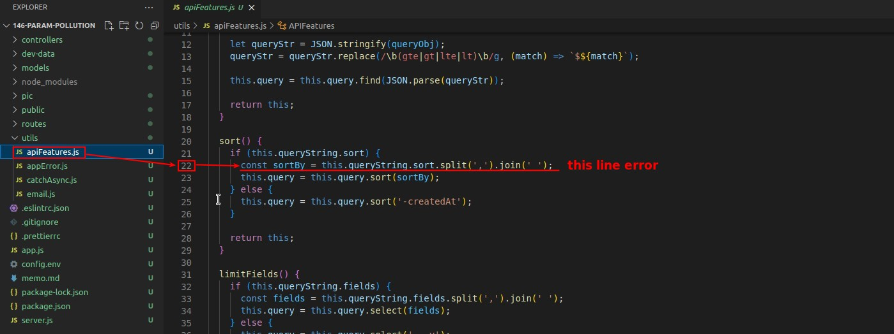
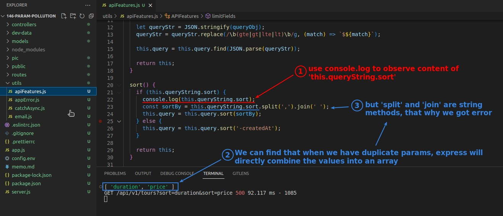
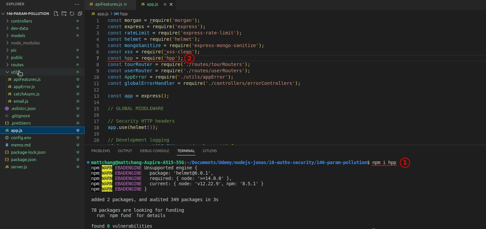
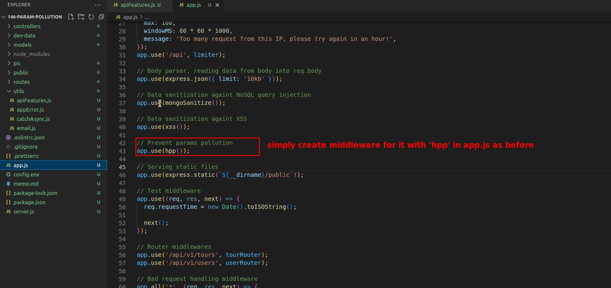
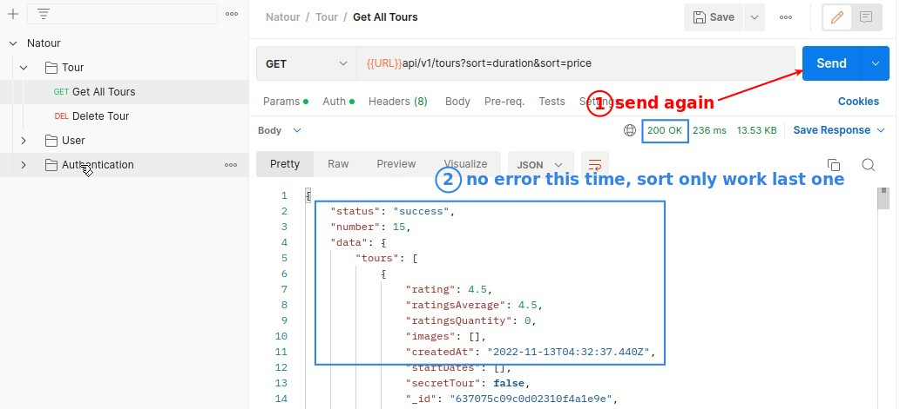
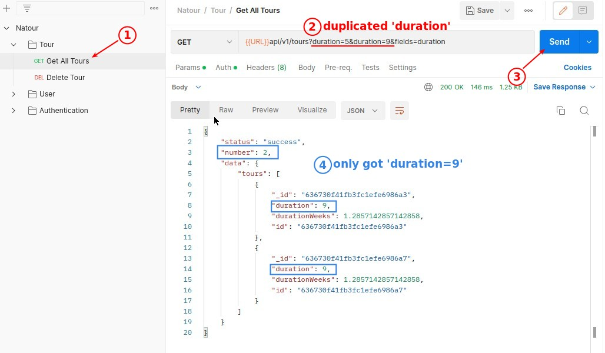
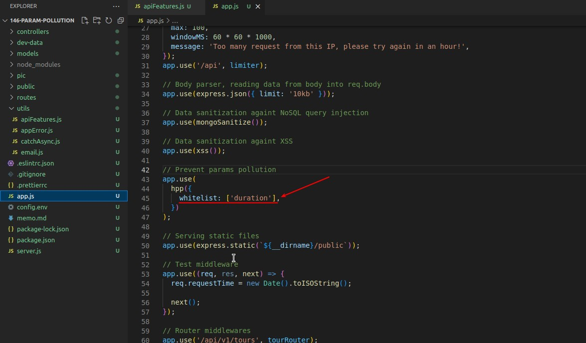
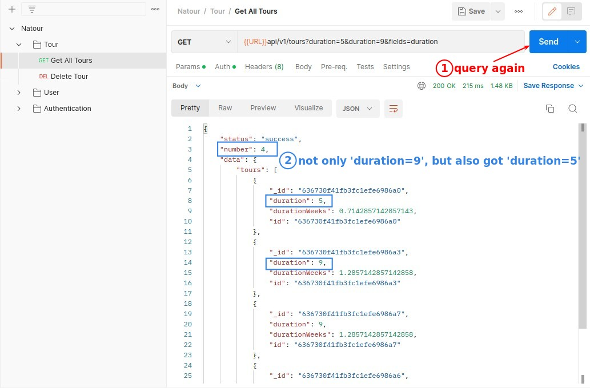
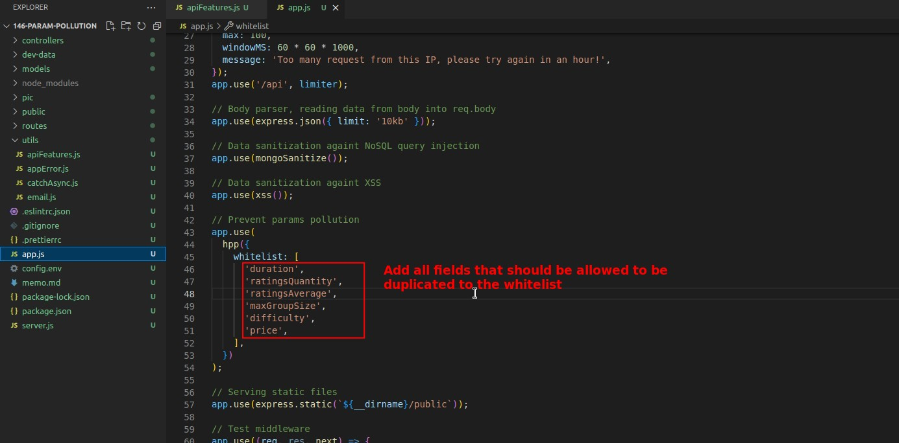

## **Params duplicated error**

- Because of the error generated by params, we call it params pollution, which can be exploited to attack.

## **Prevent params pollution**

> As usual, we use the third-party package "hpp" to create the middleware to avoid params pollution.

- It can be found that "hpp" will invalidate the last params other than the last one when duplicated params are found, in order to avoid errors.

## **Whitelist of hpp**

> However, some params should be allowed to be duplicated, for example, when querying tours with duration 5 or 9 at the same query.

