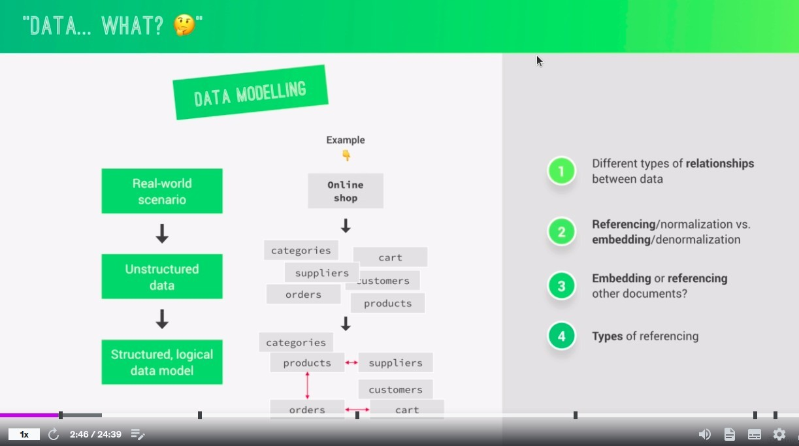
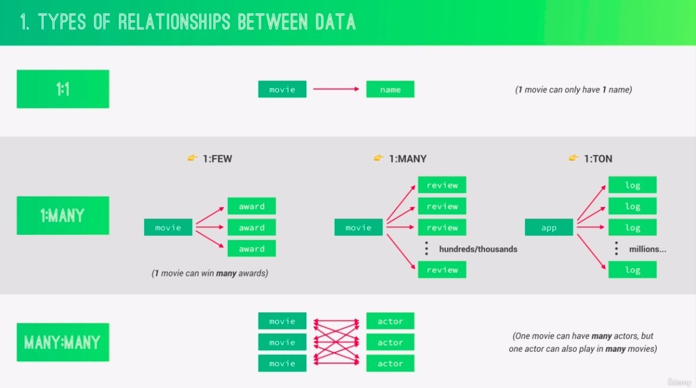
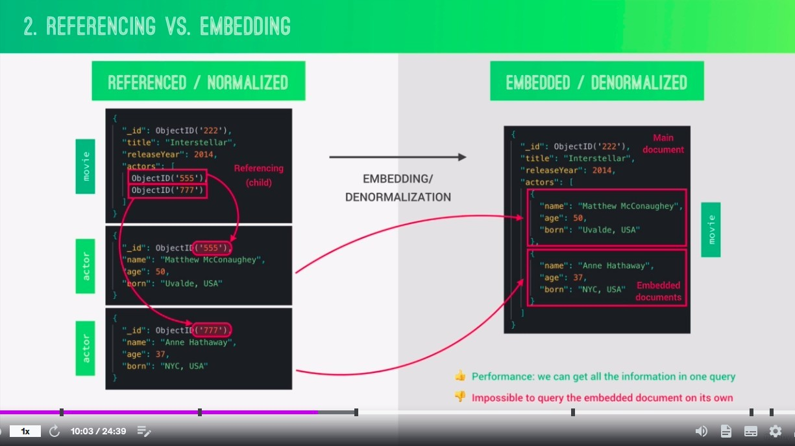
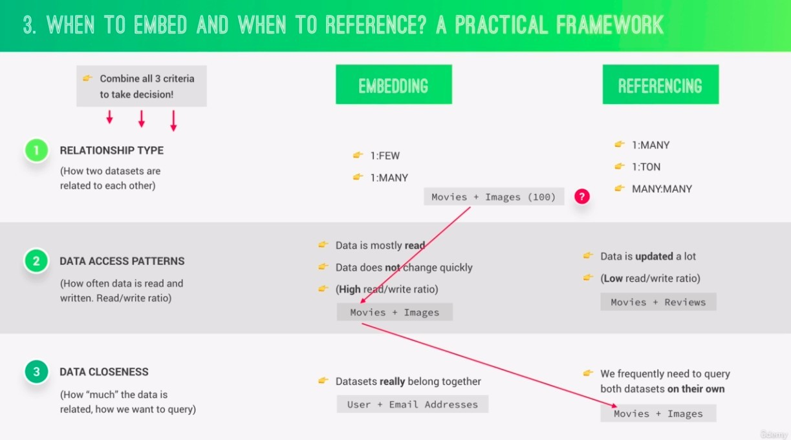
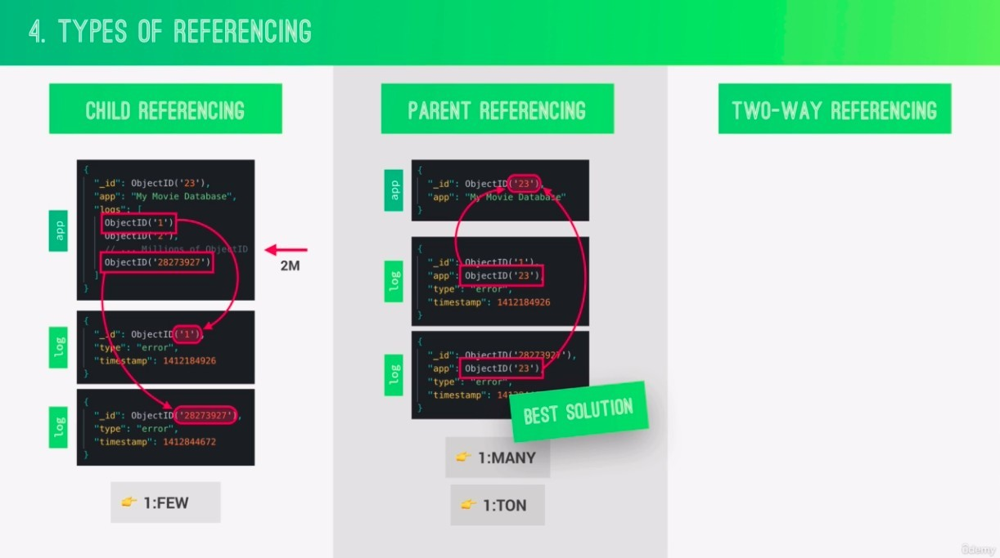
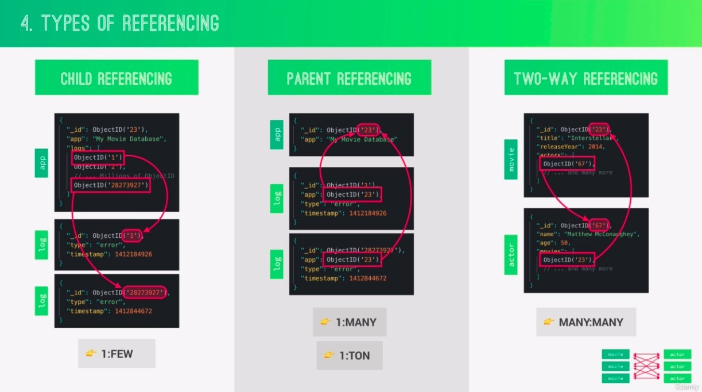
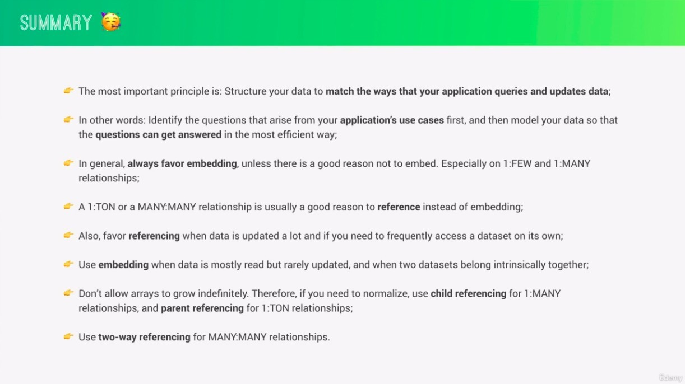

- Data modeling is the process of structuring unstructured data generated in the real world into a logical data model in a database.
  - And we do that according to a set of criteria bellow.

- For the "1:FEW" example, a movie can get several awards.
- In the case of "1:many", a film will have hundreds or thousands of reviews.
- For the "1:ton" example, an app is generating logs all the time, and there are more than a million logs in existence at any given time

- The third stage above assumes that we use images to do the puzzle to guess movie, so we almost always read the image alone and have nothing to do with the movie, so even though the image is essentially part of the movie, we choose to use referencing.
  - So deciding to use embedding or referencing requires an understanding of how we will use the data.

- Child referencing means keeping child references in the parent document, and vice versa.
  - References are usually wrapped in an array, and we want to avoid the unlimited growth of references in this array as much as possible.
    - single document has 16 megabytes size limit.
    - We don't want to respond too much data to the client, because it would become meaningless.
- In child referencing, the parent-child coupling is very close, but make sure there is no infinite growth of reference.
- In parent referencing, there is no chance of infinite growth of refences, but parents and children are more independent of each other.

- "many:many" can only be handled using two-way referencing, any other way of handling it would easily make our document grow beyond the 16 megabytes limit.

