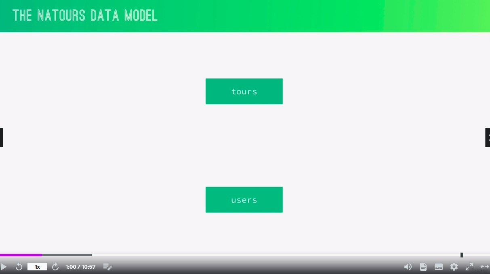
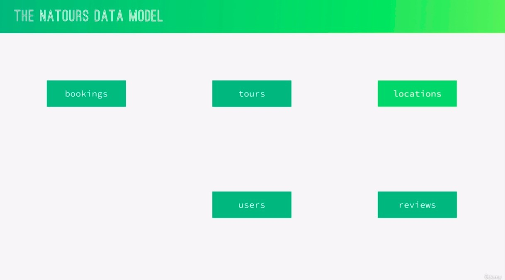
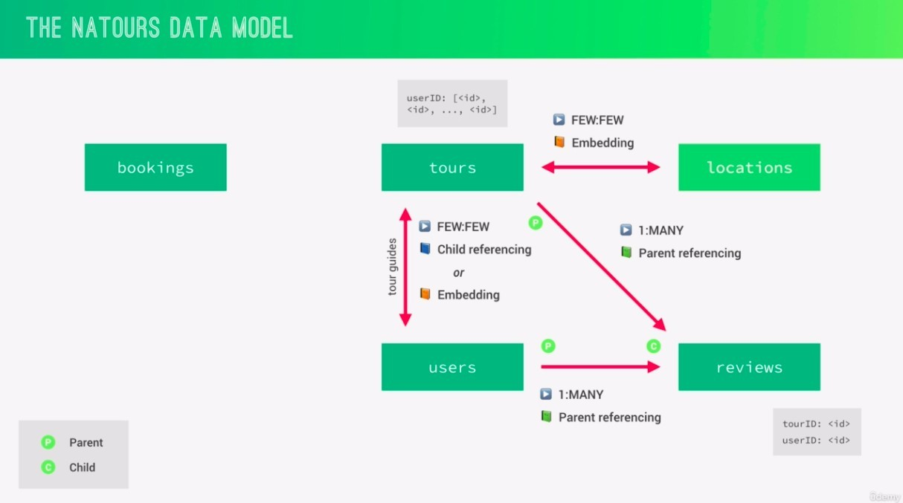

- Our Natours app already has two main collections "tours" and "users", which are two completely separate collections.
  - Therefore, we normalize them.
  - Of course, they will not be embedded.

- Because the array in users or tours can grow infinitely if we use child referencing, we choose to use parent referencing.

- "FEW:FEW" but the reason for choosing embedding(denormalize) is
  - Location is essentially part of the tour, because there can be no tour without location.
  - In the Natours app we do not access the locations collections individually.
  - A tour will have at most two or three locations, and they are usually fixed and do not grow indefinitely.

- Tours will also contain information about users, but only users whose role is guide, and a guide may be responsible for several tours.
- It's the same "FEW:FEW", but the difference with locations is that we often need to access the users collections separately, especially the authentication and athorization parts.
  - If we use embedding, each time the guide user updates its base information, the user information embedded in the tours will have to be updated as well, which is not ideal.
  - So we prefer to use child referencing here.

- bookings is actually still a relationship between the users and tours collections, but for some reason it's better to treat this relationship as a separate new collection.
  - The bookings itself will contain some information specific to itself, such as dates, prices.
  - bookings is not permanent, so you don't want it to pollute tours or users collections.
    - Following the idea of not polluting the tours and users collections, we naturally choose parent referencing here, so that tours and users don't need to have any information about bookings.
