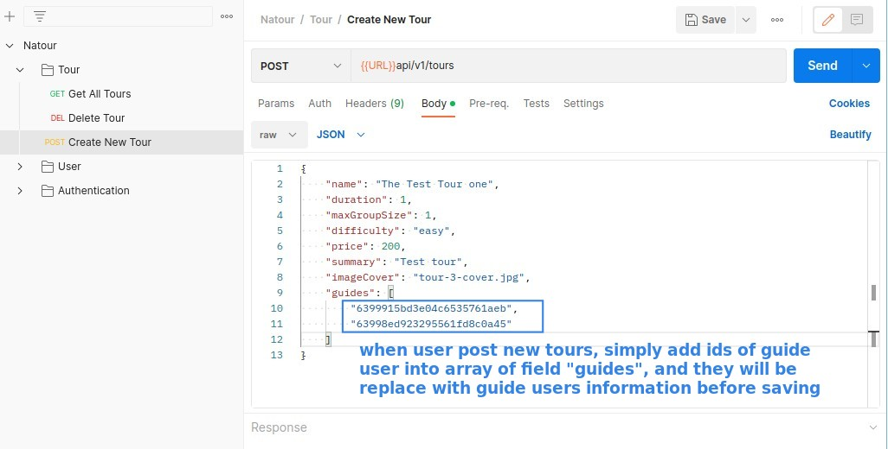
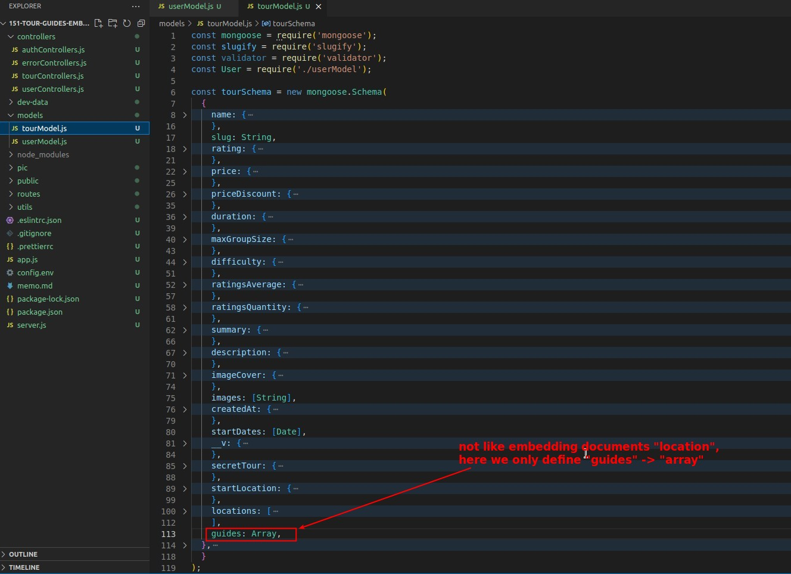
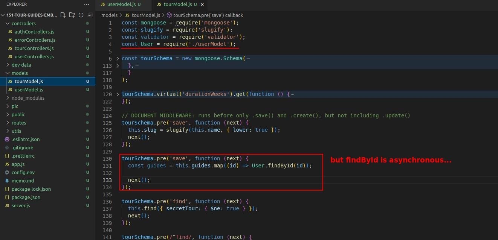
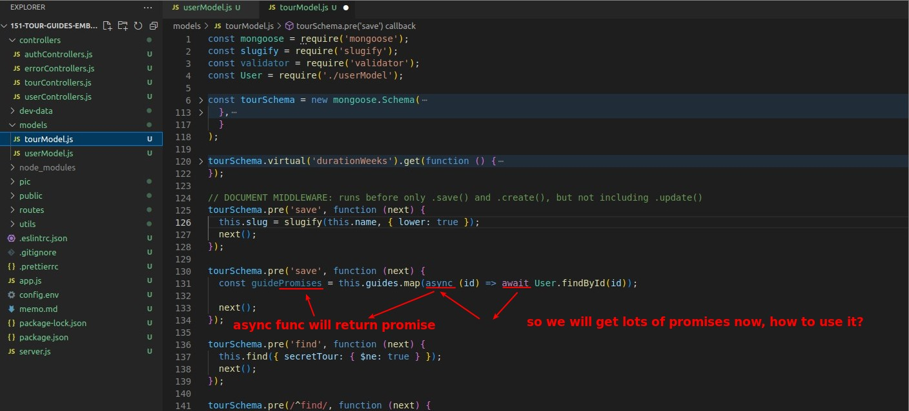
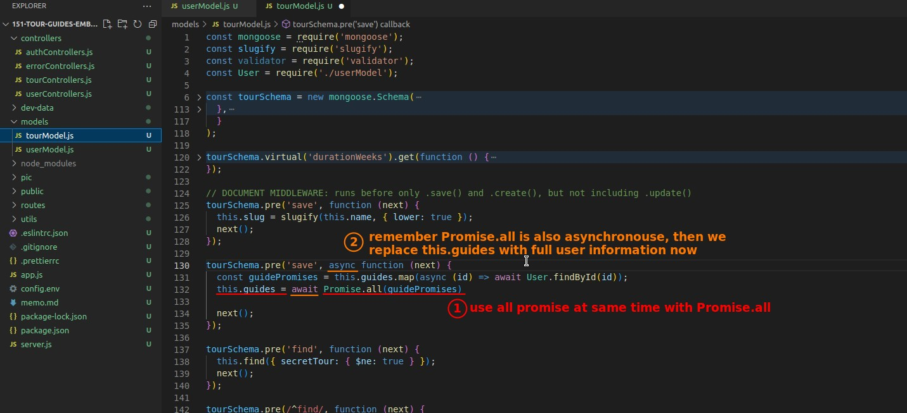
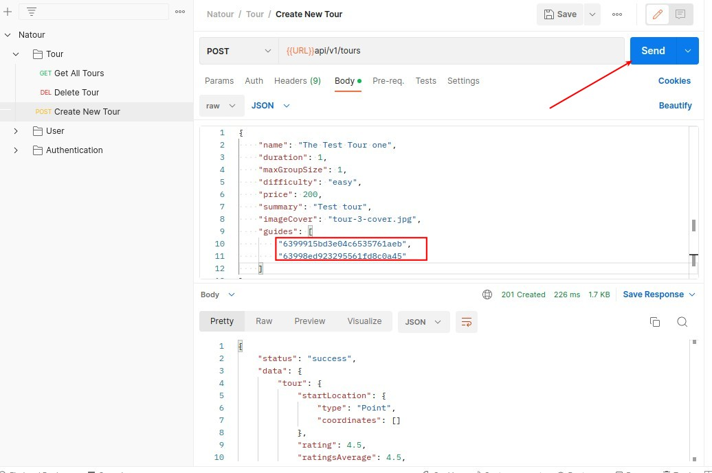
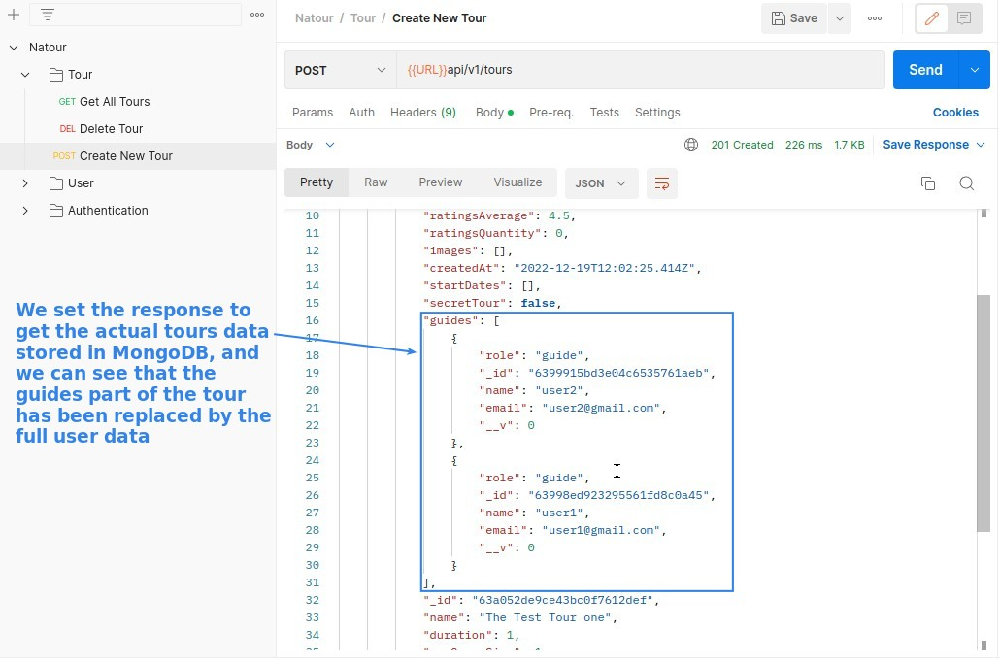

> Although in the theory lecture we have said that we think parent referencing is the best method in the relation between tours and guides, in this lecture we first do embedding documents and then use parent referencing in the next lecture, so that we can compare the difference between the two methods.

## **Explain what we want to implement**

- What we want to do in this lecture is to let the user create a new tour in the field "guides", and then the tour will automatically replace these ids with the full guide user data before saving it to MongoDB.

## **1st step: add field "guides" to tour Schema**

> In the last picture we used the new field "guides" to clip the guides ids, so the first part of course is to add the field "guides" in the tour Schema, otherwise the provided ids will be ignored directly.

- Although guides and the locations of the previous lecture are embedding documents, locations do not have independent collections, so the definition in Schema is defined with sub-fields, but users have independent collections and Schema, so we only need to give the type "Array" right here.

## **Use Pre-Save-Hook Middleware to replace id with full user data**

> We have to convert the ids to full user data before the new tour is saved to MongoDB, so it's natural to think of using middleware to do this.

- The codes in the callback function are all JavaScript, and test some more complex asynchronous processing.

## **Test**

## **How about update?**

- Up to this point, only half of the embedding documents work has been done, and the update tours part is also done in a similar way, but it will not be done in this course.
- Because, as mentioned before, if we use embedding documents, as soon as there is any change in the guide users' information, the app will have to search all tours to see if they contain the guide user, and then update the relevant tours, which is a lot of work.
  - So instead of finishing the embedding codes, in the next section, we will use a better way of parent referencing to implement this part.
