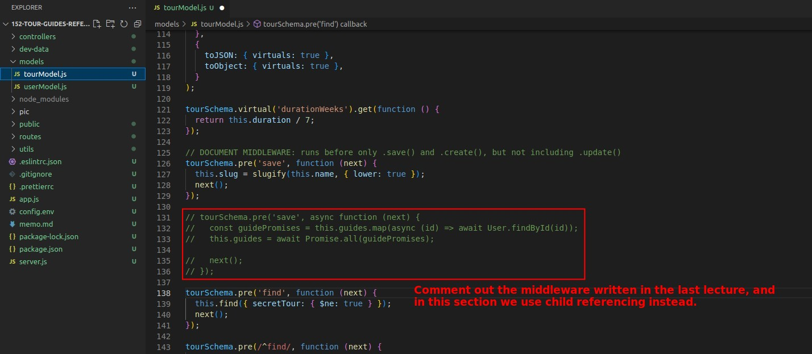
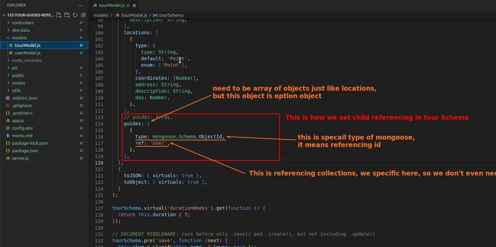
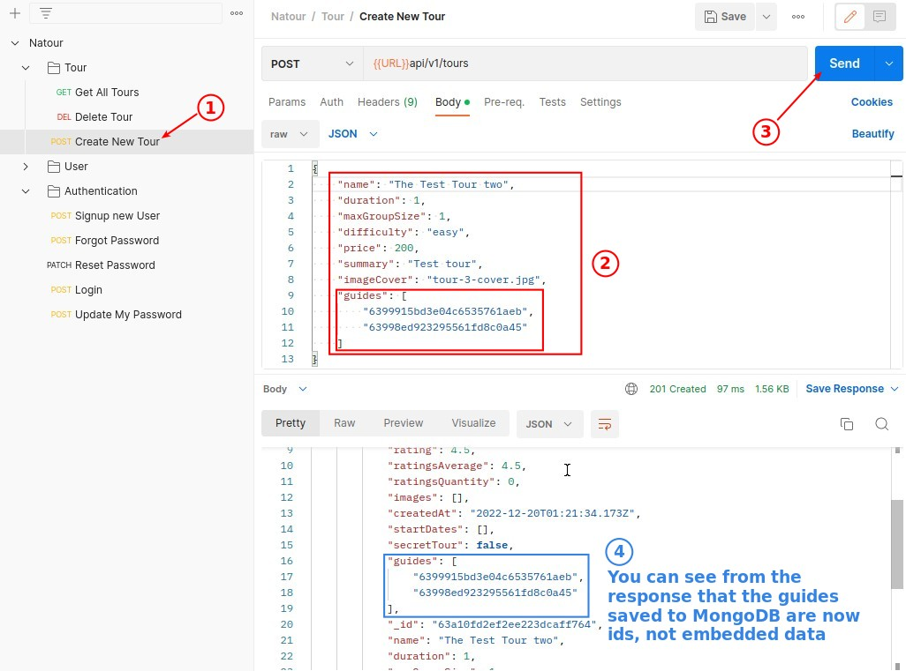
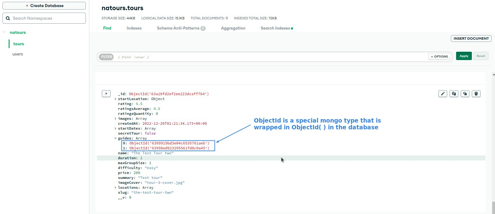

## **Comment out embedding codes and this lecture's goal**

## **Setting Schema property for child referencing**

## **TEST**

- Using child referencing, we will not save the user data of the guide in the database to the tour it belongs to, only its id will be recorded, and the complete user data of the guide will be retrieved only when the tour is queried.
