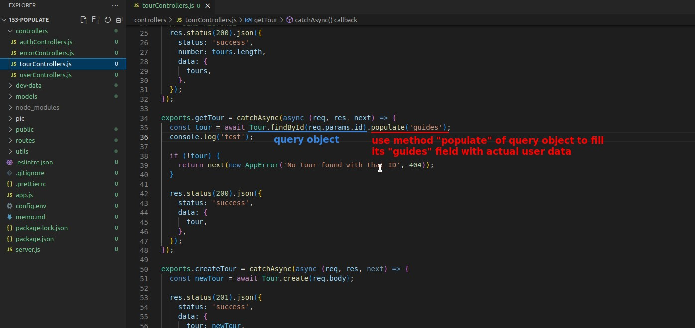
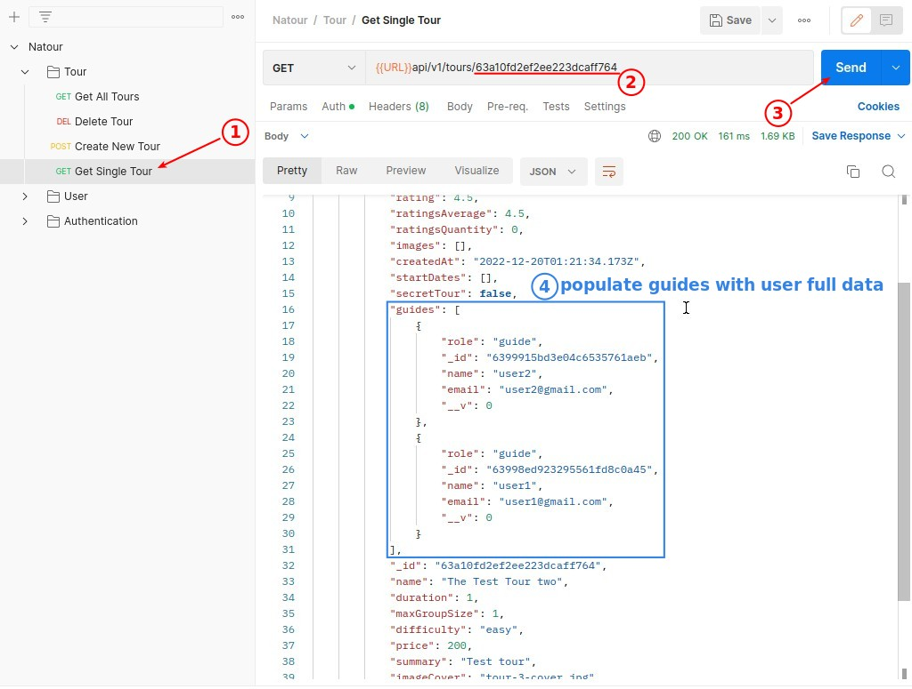
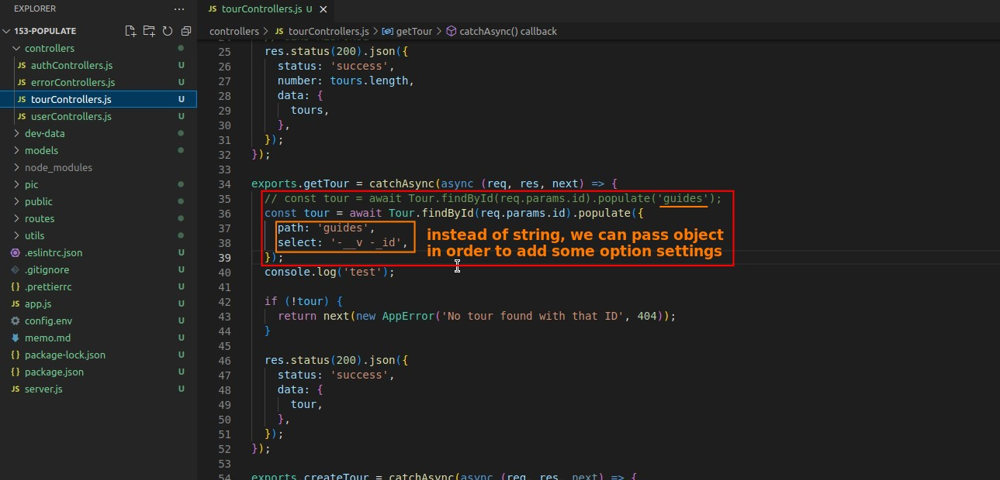
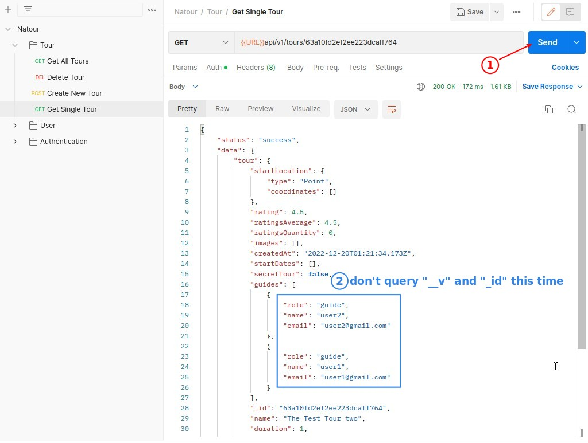
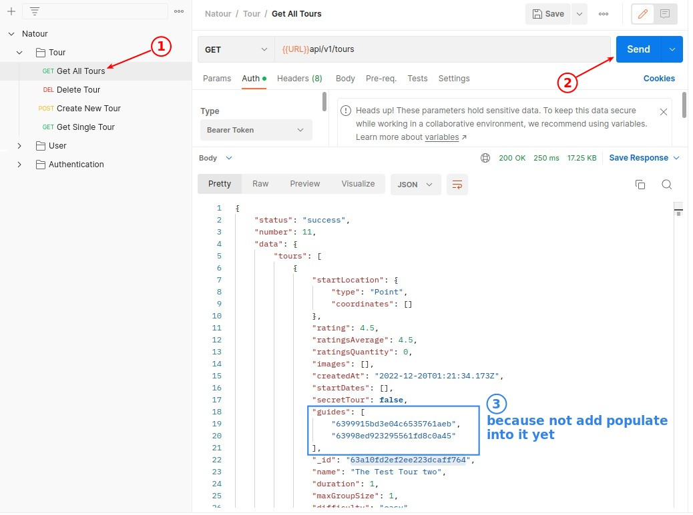
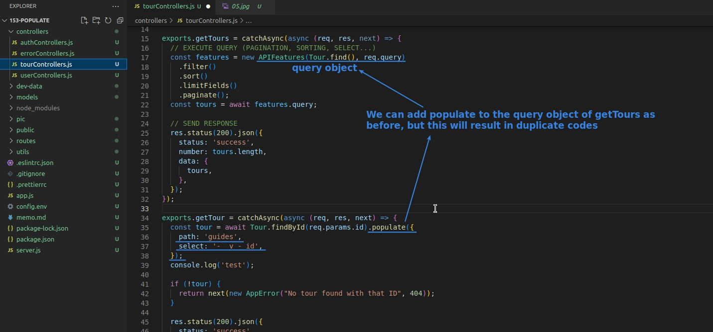
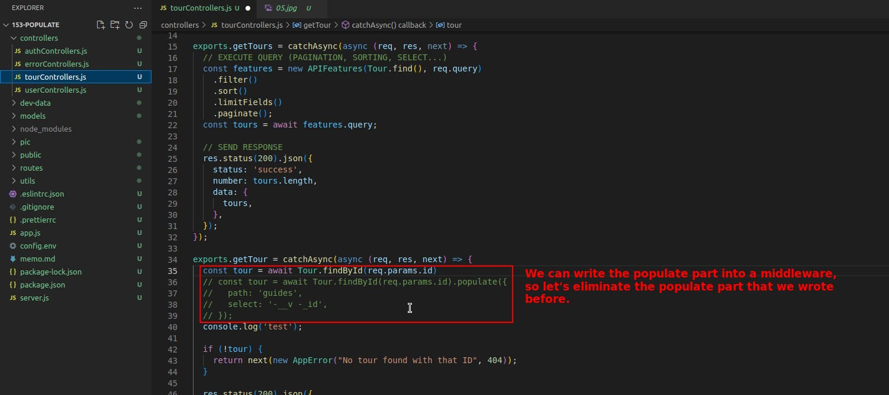
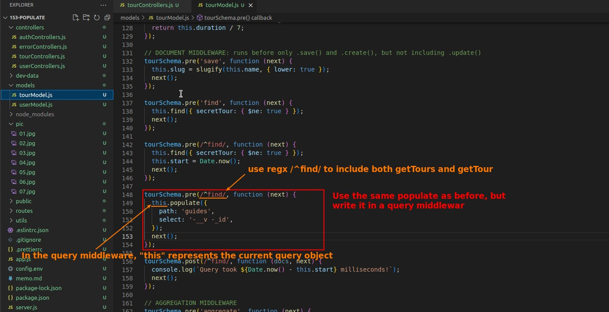
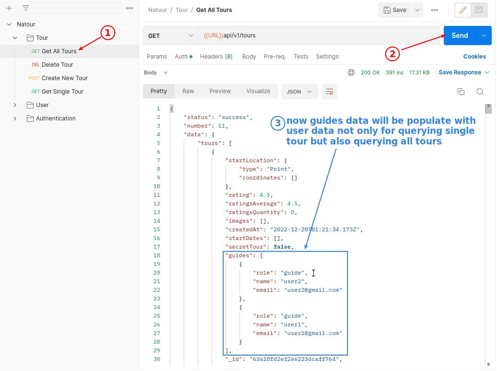

## **method populate of query object**

> populate means to use the full data to replace ObjectIds.

- populate is one method of the query object.
  - So populate will only work when querying, it will only affect the result of the user query and will not change the contents of the database.

## **Options of method populate**

> We can add a few options to populate.

- If you need to add options, you must use object instead of string to pass into populate.

## **Just use same way to populate get all tours?**

> So far we have only added populate to the route that queries a single tour, so should we use the same way to add populate to the route that queries all tours?

## **Use populate in the query middleware**

> To avoid writing the same codes over and over again, we decided to write the populate to a new query middleware.

## **Notes about populate**

- In fact, populate will make us query more than once, so be careful not to use too much populate in a large system, otherwise it may affect the performance of the app.
- populate is one of the fundamental and important functions in mongoose, and we'll be using it a lot in future lectures.
