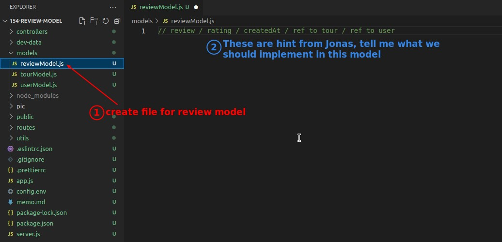
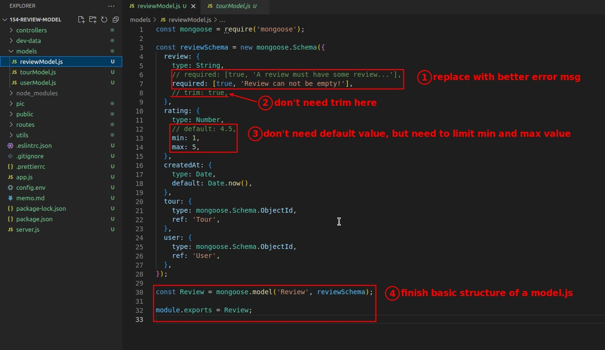
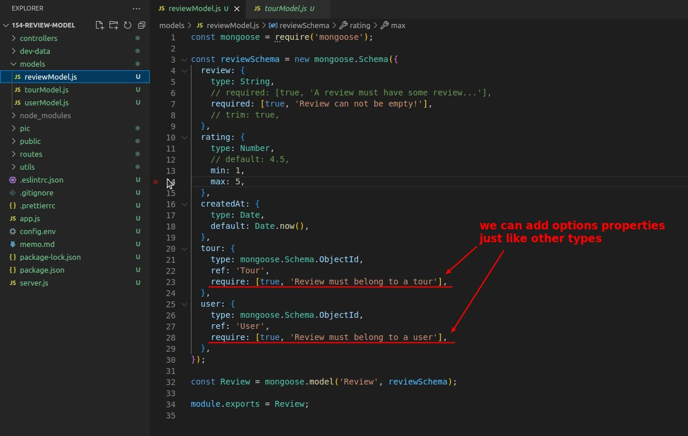

## **Challenge! Create New Model "Reviews"**

## **My Answer**

## **Basic fields difinition and fisnish fundamental structure**

## **Implement parent referencing fields**

> As mentioned in the theory course, in order to avoid the problem of reference infinite review growth, we use "parent" referencing, so we must define parent referencing fields in the child model.

## **Schema options about virtuals**

- This part is prepared in advance for future use of virtual fields, and has become part of the routine Schema writing.
