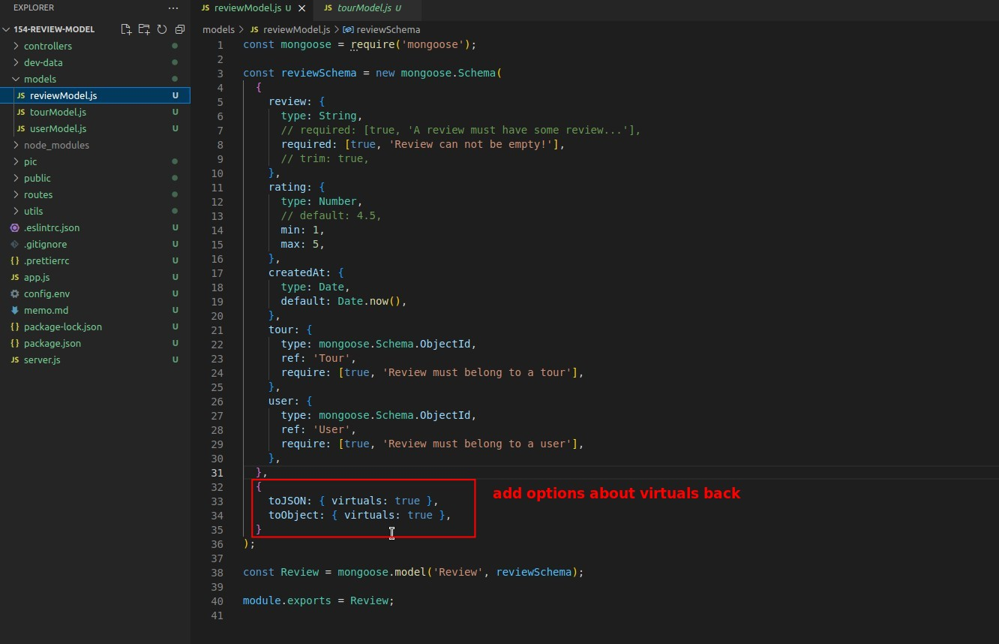

## **Challenge! Create New Model "Reviews"**

- Jonas believes that based on the previous lectures, we should have the ability to complete the reviews model on our own.

## **My Answer**

## **Basic fields difinition and fisnish fundamental structure**

- The part that makes me wonder is 3. Does the absence of both "default" and "require" option properties mean that the field "rating" is dispensable?
- The main purpose of model.js is to export the Model object, which is then generated from the Schema.
- Although mongoose.Schema.ObjectId is a special type, the field of this type can also have some options property that a normal field has.

## **Implement parent referencing fields**

> As mentioned in the theory course, in order to avoid the problem of reference infinite review growth, we use "parent" referencing, so we must define parent referencing fields in the child model.

- Note that unlike the previous field "guides" in tours, the reference here is a single one value in field "tour" and "user", so it is not an array of objects but an object.

## **Schema options about virtuals**

- This part is prepared in advance for future use of virtual fields, and has become part of the routine Schema writing.
