## **Challenge**

### _controller > route > url_

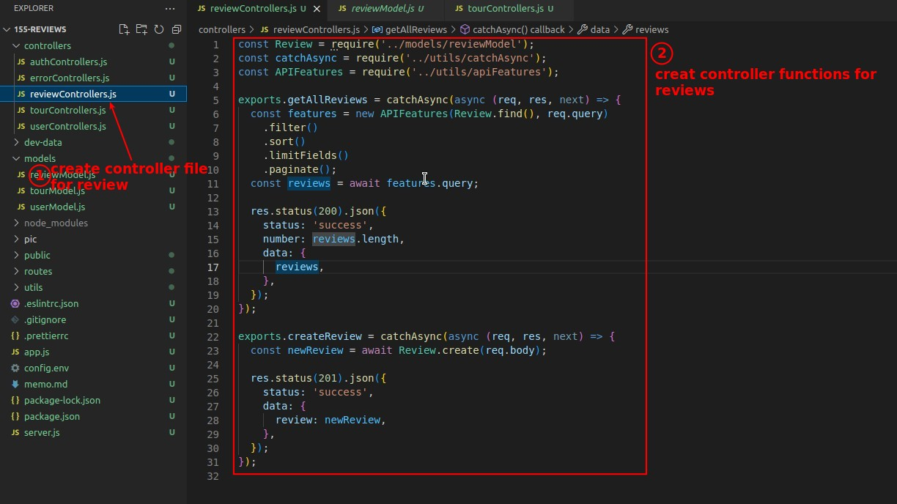

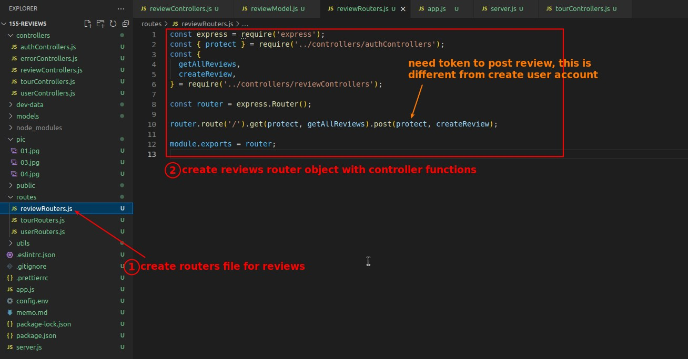

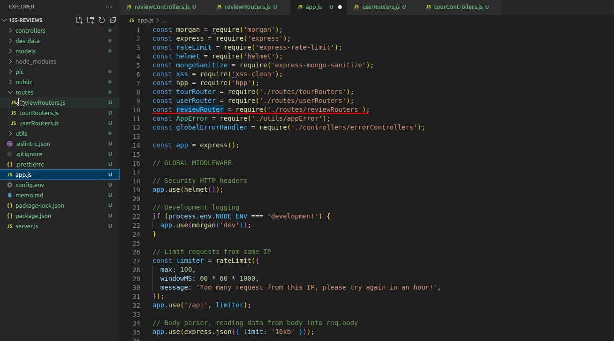

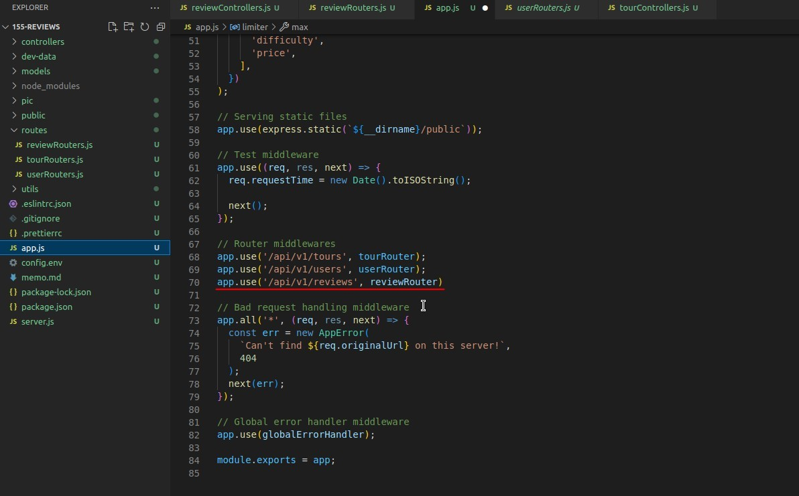

### _Build requests and test in Postman_

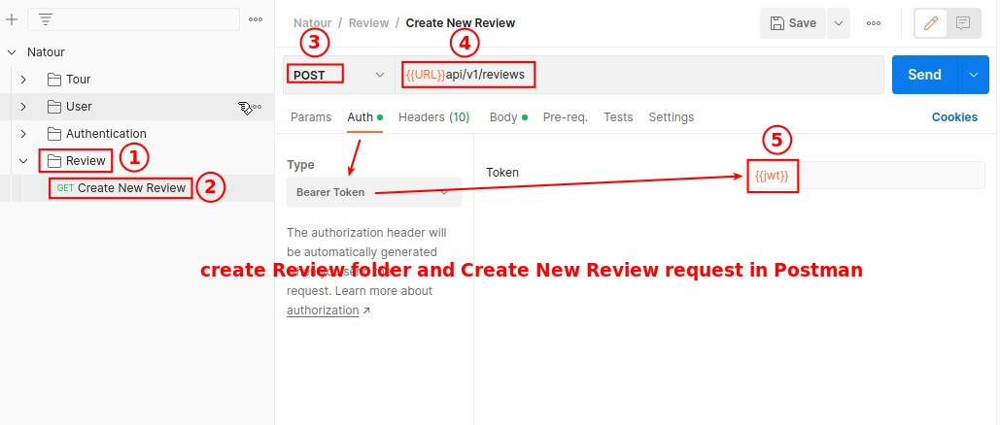

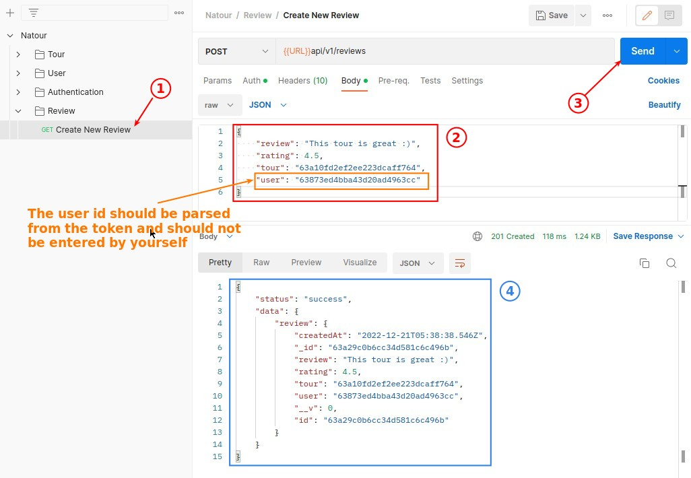

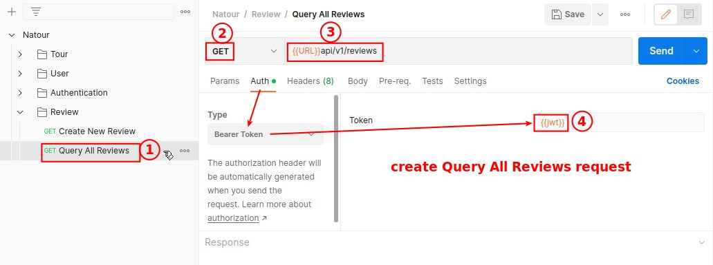

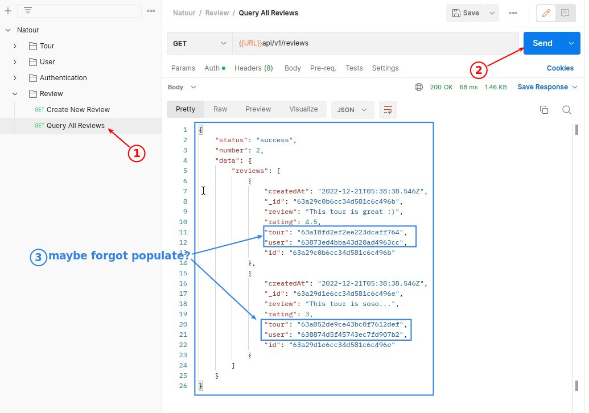

### _Use query middleware to implement population_

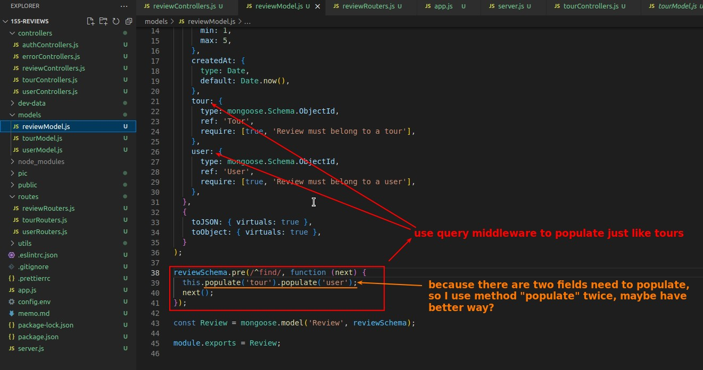

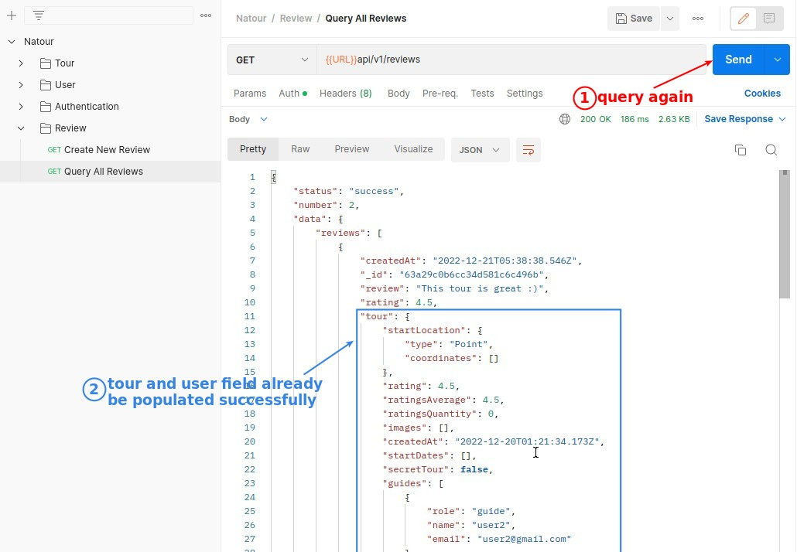

## **Correct answer by lecture video**

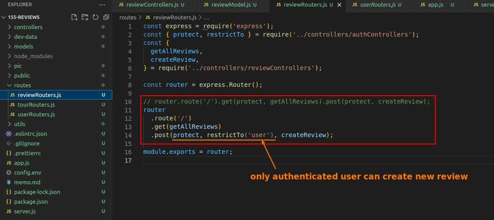
