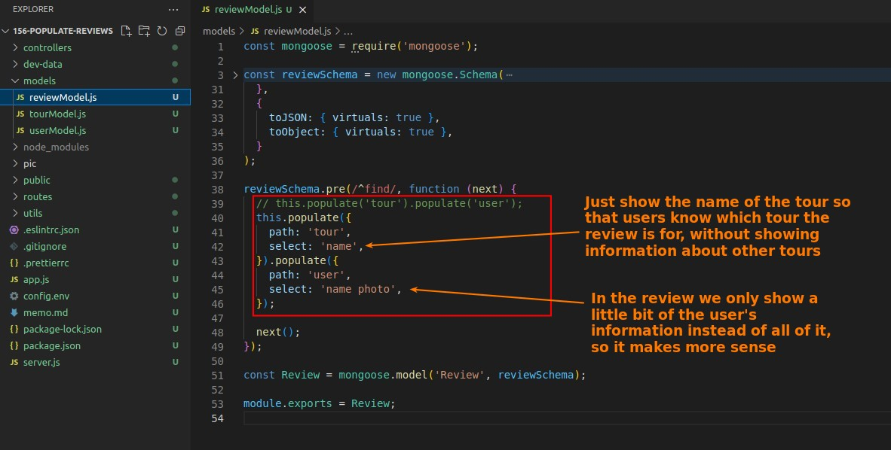

## **Population of reviews**

> I was challenged to make reviews of the population independently, but I had already done it myself in the last lecture, so I directly checked the difference with the lecture answers.

- The practice in the lecture is to limit the tour and user information shown in each review, and this practice is indeed more reasonable.
  - Because the focus here is on the review itself, and showing too much non-focused data is meaningless to the users
