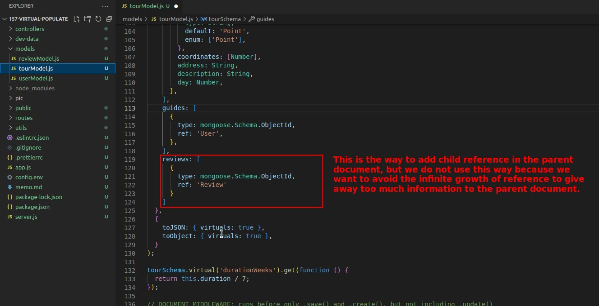
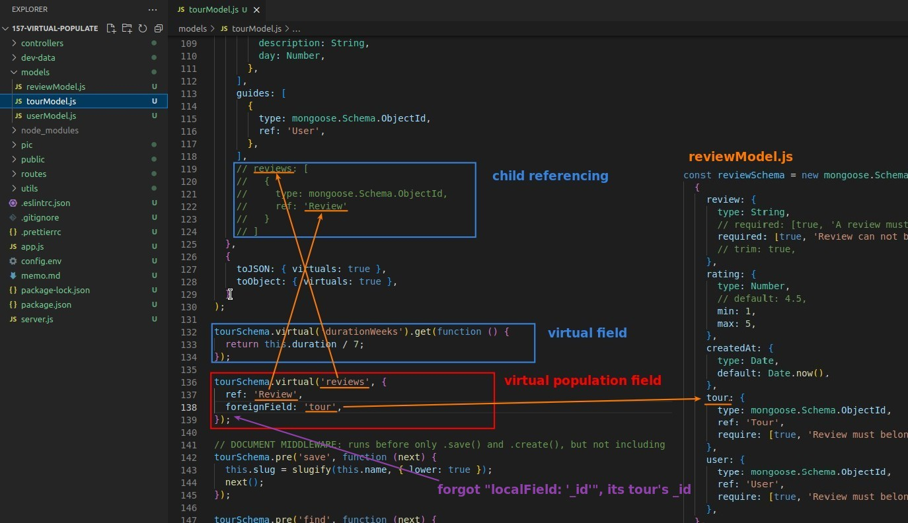
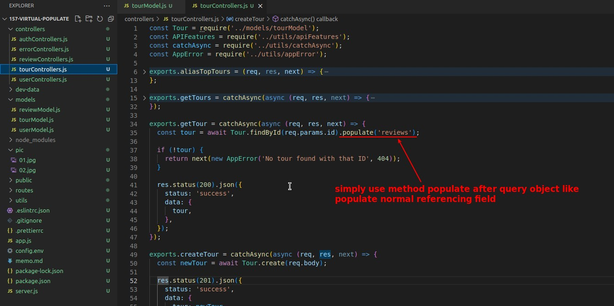
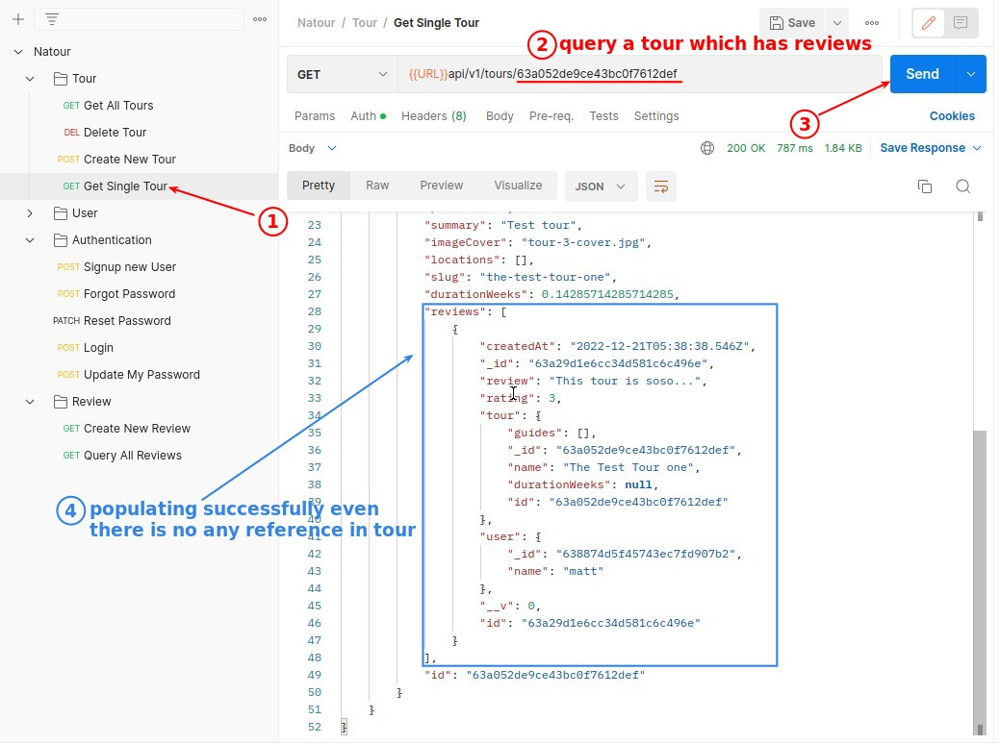

## **Problem: If we want to refer reviews in tour document, how?**

- There are three ways:
  - Every time you query each tour, you check if there is a review related to this tour.
    - More complex to implement and more performance intensive
  - Add child(reviews) referencing field into tour document.
    - This way, when the number of reviews increases infinitely, the tour document will grow to an infinite size.
  - The last method is the one provided by 'Mongoose' - 'virtual population'.
    - Easy implementation and no need to record any information about the child document in the parent document.

## **Solution: Child Referencing**

## **Solution: Virtual population**

### _Virtual population field_

### _Populate virtual population field_

### _Test_

