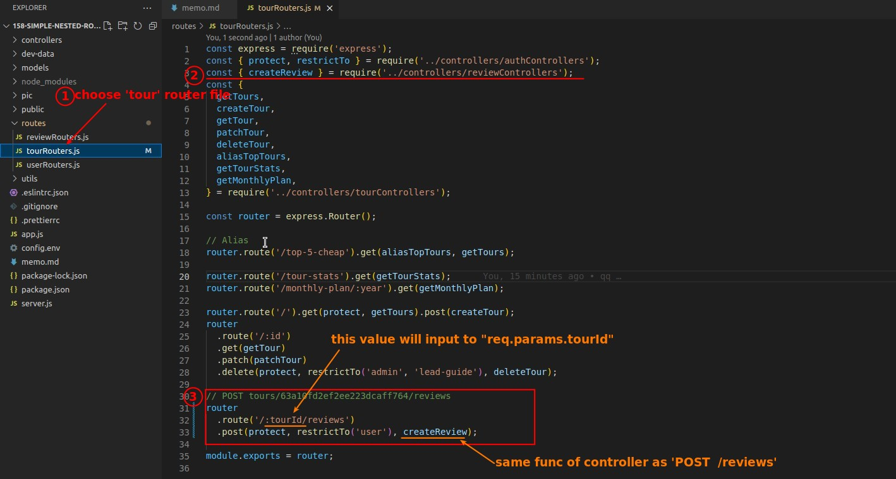

## **What URL we will implement?**

> Previously, we had to provide the tour and user ids in the request body when creating a review, but a better way is to let the app automatically get the current tour/user ids instead of relying on the user to provide it.

- For the tour id part we will use the nested routes as above to achieve it.
- In addition to allowing the app to extract the tour id from the url, nested routes also provide a clear view of the relationships between resources.

## **Nested Routes**

> Let's start by implementing to create new review on the tour.

- Because the URL starts with "/tours", we have to create routes in tourRouters.js, which is a bit counterintuitive, and we'll address this later in other lectures.

## **Allow Data from Nested routes/Protect Middleware to function in controller**

- In the above codes, we use "if condition" to make the function work regardless of whether user or tour id is provided in req.body, so that this function can be used by different routes at the same time.

## **Postman: create new request and test**

