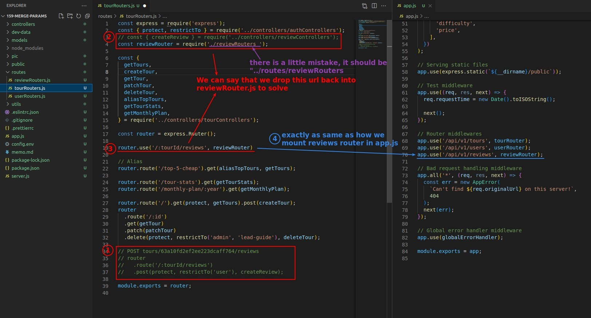
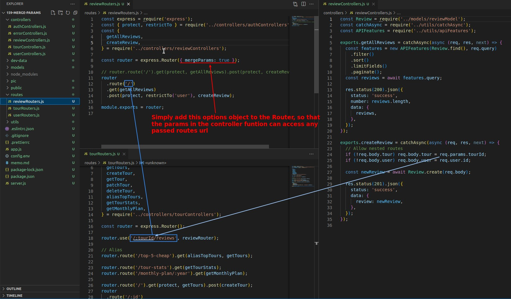
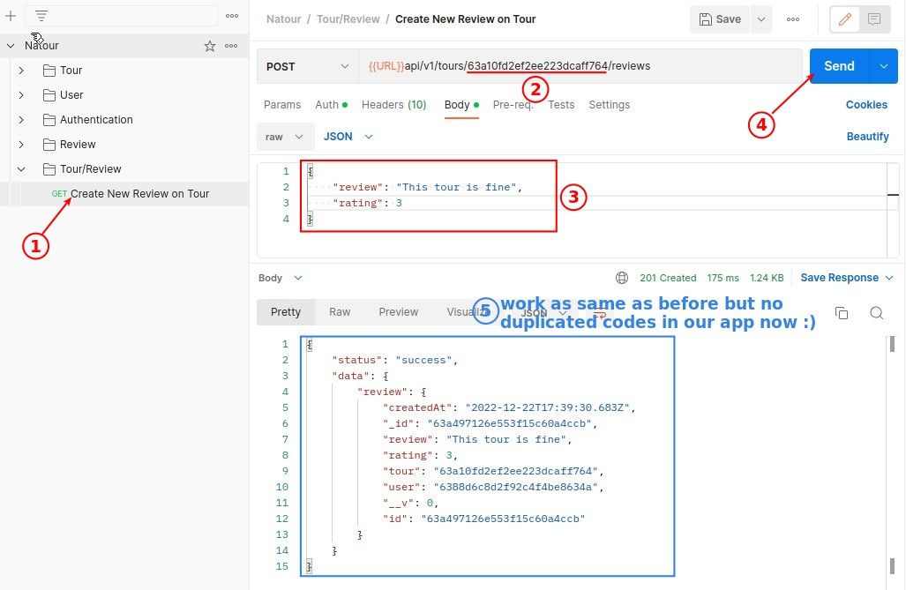

## **Problem of Duplicated Codes and Messy Codes**

- Our last lecture used the concept of nested routes to implement route for creating review on the tour, but there are two problems as shown above.

- We abandoned the use of the reviewControllers.js function in tourRouters.js, which would have caused confusion.
  - Instead, we drop the url of the function that needs to be fetched from reviewControllers.js directly back into the reviewRouters.js routes to handle.

## **Problem of Accessing Parameters and Solution**

- We have used the parameter "tourId" in the controller function, which does not exist in reviewRouters.js, this problem need to be solved.

