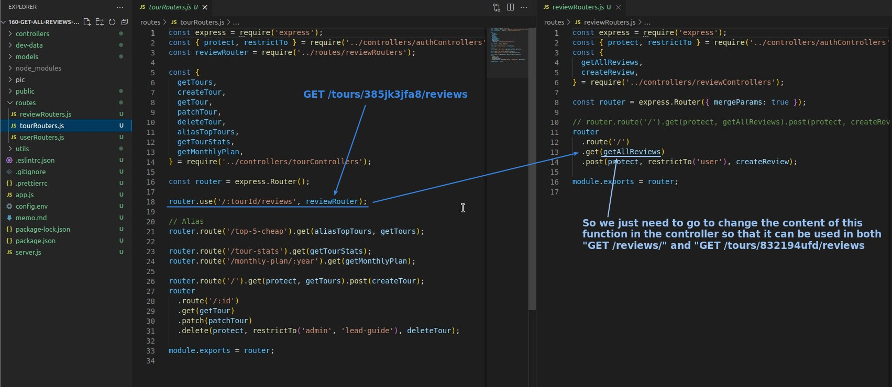
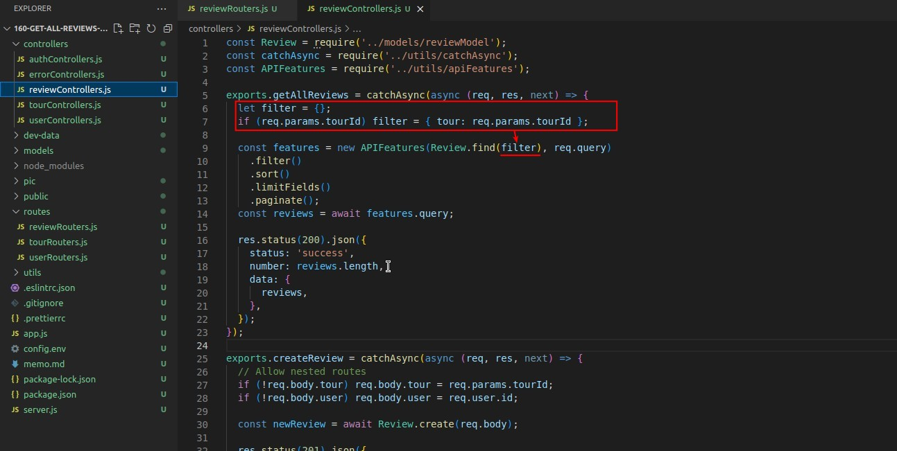
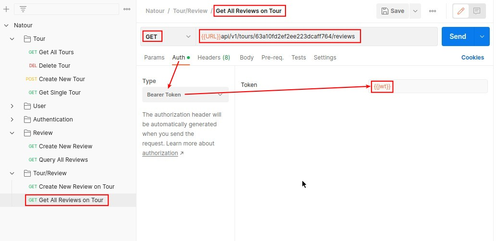
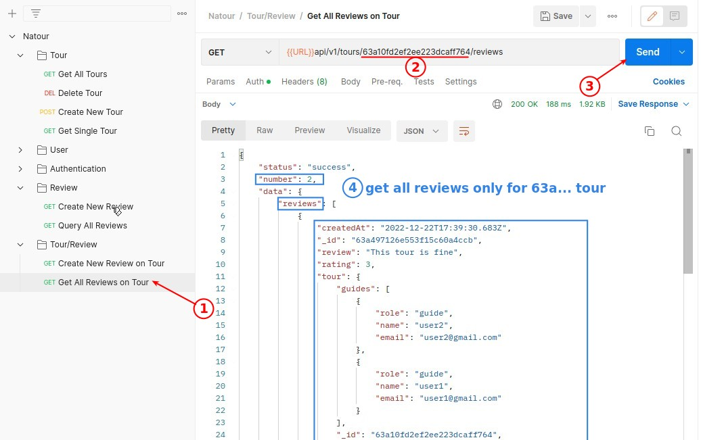

## **Redirect GET request for all reviews on tour**

- In the previous lection, we have redirected the '/tours/:tourId/reviews' url in tourRouters.js to reviewsRouters.js as a POST request, but it also works for GET requests with the same url.
  - So we only need to deal with the controller function directly in this lectur.

## **Modify Controller's function 'getAllReviews'**

## **Postman request build and Test**

