## **Structure of Pre Find HOOK**

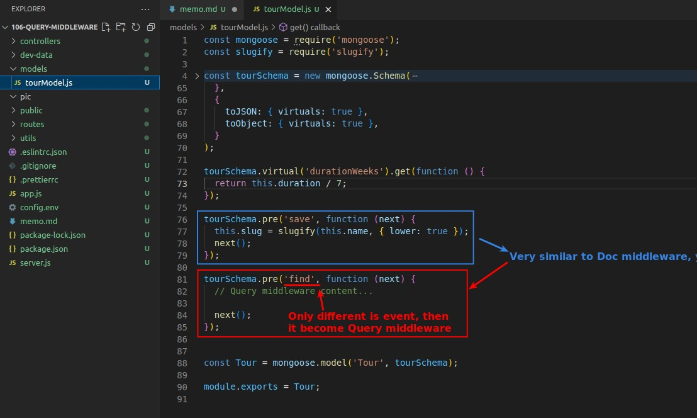

- The difference in the types of Mongoose middleware is mainly due to the **event**.

## **Premium VIP Tours**

> Suppose we have some tours that are available to premium VIPs, so they exist in the database but are not allowed to be queried by the general public.

### _Set "secretTour" property of Schema_

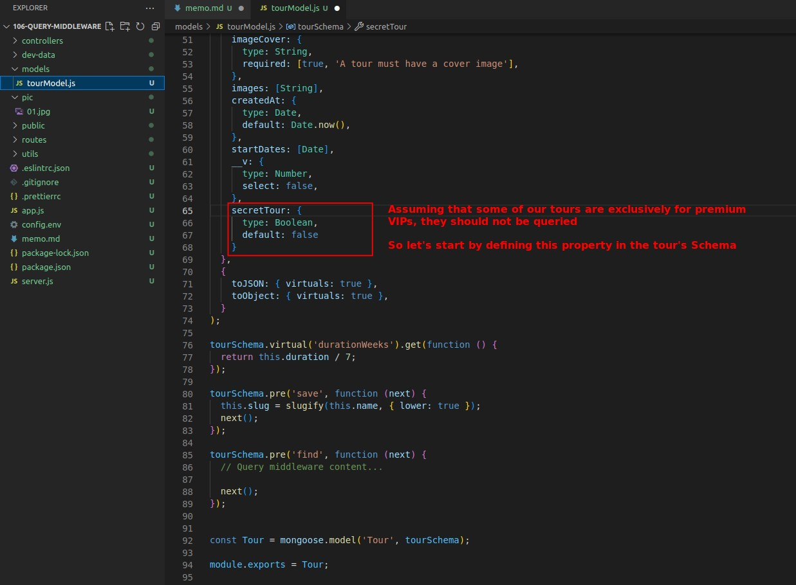

### _Create New Document with true secretTour_

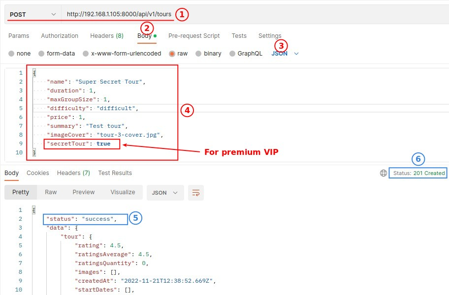

- Create a VIP-only tour using Postman (secretTour=true).

### _Compare check it with MongoDB Website and Postman request_

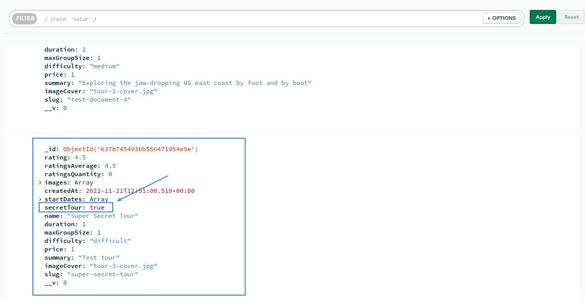

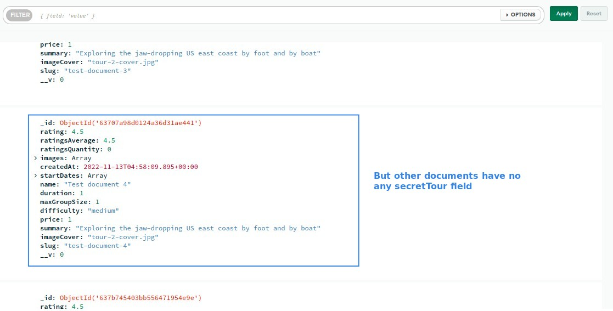

- Looking directly at the MongoDB database content, only the tour that has just been created has a secretTour field, while the other tours do not.

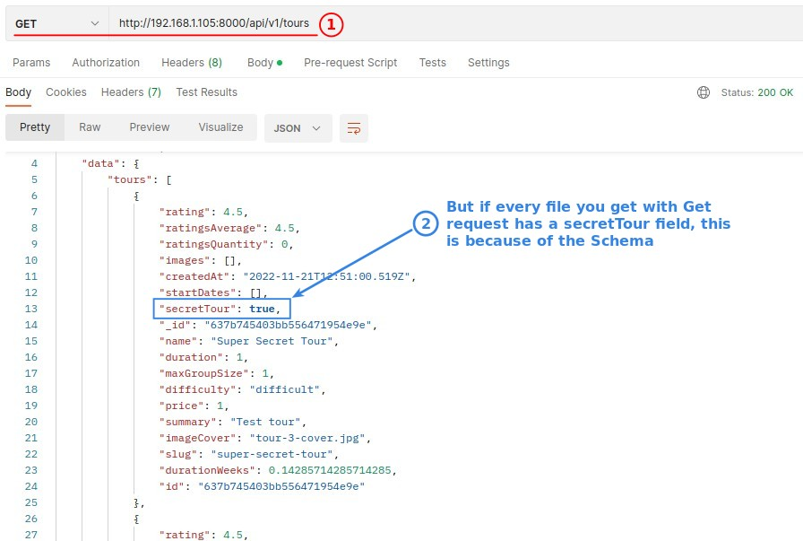

- But if you use Postman to get the tour data, each tour has a secretTour field, because of the Mongoose Schema.

### _Fill in content of Pre Find HOOK_

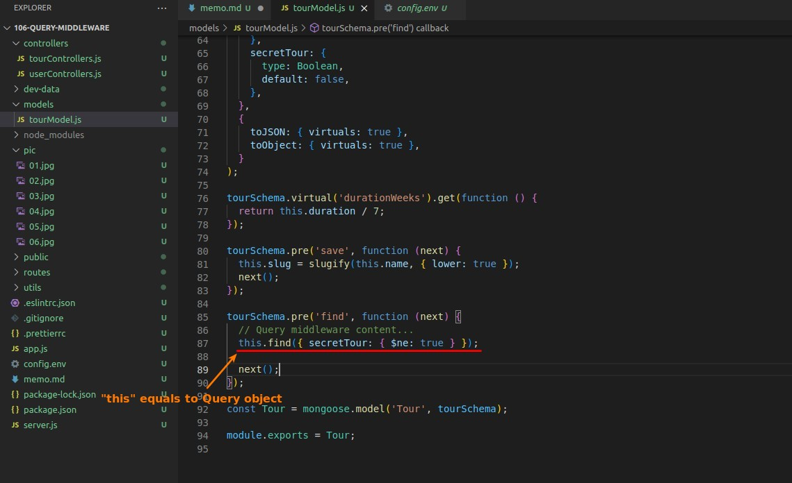

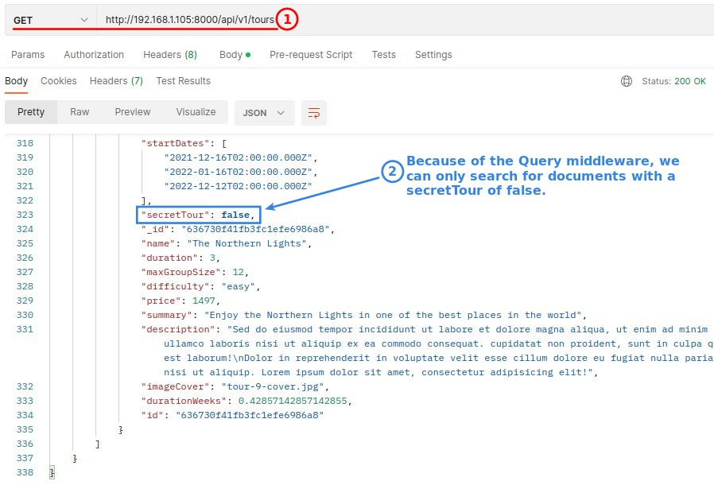

- $ne: true actually means false, so before the controller's query is executed, this middleware will be set off and exclude any tours with secretTour=true.

## **Anaylyze Where/When Pre Find HOOK to work**

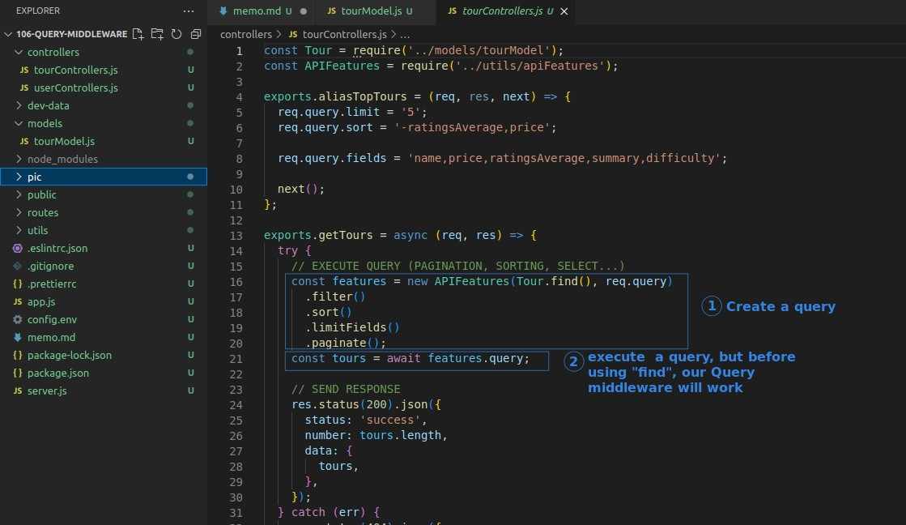

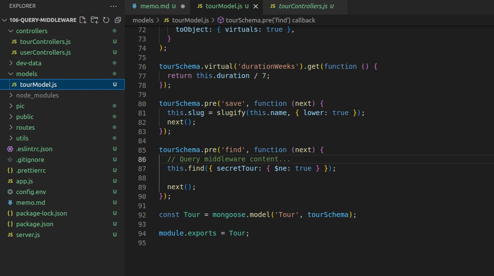

- When (2) of the controller executes the query, the Query middleware in the model will be triggered by find event and executed first.

## **If I Want Query Middleware work on any kind of find**

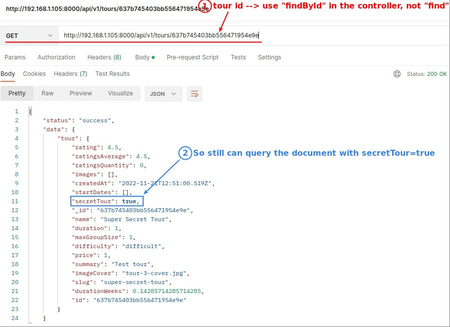

- So you can find that event "find" will only be emitted if there is a Query.prototype.find.
  - findByID, findOne and etc are not work with event "find".

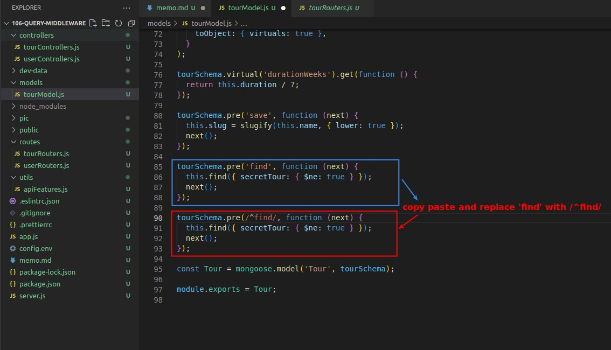

- We can use the regular expression to describe event, for example, the event in the above figure means all the events started by find.
  - It means that now findByID, findOne methods will also send an event to trigger the Query middleware before they are executed.

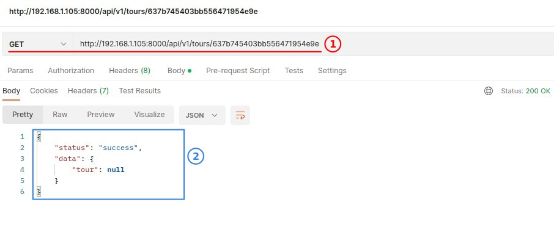

## **Check Mongoose Documents**

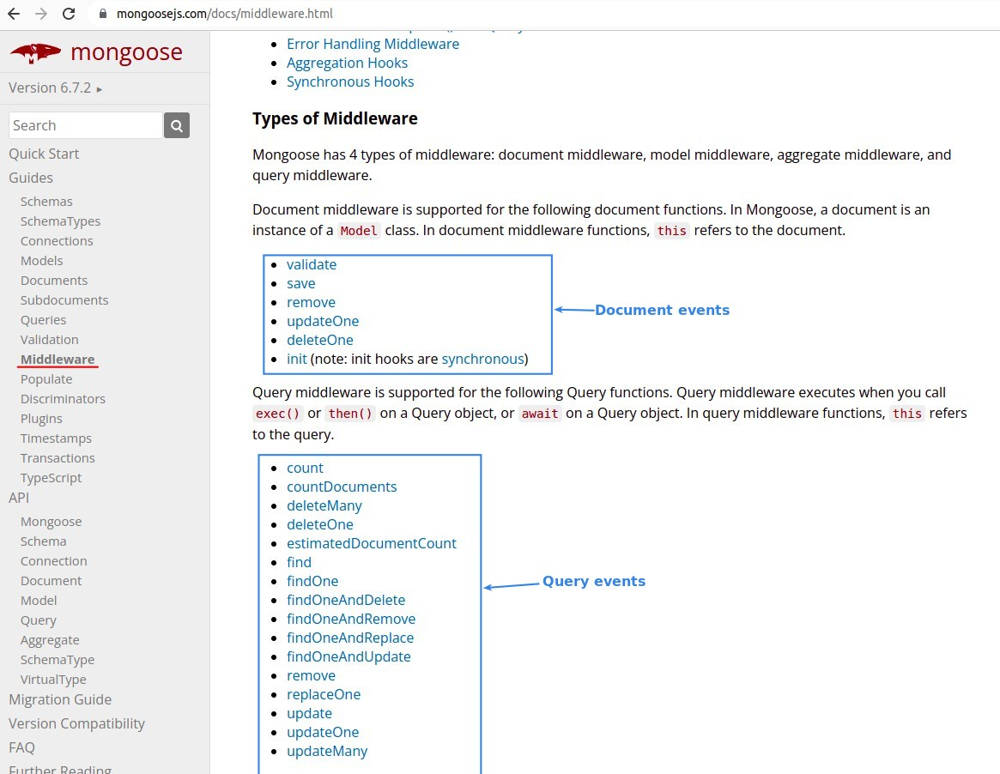

- We can see many Middleware event types in the official documentation in Mongoose.
  - Only a few parts of the course can be taught, but if you have further needs in the future, you must be able to read the official documents yourself.

## **Post Find HOOK**

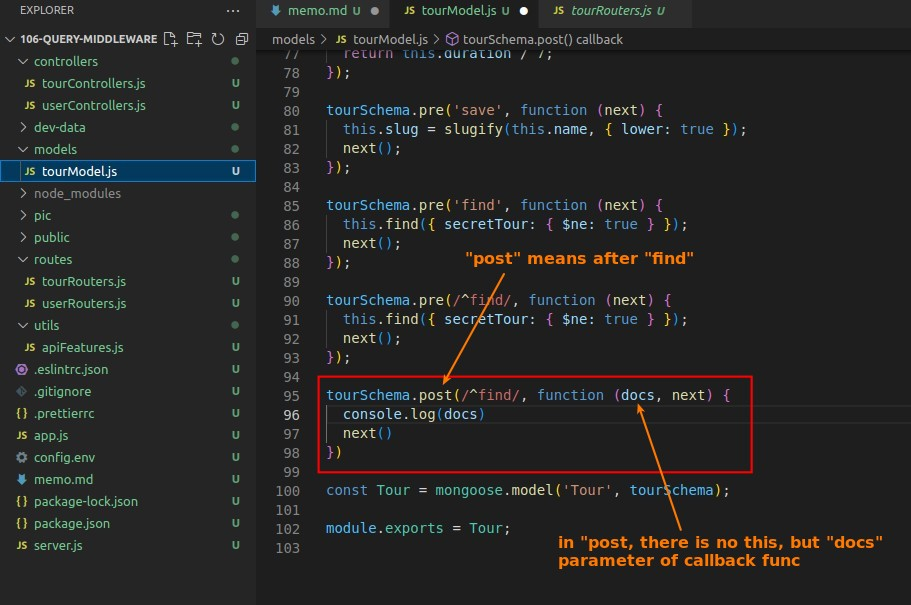

- In fact, it is very similar to the Document middleware introduced in the previous lecture, the post does not have the keyword "this", but has one more parameter to indicate the query to the content (query object).

### _Practice: Recording Query Duration_

> Combining the pre and post methods of the Query middleware, we can use it to calculate the time spent on a query.

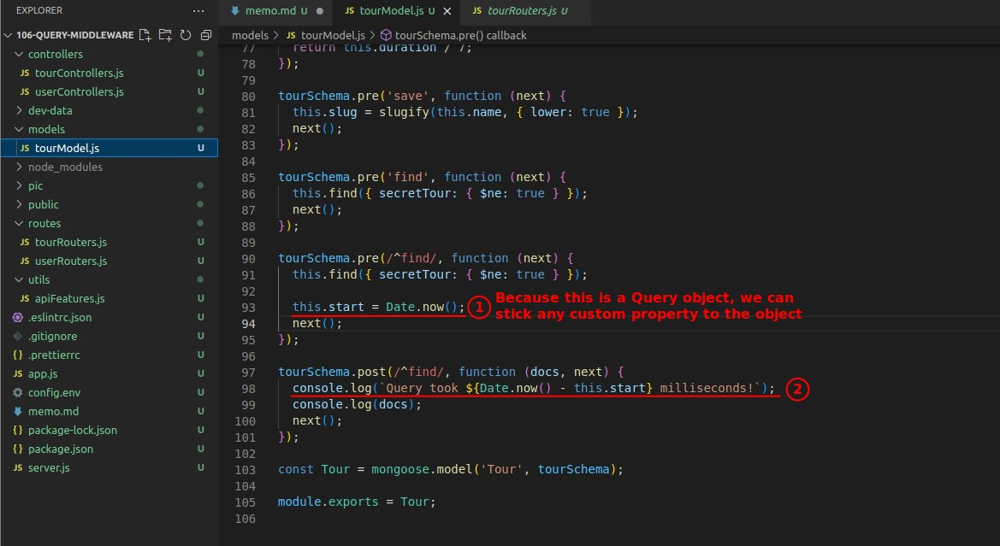

- The object can be glued to any custom property at will, So we stick a property in the pre method to record the time point before the query.

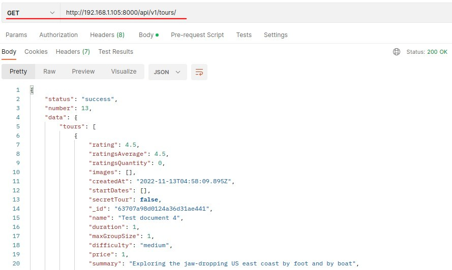

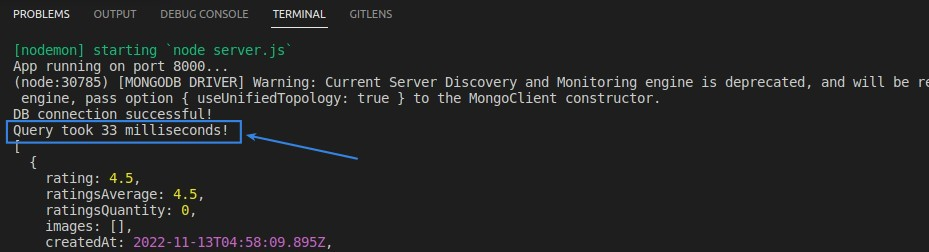
