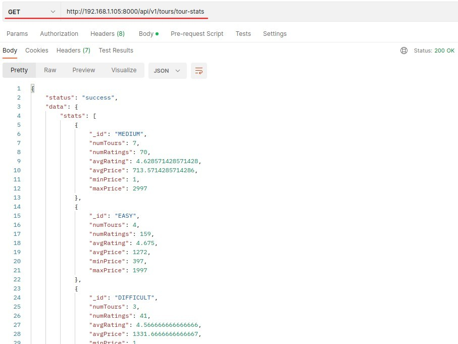

## **Recall memory about Aggregation**

- The above diagram means that we want to remember the tour quantity of each difficulty a little bit, so that after adding aggregation middleware, we can infer whether it is effective by observing whether the quantity has changed or not.

## **Intro Aggregation Middleware and Print Pipeline in the console**

## **Unshift New Stage into Pipeline by Aggregation Middleware**

- Because of the aggregation middleware, the data with secretTour=true will be filtered out before using aggregation now.

## **How about .post and model middleware**

- These two have little meaning, so there is no teaching.
