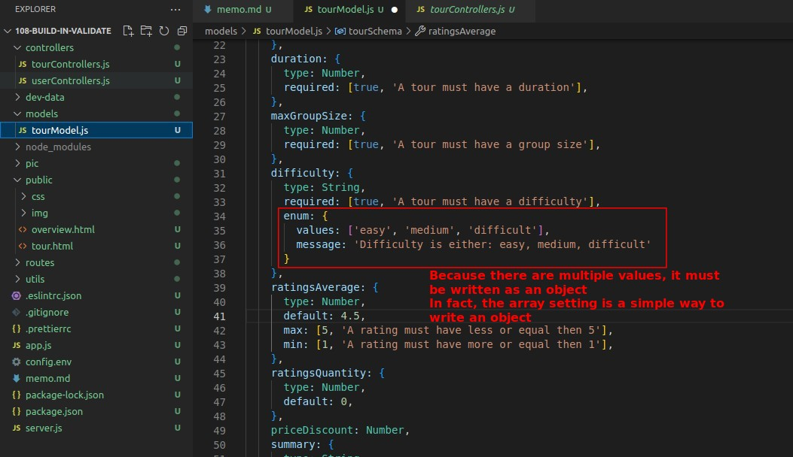

# **_Mongoose Built-in Validation_**

## **require**

## **maxlength/minlength**

## **max/min**

## **enum**

## **Other Validation**

- There are many other types of validate, for example, there is a validate called match for strings that can be checked with regular expression.

## **Sterilization**

- This is similar to the concept of validation, but with some differences. It means that any data input will be checked for any malicious codes or unnecessary characters to keep the input data basically clean.

- We never accept input from users as it is.

- This part will be left to the security section to explain.
