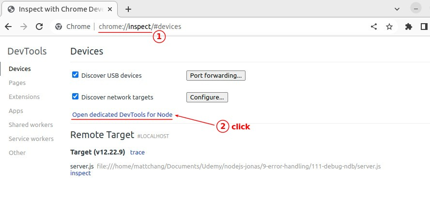

## **Do not use ndb, use chrome inspect**

## **Into Debugger with 1st Breakpoint**

## **Check Local/Global important variables**

## **Finish Debugger mode and Edit with DevTool**

## **2nd Breakpoint and Use request to trigger it**

## **Debug in Real World**

