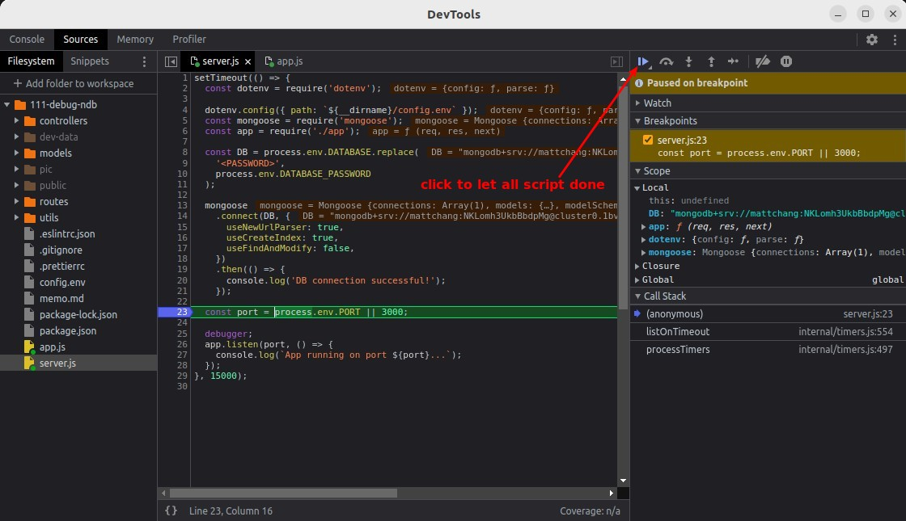
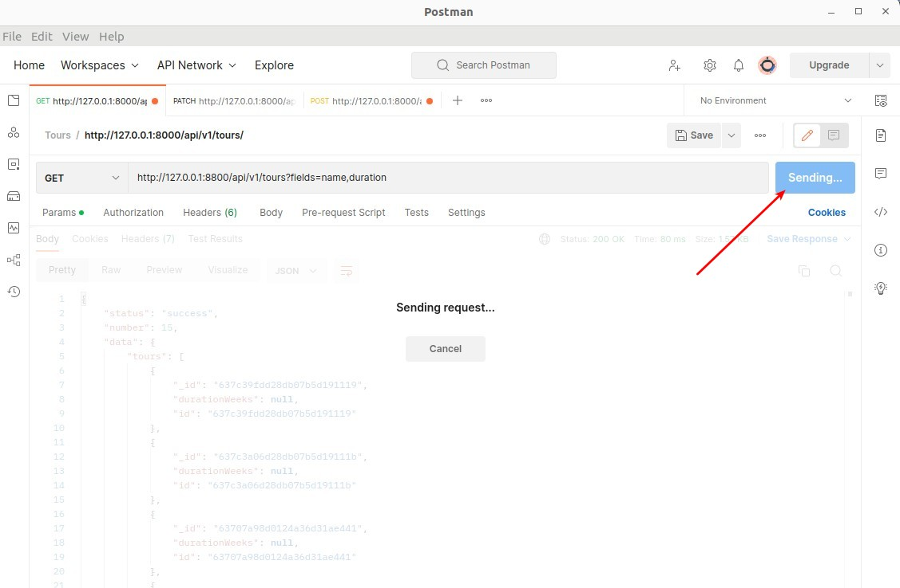

## **Do not use ndb, use chrome inspect**

### _ndb is no longer maintained, do not use it_

### _Solution_

## **Into Debugger with 1st Breakpoint**

- However, the breakpoint above cannot be triggered because DevTool cannot reload the app.

### _Use setTimeout to Trigger Breakpoint_

## **Check Local/Global important variables**

### _middleware stacks_

### _tour/userRouter middleware stacks_

### _Environment variables_

## **Finish Debugger mode and Edit with DevTool**

- Clicking play will finish all instructions if there are no other breakpoints.

- All instructions will automatically leave debugger mode after execution.

## **2nd Breakpoint and Use request to trigger it**

- All instructions will automatically leave debugger mode after execution.The code of the above breakpoint will be triggered when the correct request is received, so instead of using setTimeout, use Postman to send the corresponding request to trigger it.

- On the right are some important variables that have been studied before, so you can make your own detailed observations.

## **Debug in Real World**

> We simulate the real situation for debugging here.

### _create context(let something wrong)_

### _find something wrong_

### _choose right place to set breakpoint_

- This requires a certain understanding of the program structure in order to find the right place to set the breakpoint.

### _check value of key variable step by step_

### _final test_

