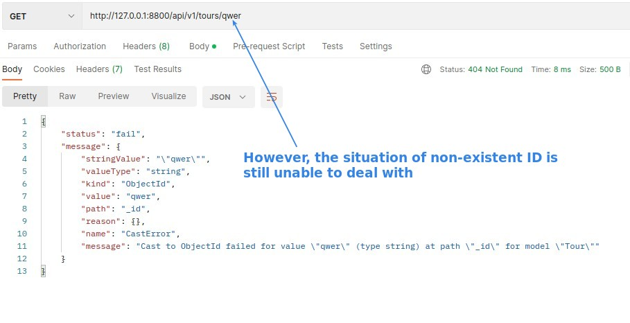

## **Client Send Invalid Request**

- In the second case, the URL is actually correct but the given ID does not exist in the database, so although you will also get an error, it is essentially different from the first case.

## **Handling it**

- The point here is the **order** of the route, only the previous request not processed by any previous route will come to this part **(app.all)**.

## **Re-Test**

