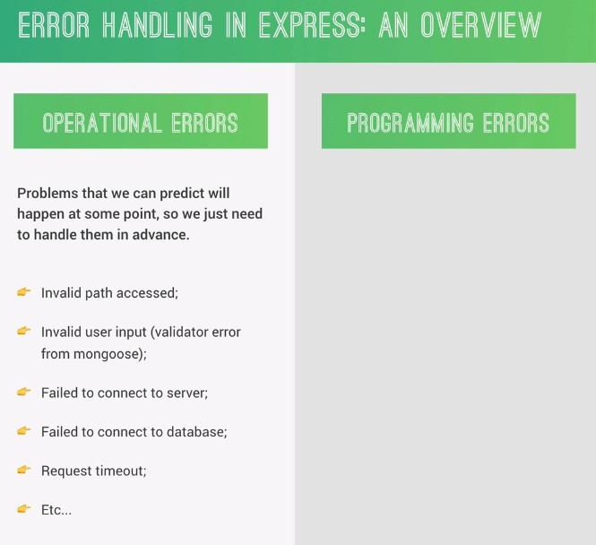
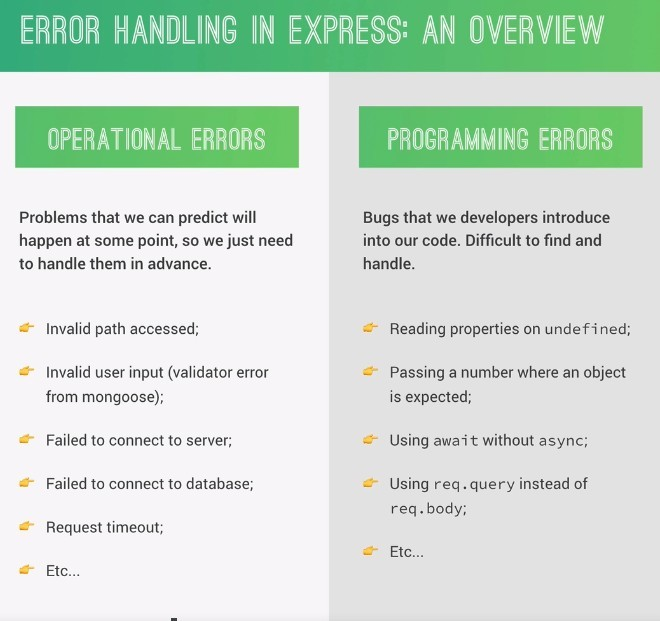
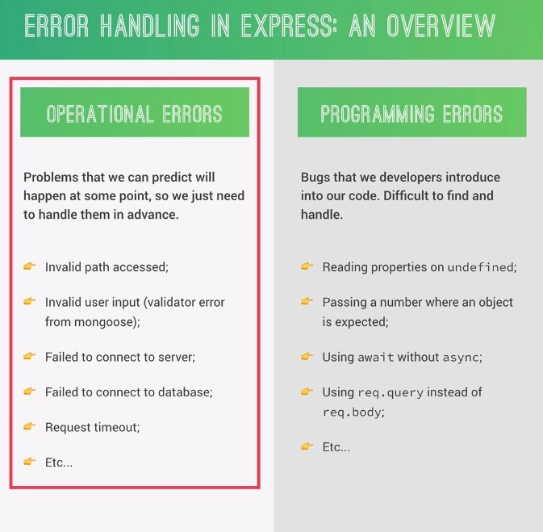
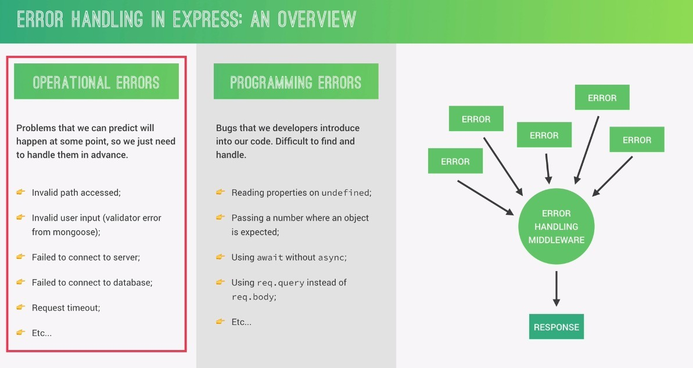

## **The previous is not a real error handling**

- In the previous lectures in this chapter we instructed to simply send back the error message in each route handler as a JSON in case there was a problem.

  - But that's not really dealing with the error.

## **Operational Errors**

> Some people use error and exception to distinguish between the following two types of errors, but we call them both error to avoid confusion.

## **Programming Errors**

## **Which one does Express Error Handling mean?**

- Error in Express Error Handling means operational error.

  - Express has many out-of-the-box error handling tools.

## **Global Central Error Handling Middleware**

- All we have to do is write a global fast error handling middleware to catch errors from the whole application.

  - No matter where the error comes from, such as model or controller, it will be centralized in a central error handling middleware to deal with.

- The advantage of using centralized error handling is that:

  - A good response can be sent to the client to let them know what's going on.

    - The way operational errors are handled is to properly inform the customer of what has happened.

    - You can concentrate on the business logic or other parts of your business without worrying about errors and waiting until later to deal with them.
