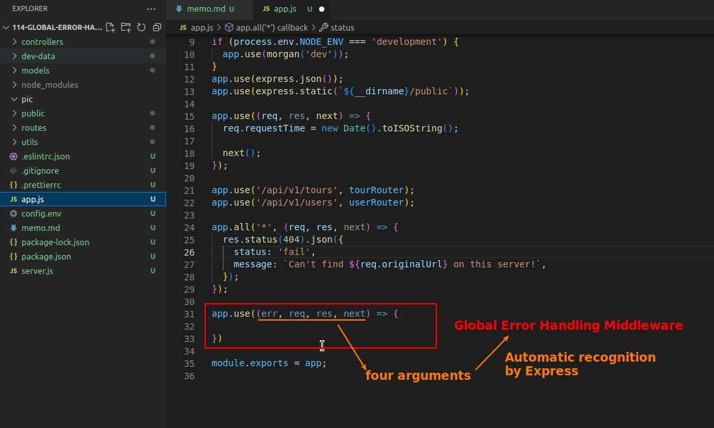
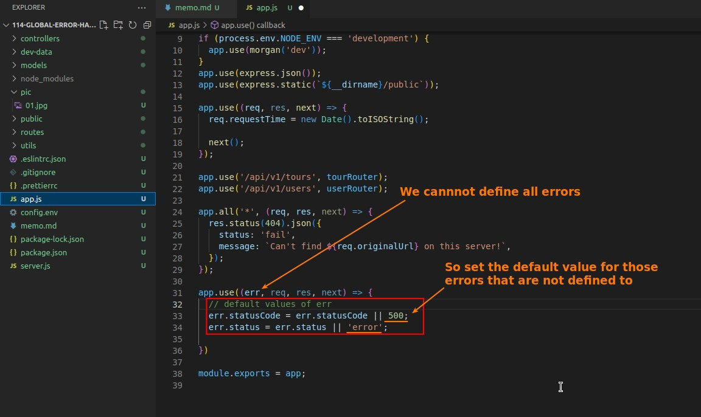
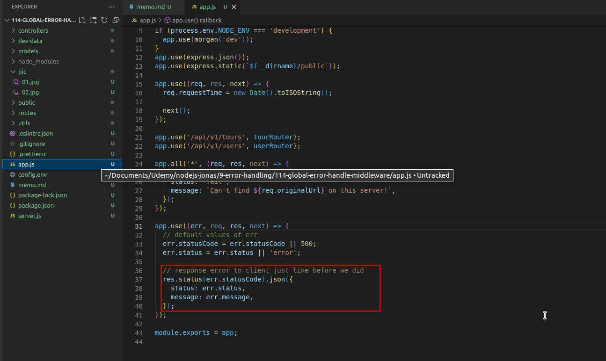
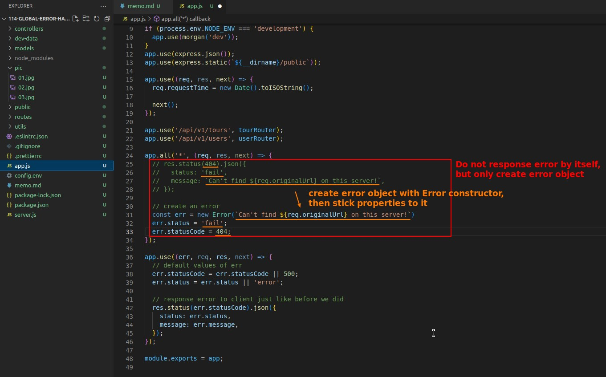
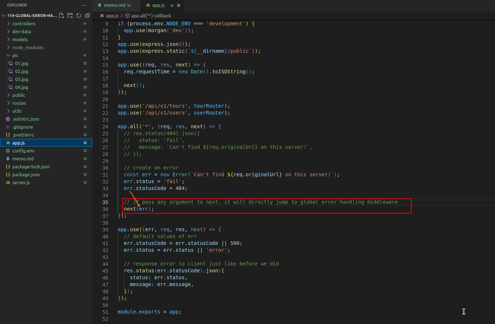
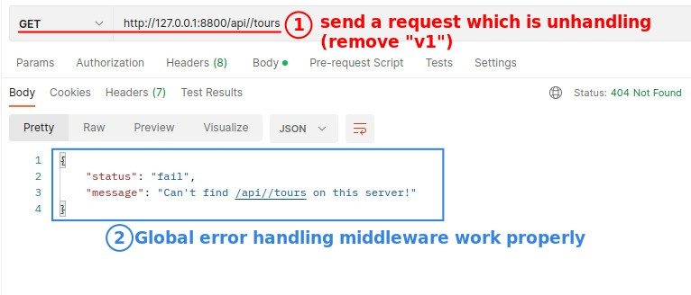
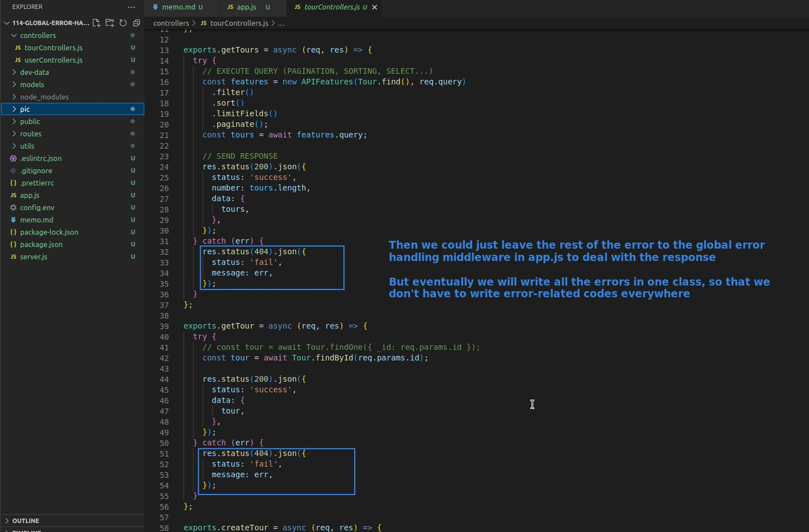

## **Structure of Global Error Handling Middleware**

- Any middleware with four arguments will be automatically recognized by Express as a Global Error Handling Middleware.

## **Set Default Values of Error**

- The first argument is used to receive error objects sent from anywhere in our app.
- Because we cannot define all errors, we must set some default values in the Global Error Handing Middleware for those errors that are not defined by us.

## **Response Error to the Client**

- All errors are now uniformly responded to the client using this Global Error Handing Middleware.
  - The response way is the same as before, except that the error object is applied.

## **Create Error Object in other Middlewares/Routes**

- We use the Error constructor to create the error object in every place where the error will occur (not the Global Error Handing Middleware).

## **Pass Error Object into next()**

- Once the error object is created and passed to the next function, as long as any value is passed to the next function, Express will determine that an error has occurred and skip all the middleware in the Middleware stack and go directly to the Global Error Handling Middleware.

## **Postman Testing and Future Plan**

