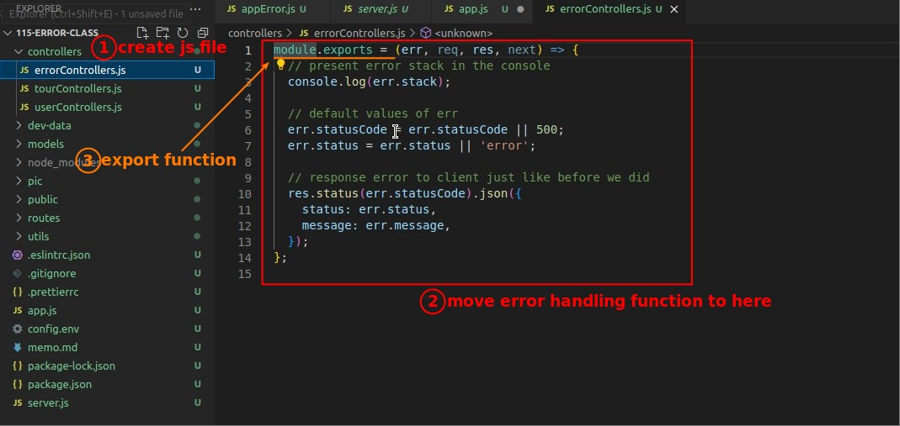

## **Custom Error Constructor**

### _isOperational_

> Normally the error objects generated by the AppError Class are operational errors, but in the future there must be other types of errors, such as program errors or even errors from third-party packages, so to distinguish them we add the following property.

## **Error Stack Trace**

### _What is it?_

> In fact, it is something we are already very familiar with.

### _Avoiding its being polluted by AppError Class_

> If the error object is generated using the AppError Class, the part that calls its contructor will also be included in the Stack Trace, and we don't want that so we add the following codes.
>
> 

### _Debug: Response is changed_

> We actually use AppError to generate the error object and then use Postman to test it.

- We were hoping that the result would be exactly the same as before we imported AppError, but it doesn't seem to be the case so far.

- Just a simple syntax mistake.

## **Move Global Error Hanlder(function) to Controller**

