## **DRY problem in Controller Async Functions**

## **Solution Step by Step**

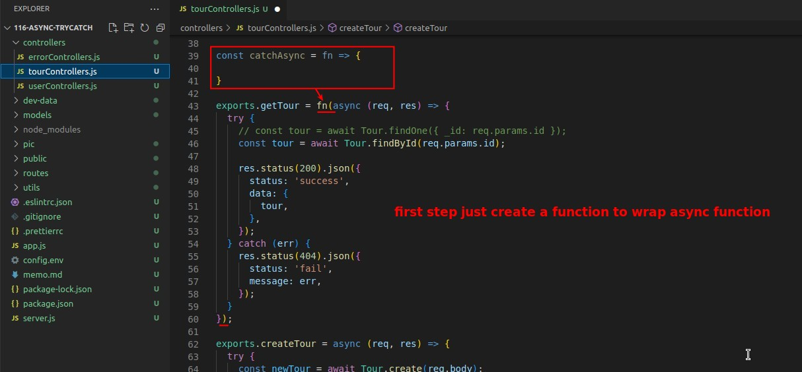

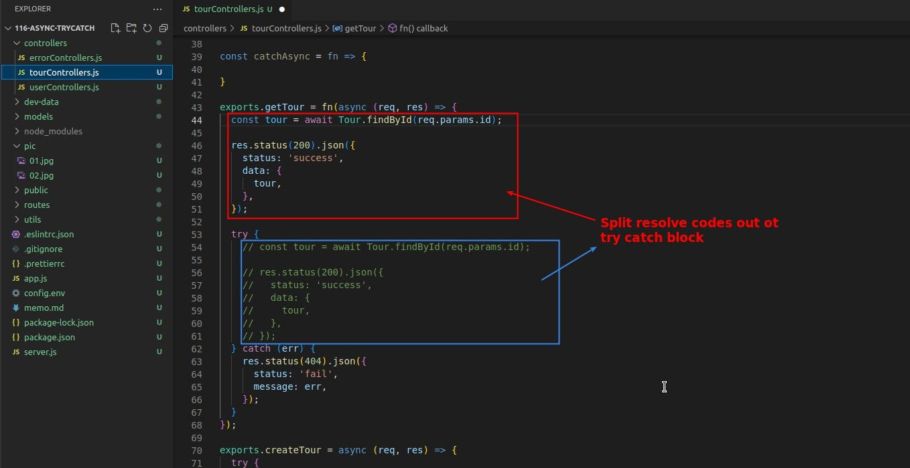

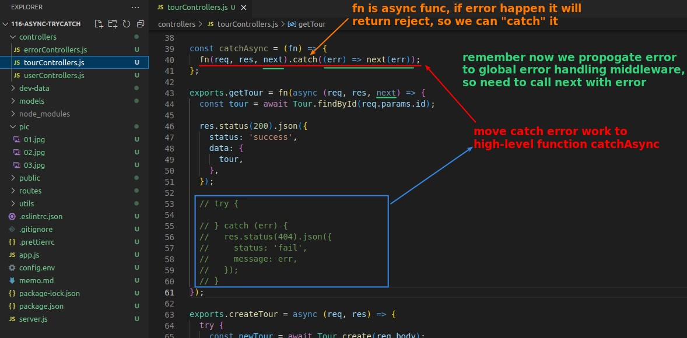

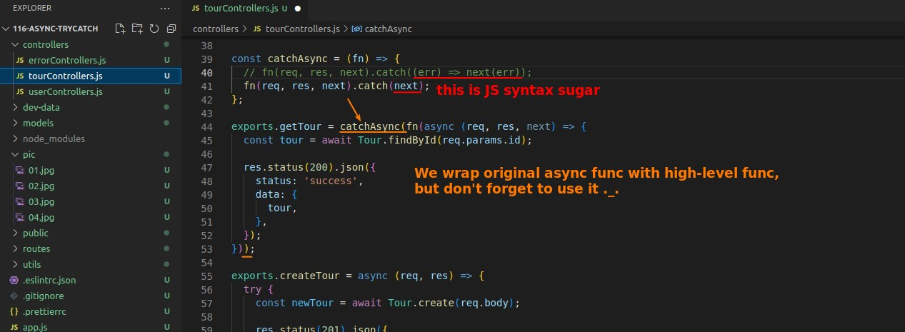

## **Still Not Work!?**

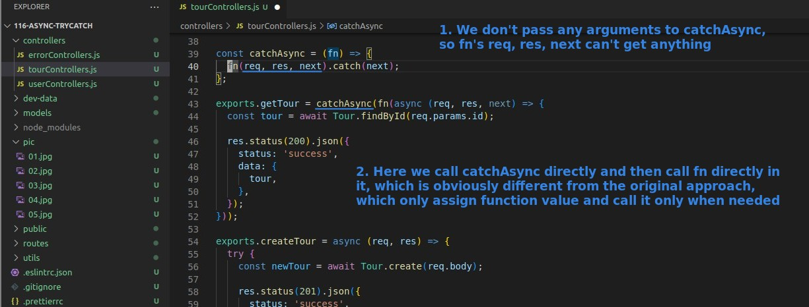

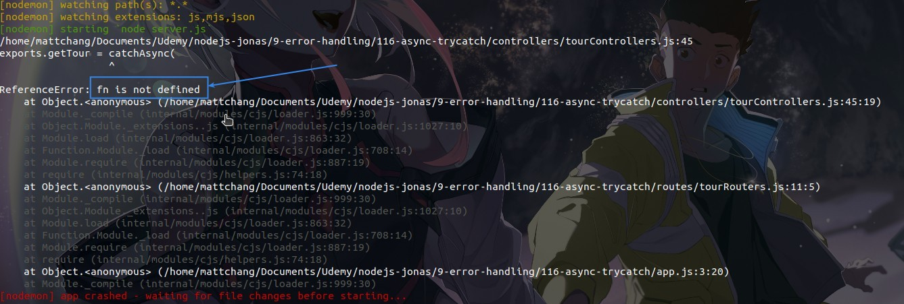

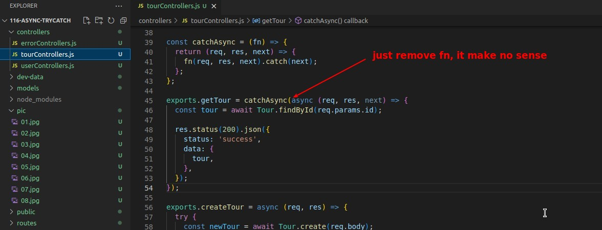

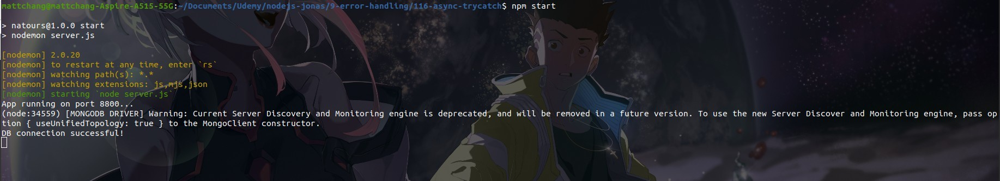

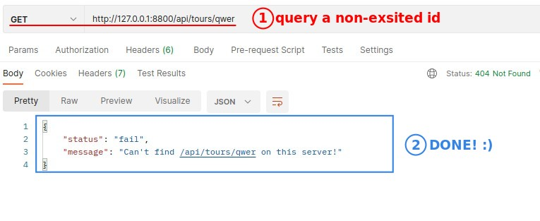

## **Export catchAsync to New file in utils**

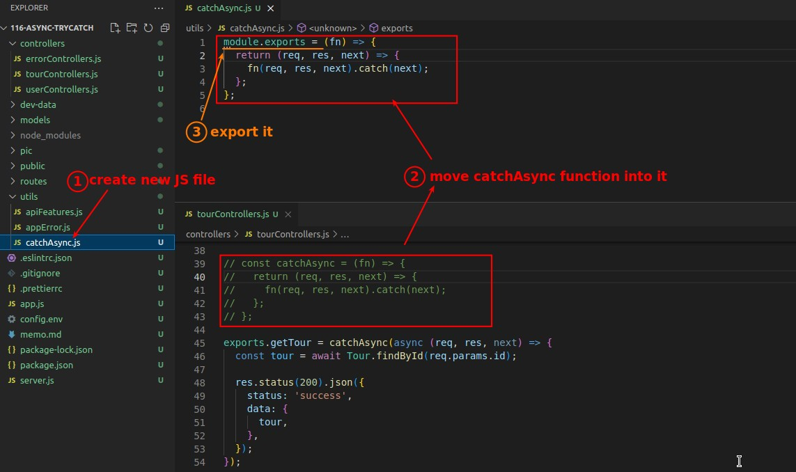

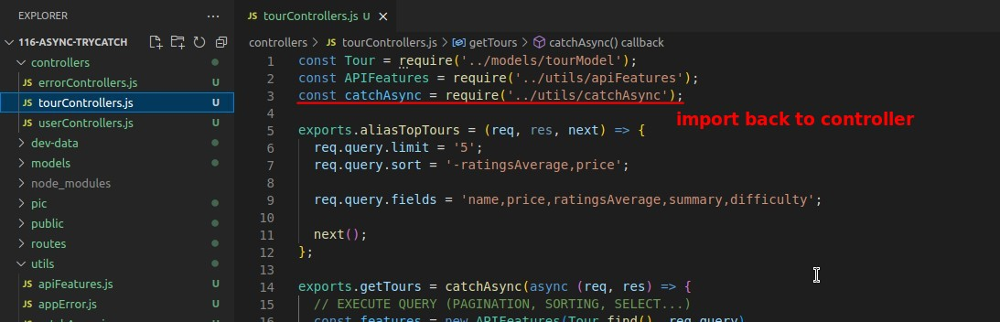

## **Rewrite all Async Functions in Conrtroller**

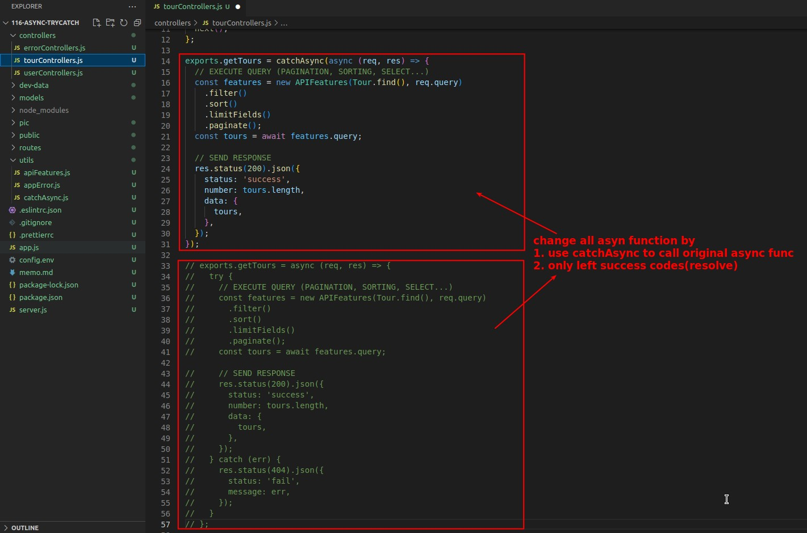

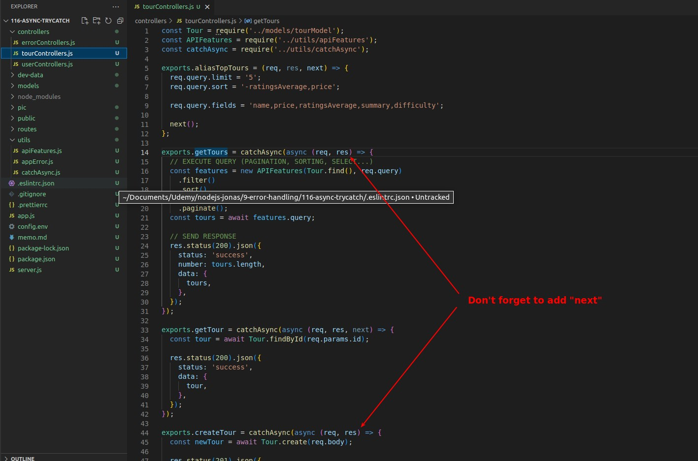

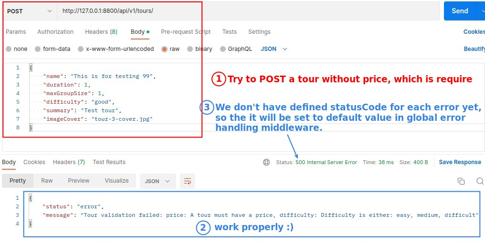
