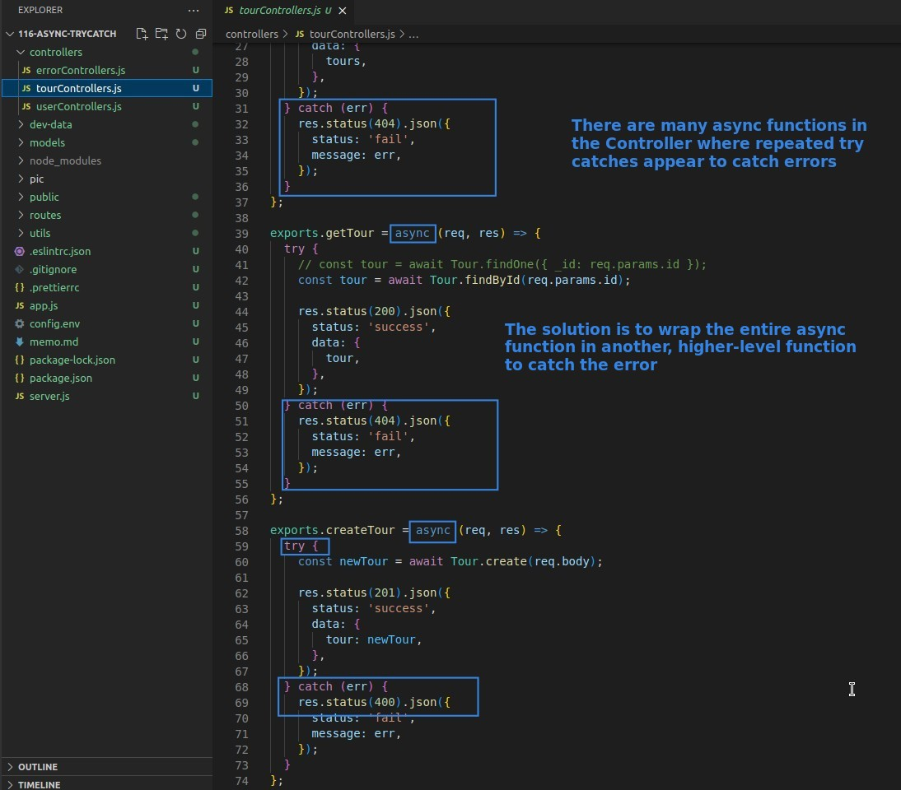
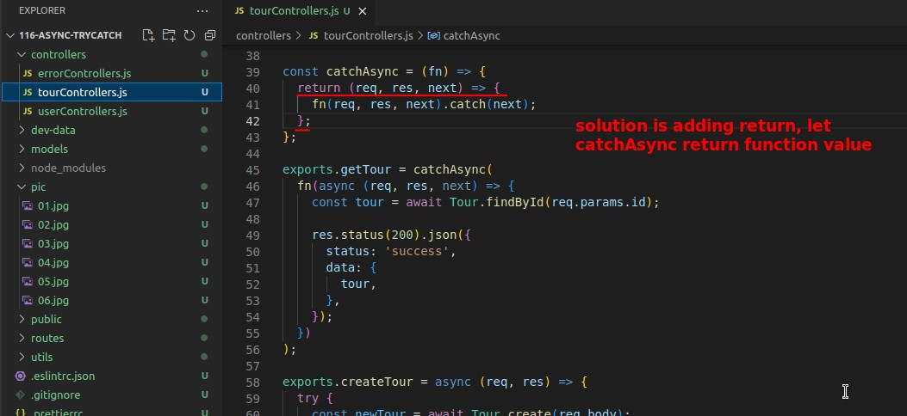

## **DRY problem in Controller Async Functions**

## **Solution Step by Step**

- In fact, you can find that the part setting error status code has disappeared, and the error is caught and thrown directly to the global error handling middleware.
  - So if an error is caught, the status code will use the default value of 500.

## **Still Not Work!?**

> So far it is still not working at all, for two reasons bellow.

### _fn problem_

> There is an error in the second step at the top that causes the npm start error, simply fix it back.

## **Export catchAsync to New file in utils**

## **Rewrite all Async Functions in Conrtroller**

